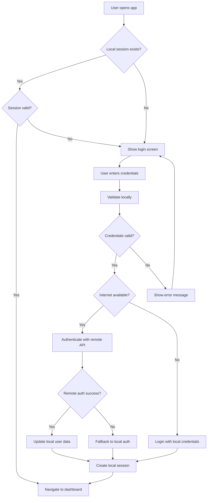
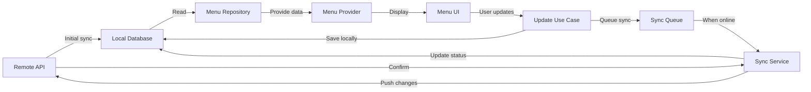
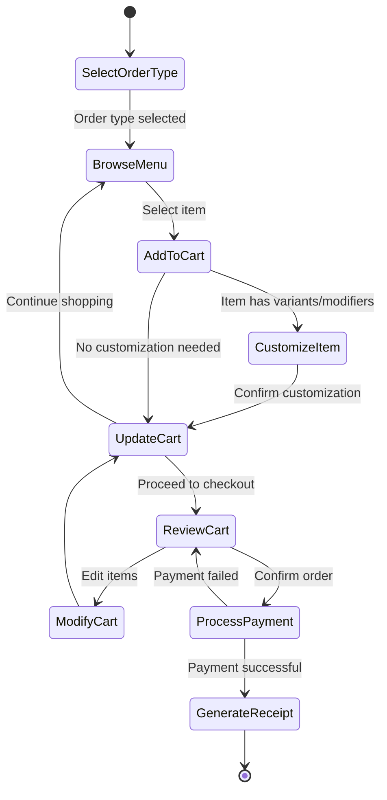
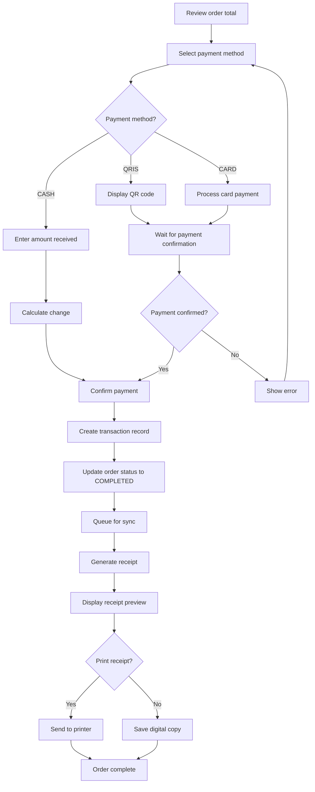
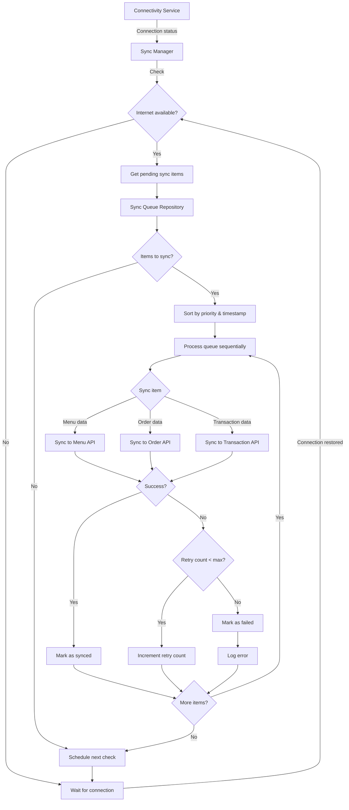
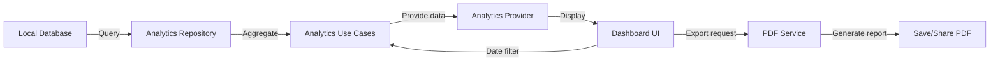
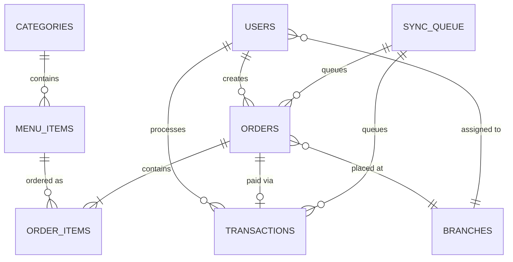

# Offline-First POS System Design

## 1. Project Overview

### 1.1 Purpose
Design and implement a complete offline-first Point of Sale (POS) application for Food & Beverage businesses using Flutter. The system prioritizes offline functionality with automatic synchronization when internet connectivity is available.

### 1.2 Key Characteristics
- **Offline-first architecture**: All core operations function without internet connectivity
- **Automatic sync**: Background synchronization when online
- **Clean architecture**: Clear separation of concerns across data, domain, and presentation layers
- **Material 3 design**: Modern, responsive UI for tablet and mobile devices
- **Multi-platform support**: Targets Android, iOS, Web, and Desktop platforms

### 1.3 Primary Users
- Cashiers (order entry, payment processing)
- Store managers (menu management, basic analytics)
- System administrators (user management, configuration)

## 2. Technical Architecture

### 2.1 Architecture Pattern
The system follows **Clean Architecture** principles with three distinct layers:

| Layer | Responsibility | Dependencies |
|-------|---------------|--------------|
| Presentation | UI components, state management, user interactions | Domain layer only |
| Domain | Business logic, entities, use cases | No external dependencies |
| Data | Data sources, repositories implementation, API clients | Domain layer (implements interfaces) |

### 2.2 Technology Stack

| Component | Technology | Justification |
|-----------|-----------|---------------|
| Framework | Flutter (latest stable) | Cross-platform development with single codebase |
| State Management | Riverpod | Type-safe, compile-time dependency injection, excellent testability |
| Local Database | Drift | Type-safe SQL with excellent migration support and reactive queries |
| HTTP Client | Dio | Powerful interceptors for auth, logging, and retry logic |
| Code Generation | Freezed + JsonSerializable | Immutable data classes with copy methods and JSON serialization |
| Background Sync | Workmanager | Platform-independent background task execution |
| PDF Generation | pdf package | Receipt and report generation |
| Local Storage | shared_preferences | Simple key-value storage for settings and session data |

### 2.3 Folder Structure

```
lib/
├── core/
│   ├── constants/
│   │   ├── app_colors.dart
│   │   ├── app_strings.dart
│   │   ├── api_endpoints.dart
│   │   └── database_constants.dart
│   ├── services/
│   │   ├── sync_service.dart
│   │   ├── connectivity_service.dart
│   │   ├── encryption_service.dart
│   │   └── pdf_service.dart
│   ├── utils/
│   │   ├── date_formatter.dart
│   │   ├── currency_formatter.dart
│   │   ├── validators.dart
│   │   └── logger.dart
│   ├── network/
│   │   ├── api_client.dart
│   │   ├── api_interceptor.dart
│   │   └── network_info.dart
│   └── errors/
│       ├── failures.dart
│       └── exceptions.dart
├── data/
│   ├── models/
│   │   ├── user_model.dart
│   │   ├── menu_item_model.dart
│   │   ├── category_model.dart
│   │   ├── order_model.dart
│   │   ├── transaction_model.dart
│   │   └── sync_queue_model.dart
│   ├── datasources/
│   │   ├── local/
│   │   │   ├── user_local_datasource.dart
│   │   │   ├── menu_local_datasource.dart
│   │   │   ├── order_local_datasource.dart
│   │   │   └── sync_queue_datasource.dart
│   │   └── remote/
│   │       ├── user_remote_datasource.dart
│   │       ├── menu_remote_datasource.dart
│   │       └── order_remote_datasource.dart
│   ├── repositories/
│   │   ├── user_repository_impl.dart
│   │   ├── menu_repository_impl.dart
│   │   ├── order_repository_impl.dart
│   │   └── sync_repository_impl.dart
│   └── local/
│       ├── database.dart
│       ├── tables/
│       │   ├── users_table.dart
│       │   ├── menu_items_table.dart
│       │   ├── categories_table.dart
│       │   ├── orders_table.dart
│       │   ├── order_items_table.dart
│       │   ├── transactions_table.dart
│       │   └── sync_queue_table.dart
│       └── daos/
│           ├── user_dao.dart
│           ├── menu_dao.dart
│           ├── order_dao.dart
│           └── sync_dao.dart
├── domain/
│   ├── entities/
│   │   ├── user.dart
│   │   ├── menu_item.dart
│   │   ├── category.dart
│   │   ├── order.dart
│   │   ├── order_item.dart
│   │   ├── transaction.dart
│   │   ├── payment_method.dart
│   │   └── sync_status.dart
│   ├── repositories/
│   │   ├── user_repository.dart
│   │   ├── menu_repository.dart
│   │   ├── order_repository.dart
│   │   └── sync_repository.dart
│   └── usecases/
│       ├── auth/
│       │   ├── login_user.dart
│       │   ├── logout_user.dart
│       │   └── get_current_user.dart
│       ├── menu/
│       │   ├── get_menu_items.dart
│       │   ├── get_categories.dart
│       │   ├── update_menu_item.dart
│       │   └── toggle_item_availability.dart
│       ├── order/
│       │   ├── create_order.dart
│       │   ├── add_item_to_order.dart
│       │   ├── update_order_item.dart
│       │   ├── remove_item_from_order.dart
│       │   ├── calculate_order_total.dart
│       │   └── complete_order.dart
│       ├── payment/
│       │   ├── process_payment.dart
│       │   └── generate_receipt.dart
│       ├── sync/
│       │   ├── sync_menu_data.dart
│       │   ├── sync_orders.dart
│       │   └── get_sync_status.dart
│       └── analytics/
│           ├── get_daily_sales.dart
│           ├── get_top_selling_items.dart
│           └── get_sales_summary.dart
├── presentation/
│   ├── screens/
│   │   ├── splash/
│   │   │   └── splash_screen.dart
│   │   ├── auth/
│   │   │   ├── login_screen.dart
│   │   │   └── widgets/
│   │   │       └── login_form.dart
│   │   ├── dashboard/
│   │   │   ├── dashboard_screen.dart
│   │   │   └── widgets/
│   │   │       ├── sales_summary_card.dart
│   │   │       ├── quick_stats_card.dart
│   │   │       └── sync_status_indicator.dart
│   │   ├── menu/
│   │   │   ├── menu_list_screen.dart
│   │   │   ├── menu_detail_screen.dart
│   │   │   └── widgets/
│   │   │       ├── menu_item_card.dart
│   │   │       ├── category_filter.dart
│   │   │       └── availability_toggle.dart
│   │   ├── order/
│   │   │   ├── order_screen.dart
│   │   │   ├── cart_screen.dart
│   │   │   └── widgets/
│   │   │       ├── menu_grid.dart
│   │   │       ├── cart_item.dart
│   │   │       ├── modifier_dialog.dart
│   │   │       └── order_type_selector.dart
│   │   ├── payment/
│   │   │   ├── payment_screen.dart
│   │   │   └── widgets/
│   │   │       ├── payment_method_selector.dart
│   │   │       ├── amount_display.dart
│   │   │       └── numpad.dart
│   │   ├── receipt/
│   │   │   ├── receipt_preview_screen.dart
│   │   │   └── widgets/
│   │   │       └── receipt_template.dart
│   │   ├── analytics/
│   │   │   ├── analytics_screen.dart
│   │   │   └── widgets/
│   │   │       ├── sales_chart.dart
│   │   │       ├── top_items_list.dart
│   │   │       └── date_range_picker.dart
│   │   └── settings/
│   │       ├── settings_screen.dart
│   │       └── widgets/
│   │           ├── theme_toggle.dart
│   │           └── sync_settings.dart
│   ├── widgets/
│   │   ├── common/
│   │   │   ├── custom_button.dart
│   │   │   ├── custom_text_field.dart
│   │   │   ├── loading_indicator.dart
│   │   │   └── error_display.dart
│   │   └── layout/
│   │       ├── responsive_layout.dart
│   │       └── app_drawer.dart
│   ├── providers/
│   │   ├── auth_provider.dart
│   │   ├── menu_provider.dart
│   │   ├── order_provider.dart
│   │   ├── cart_provider.dart
│   │   ├── payment_provider.dart
│   │   ├── sync_provider.dart
│   │   ├── analytics_provider.dart
│   │   └── theme_provider.dart
│   └── theme/
│       ├── app_theme.dart
│       ├── light_theme.dart
│       └── dark_theme.dart
├── main.dart
└── app.dart
```

## 3. Data Model Design

### 3.1 Core Entities

#### User Entity
| Field | Type | Description | Constraints |
|-------|------|-------------|-------------|
| id | String | Unique identifier | Primary key, UUID |
| username | String | Login username | Unique, not null |
| fullName | String | Display name | Not null |
| role | UserRole | User permission level | Enum: CASHIER, MANAGER, ADMIN |
| branchId | String? | Associated branch | Nullable for admin users |
| isActive | Boolean | Account status | Default: true |
| lastSyncAt | DateTime? | Last sync timestamp | Nullable |
| createdAt | DateTime | Account creation time | Not null |

#### Category Entity
| Field | Type | Description | Constraints |
|-------|------|-------------|-------------|
| id | String | Unique identifier | Primary key, UUID |
| name | String | Category name | Not null |
| description | String? | Category description | Nullable |
| displayOrder | int | Sort order | Default: 0 |
| isActive | Boolean | Visibility status | Default: true |
| icon | String? | Icon identifier | Nullable |
| createdAt | DateTime | Creation timestamp | Not null |
| updatedAt | DateTime | Last update timestamp | Not null |

#### MenuItem Entity
| Field | Type | Description | Constraints |
|-------|------|-------------|-------------|
| id | String | Unique identifier | Primary key, UUID |
| categoryId | String | Parent category | Foreign key to Category |
| name | String | Item name | Not null |
| description | String? | Item description | Nullable |
| basePrice | Decimal | Base price | Not null, >= 0 |
| imageUrl | String? | Product image URL | Nullable |
| isAvailable | Boolean | Current availability | Default: true |
| hasVariants | Boolean | Has size/variant options | Default: false |
| variants | List<Variant> | Available variants | Empty list if no variants |
| modifiers | List<Modifier> | Available modifiers | Empty list if no modifiers |
| createdAt | DateTime | Creation timestamp | Not null |
| updatedAt | DateTime | Last update timestamp | Not null |

#### Variant (Value Object)
| Field | Type | Description | Constraints |
|-------|------|-------------|-------------|
| id | String | Variant identifier | UUID |
| name | String | Variant name | e.g., "Small", "Large" |
| priceAdjustment | Decimal | Price difference from base | Can be negative |

#### Modifier (Value Object)
| Field | Type | Description | Constraints |
|-------|------|-------------|-------------|
| id | String | Modifier identifier | UUID |
| name | String | Modifier name | e.g., "Extra Cheese" |
| price | Decimal | Additional cost | >= 0 |
| category | String | Modifier group | e.g., "Toppings", "Add-ons" |

#### Order Entity
| Field | Type | Description | Constraints |
|-------|------|-------------|-------------|
| id | String | Unique identifier | Primary key, UUID |
| orderNumber | String | Human-readable order number | Unique, format: ORD-YYYYMMDD-XXXX |
| orderType | OrderType | Service type | Enum: DINE_IN, TAKE_AWAY |
| status | OrderStatus | Current status | Enum: DRAFT, CONFIRMED, COMPLETED, CANCELLED |
| tableNumber | String? | Table identifier | Required for DINE_IN |
| customerName | String? | Customer name | Nullable |
| items | List<OrderItem> | Ordered items | Not empty for confirmed orders |
| subtotal | Decimal | Sum before tax/discount | Calculated |
| taxAmount | Decimal | Tax amount | Calculated |
| discountAmount | Decimal | Total discount | Default: 0 |
| totalAmount | Decimal | Final payable amount | Calculated |
| cashierId | String | User who created order | Foreign key to User |
| branchId | String | Branch where order created | Not null |
| notes | String? | Special instructions | Nullable |
| isSynced | Boolean | Sync status to server | Default: false |
| createdAt | DateTime | Order creation time | Not null |
| completedAt | DateTime? | Order completion time | Nullable |

#### OrderItem (Value Object)
| Field | Type | Description | Constraints |
|-------|------|-------------|-------------|
| id | String | Item identifier | UUID |
| menuItemId | String | Reference to menu item | Foreign key |
| menuItemName | String | Snapshot of item name | Not null |
| basePrice | Decimal | Snapshot of base price | Not null |
| selectedVariant | Variant? | Chosen variant | Nullable |
| selectedModifiers | List<Modifier> | Chosen modifiers | Can be empty |
| quantity | int | Item quantity | >= 1 |
| unitPrice | Decimal | Price per unit (with variant) | Calculated |
| itemTotal | Decimal | Total for this line | Calculated |
| notes | String? | Item-specific notes | Nullable |

#### Transaction Entity
| Field | Type | Description | Constraints |
|-------|------|-------------|-------------|
| id | String | Unique identifier | Primary key, UUID |
| orderId | String | Associated order | Foreign key to Order |
| transactionNumber | String | Receipt number | Unique, format: TXN-YYYYMMDD-XXXX |
| paymentMethod | PaymentMethod | Payment type | Enum: CASH, QRIS, CARD, OTHER |
| totalAmount | Decimal | Total paid | Not null, > 0 |
| amountPaid | Decimal | Amount tendered | >= totalAmount |
| changeAmount | Decimal | Change given | >= 0 |
| paymentReference | String? | External payment reference | For QRIS/CARD |
| cashierId | String | User who processed payment | Foreign key to User |
| isSynced | Boolean | Sync status | Default: false |
| createdAt | DateTime | Transaction timestamp | Not null |

#### SyncQueue Entity
| Field | Type | Description | Constraints |
|-------|------|-------------|-------------|
| id | String | Queue entry identifier | Primary key, UUID |
| entityType | String | Type of data | e.g., "order", "transaction" |
| entityId | String | ID of entity to sync | Not null |
| operation | SyncOperation | Type of change | Enum: CREATE, UPDATE, DELETE |
| payload | String | JSON data to sync | Serialized entity |
| retryCount | int | Failed attempt count | Default: 0 |
| lastAttemptAt | DateTime? | Last sync attempt | Nullable |
| status | SyncStatus | Current sync state | Enum: PENDING, IN_PROGRESS, COMPLETED, FAILED |
| errorMessage | String? | Failure reason | Nullable |
| createdAt | DateTime | Queue entry creation | Not null |

### 3.2 Enumerations

| Enumeration | Values | Description |
|-------------|--------|-------------|
| UserRole | CASHIER, MANAGER, ADMIN | User permission levels |
| OrderType | DINE_IN, TAKE_AWAY | Service types |
| OrderStatus | DRAFT, CONFIRMED, COMPLETED, CANCELLED | Order lifecycle states |
| PaymentMethod | CASH, QRIS, CARD, OTHER | Supported payment types |
| SyncOperation | CREATE, UPDATE, DELETE | Data modification types |
| SyncStatus | PENDING, IN_PROGRESS, COMPLETED, FAILED | Sync queue states |

## 4. Core Features Design

### 4.1 Authentication & Authorization

#### 4.1.1 Login Flow


#### 4.1.2 Session Management Strategy
- Store encrypted user credentials locally using encrypted shared preferences
- Maintain session token with expiration timestamp
- Auto-refresh session on app resume if within validity period
- Support offline authentication using cached credentials with hash verification
- Sync authentication status when connection is restored

#### 4.1.3 Role-Based Access Control
| Feature | CASHIER | MANAGER | ADMIN |
|---------|---------|---------|-------|
| Create orders | ✓ | ✓ | ✓ |
| Process payments | ✓ | ✓ | ✓ |
| View dashboard | ✓ | ✓ | ✓ |
| View analytics | - | ✓ | ✓ |
| Manage menu items | - | ✓ | ✓ |
| Toggle item availability | ✓ | ✓ | ✓ |
| Export reports | - | ✓ | ✓ |
| Manage users | - | - | ✓ |
| Access settings | - | ✓ | ✓ |

### 4.2 Menu Management

#### 4.2.1 Menu Data Flow


#### 4.2.2 Menu Operations
| Operation | Offline Support | Sync Behavior |
|-----------|----------------|---------------|
| Fetch menu list | Fully supported (cached) | Pull latest on connection |
| Search/filter items | Fully supported (local) | No sync needed |
| Toggle availability | Fully supported | Queue for sync |
| Update pricing | Manager/Admin only | Queue for sync, conflict resolution needed |
| Update item details | Manager/Admin only | Queue for sync, conflict resolution needed |
| View by category | Fully supported (local) | No sync needed |

#### 4.2.3 Availability Management
- Cashiers can toggle item availability in real-time
- Changes persist locally immediately
- Sync status indicator shows pending sync items
- When synced, resolve conflicts by using most recent timestamp
- Support bulk availability toggle for categories

### 4.3 Order Management

#### 4.3.1 Order Creation Workflow


#### 4.3.2 Cart Management Strategy
- Maintain cart state in memory using Riverpod StateNotifier
- Persist cart to local database on app background/close
- Restore cart on app resume if not completed
- Support multiple draft orders per cashier
- Calculate totals reactively on cart changes

#### 4.3.3 Order Lifecycle States
| Status | Description | Available Actions | Persistence |
|--------|-------------|-------------------|-------------|
| DRAFT | Cart not yet confirmed | Add items, remove items, update quantities, discard | Memory + local DB backup |
| CONFIRMED | Order confirmed, awaiting payment | Process payment, cancel order | Local DB |
| COMPLETED | Payment successful | View receipt, reprint, sync to server | Local DB + sync queue |
| CANCELLED | Order cancelled | View only, sync to server | Local DB + sync queue |

### 4.4 Payment Processing

#### 4.4.1 Payment Flow


#### 4.4.2 Payment Method Handling
| Method | Offline Support | Validation | Receipt Info |
|--------|----------------|------------|--------------|
| CASH | Full | Amount >= total, calculate change | Amount paid, change |
| QRIS | Partial (requires internet) | Payment gateway confirmation | Transaction reference |
| CARD | Partial (requires internet) | Card terminal integration | Card last 4 digits, approval code |
| OTHER | Full | Custom validation | Payment notes |

#### 4.4.3 Transaction Recording
- Create transaction record immediately upon payment confirmation
- Link transaction to order with foreign key
- Store payment method and all relevant payment details
- Mark transaction as unsynced
- Add to sync queue for server submission
- Support transaction reversal for manager role (with reason logging)

### 4.5 Receipt Generation

#### 4.5.1 Receipt Components
| Section | Content | Data Source |
|---------|---------|-------------|
| Header | Business name, branch address, contact | Configuration/Settings |
| Transaction Info | Transaction number, date/time, cashier name | Transaction entity |
| Order Details | Table/order type, order number | Order entity |
| Items List | Item name, quantity, unit price, subtotal | OrderItem collection |
| Modifiers | Selected variants and add-ons per item | OrderItem modifiers |
| Calculation | Subtotal, tax, discount, total | Order calculated fields |
| Payment | Method, amount paid, change | Transaction entity |
| Footer | Thank you message, promotional text | Configuration/Settings |

#### 4.5.2 Receipt Output Formats
- **Digital Preview**: Display in-app using custom widget
- **PDF Export**: Generate PDF for email or sharing
- **Thermal Printer**: Format for 58mm/80mm receipt printers
- **Email**: Send PDF to customer email (when online)

### 4.6 Offline Synchronization

#### 4.6.1 Sync Architecture


#### 4.6.2 Sync Priorities
| Entity Type | Priority | Sync Direction | Frequency |
|-------------|----------|----------------|-----------|
| User authentication | Highest | Bidirectional | On login + every 1 hour |
| Menu data | High | Pull from server | On app start + every 6 hours |
| Item availability | High | Push to server | Immediate when online |
| Orders | Critical | Push to server | Immediate when online |
| Transactions | Critical | Push to server | Immediate when online |
| Analytics data | Medium | Pull from server | On demand |

#### 4.6.3 Conflict Resolution Strategy
| Conflict Type | Resolution Strategy | Business Rule |
|--------------|---------------------|---------------|
| Menu item price updated locally and remotely | Server wins | Pricing controlled centrally |
| Item availability toggled locally and remotely | Most recent timestamp wins | Last change takes precedence |
| Order created offline with same order number | Generate new order number locally | Use client-side UUID + timestamp |
| Menu item deleted remotely but used in local order | Keep item data, mark as inactive | Preserve historical order data |
| User deactivated remotely but logged in locally | Force logout on sync | Security priority |

#### 4.6.4 Sync Queue Management
- Persist all data changes to sync queue immediately
- Include full entity payload for resilience
- Track retry attempts with exponential backoff
- Maximum 5 retry attempts before marking as failed
- Failed items require manual review or auto-resolve after 24 hours
- Support manual retry trigger from sync status screen

#### 4.6.5 Background Sync Configuration
- Register background task using Workmanager
- Periodic sync every 15 minutes when app is backgrounded
- Immediate sync on connectivity change detection
- Battery-aware: reduce frequency on low battery
- Respect user data settings: Wi-Fi only option

### 4.7 Analytics Dashboard

#### 4.7.1 Dashboard Metrics
| Metric | Calculation | Timeframe | Data Source |
|--------|-------------|-----------|-------------|
| Today's Sales | Sum of completed transaction amounts | Current day (00:00 - now) | Transaction table |
| Total Orders | Count of completed orders | Current day | Order table |
| Average Order Value | Total sales / order count | Current day | Calculated |
| Top Selling Items | Group by menu item, sum quantities sold | Current day / week / month | OrderItem table |
| Sales by Category | Group by category, sum transaction amounts | Selectable range | OrderItem + Category join |
| Sales by Hour | Group transactions by hour | Current day | Transaction timestamp |
| Payment Method Distribution | Group by payment method, sum amounts | Selectable range | Transaction table |
| Cashier Performance | Group by cashier, count orders and sum sales | Selectable range | Order + Transaction join |

#### 4.7.2 Analytics Data Flow


#### 4.7.3 Chart Visualizations
- Line chart: Sales trend over time (hourly, daily, weekly)
- Bar chart: Sales by category
- Pie chart: Payment method distribution
- Horizontal bar chart: Top 10 selling items
- All charts use responsive design for mobile and tablet

### 4.8 Multi-Branch Support (Optional Feature)

#### 4.8.1 Branch Isolation Strategy
- Each user assigned to specific branch
- All orders and transactions tagged with branchId
- Local database filters data by current user's branch
- Dashboard analytics scoped to current branch only
- Admin users can view cross-branch analytics when online

#### 4.8.2 Branch Data Synchronization
- Menu data synced globally (shared across branches)
- Item availability managed per branch
- Orders and transactions synced with branch identifier
- User assignments synced from server

## 5. UI/UX Design

### 5.1 Design System

#### 5.1.1 Material 3 Theme Configuration
| Element | Light Theme | Dark Theme |
|---------|-------------|------------|
| Primary Color | #FF6F00 (Orange) | #FFB74D (Light Orange) |
| Secondary Color | #455A64 (Blue Grey) | #90A4AE (Light Blue Grey) |
| Background | #FFFFFF | #121212 |
| Surface | #F5F5F5 | #1E1E1E |
| Error | #D32F2F | #EF5350 |
| Success | #388E3C | #66BB6A |
| Text Primary | #212121 | #FFFFFF |
| Text Secondary | #757575 | #BDBDBD |

#### 5.1.2 Typography Scale
| Style | Font Size | Weight | Use Case |
|-------|-----------|--------|----------|
| Display Large | 57px | 400 | Hero sections |
| Headline Large | 32px | 500 | Screen titles |
| Headline Medium | 28px | 500 | Section headers |
| Title Large | 22px | 500 | Card titles |
| Body Large | 16px | 400 | Main content |
| Body Medium | 14px | 400 | Secondary content |
| Label Large | 14px | 500 | Buttons |
| Label Small | 11px | 500 | Chips, badges |

#### 5.1.3 Spacing System
- Base unit: 4px
- Common spacing: 4px, 8px, 12px, 16px, 24px, 32px, 48px
- Screen padding: 16px (mobile), 24px (tablet)
- Card padding: 16px
- Component gap: 8px (tight), 16px (normal), 24px (relaxed)

### 5.2 Responsive Layout Strategy

#### 5.2.1 Breakpoints
| Device Type | Width Range | Layout Approach |
|-------------|-------------|-----------------|
| Mobile | < 600px | Single column, full-width cards, bottom navigation |
| Tablet Portrait | 600px - 839px | Two columns where appropriate, side navigation drawer |
| Tablet Landscape | 840px - 1199px | Two/three columns, persistent side navigation |
| Desktop | ≥ 1200px | Multi-column, persistent navigation rail |

#### 5.2.2 Adaptive Components
- **Navigation**: Bottom bar (mobile) → Navigation drawer (tablet) → Navigation rail (desktop)
- **Menu Grid**: 2 columns (mobile) → 3 columns (tablet) → 4 columns (desktop)
- **Dashboard Cards**: Stacked (mobile) → 2-column grid (tablet) → 3-column grid (desktop)
- **Order Screen**: Single panel (mobile) → Split view with cart (tablet/desktop)

### 5.3 Key Screen Layouts

#### 5.3.1 Login Screen
**Layout**:
- Centered logo and app name
- Username text field
- Password text field with visibility toggle
- Login button (full width)
- Sync status indicator at bottom

**User Interaction**:
- Auto-focus username field
- Submit on enter key
- Show loading indicator during authentication
- Display error message below form
- Remember last username (optional setting)

#### 5.3.2 Dashboard Screen
**Layout Sections**:
- **Header**: Date, user name, branch name, sync status
- **Summary Cards** (grid):
  - Today's total sales
  - Number of orders
  - Average order value
  - Current shift start time
- **Quick Actions** (buttons):
  - New Order
  - View Menu
  - View Reports
- **Recent Transactions** (scrollable list):
  - Last 10 transactions with time, amount, status

**User Interaction**:
- Pull-to-refresh to trigger sync
- Tap summary card to view detailed analytics
- Quick action buttons navigate to respective screens
- Tap transaction to view details

#### 5.3.3 Order Screen (Split View)
**Left Panel - Menu**:
- Category filter tabs at top
- Search bar
- Grid of menu items with:
  - Item image
  - Item name
  - Price
  - Availability indicator
- Tap item to add to cart or show modifier dialog

**Right Panel - Cart**:
- Order type selector (Dine-in/Take-away)
- Table number input (if dine-in)
- List of cart items showing:
  - Item name
  - Selected modifiers
  - Quantity controls
  - Price
- Summary section:
  - Subtotal
  - Tax
  - Total
- Checkout button

**User Interaction**:
- Category filter updates menu grid
- Search filters items in real-time
- Tap menu item opens modifier dialog if needed
- Adjust quantity in cart
- Swipe cart item to remove
- Long press cart item to edit modifiers

#### 5.3.4 Payment Screen
**Layout**:
- Order summary at top (collapsed)
- Large total amount display
- Payment method selector (horizontal chips)
- Payment input area:
  - For CASH: Numpad for amount input
  - For QRIS: QR code display
  - For CARD: Terminal status
- Confirm payment button
- Cancel button

**User Interaction**:
- Tap payment method chip to select
- Use numpad to enter cash amount
- Auto-calculate change
- Show change amount prominently
- Confirm to process payment
- Navigate to receipt on success

#### 5.3.5 Receipt Preview Screen
**Layout**:
- Scrollable receipt template displaying all transaction details
- Action buttons at bottom:
  - Print receipt
  - Share PDF
  - Email receipt (when online)
  - Done (return to dashboard)

**User Interaction**:
- Scroll to review full receipt
- Tap print to send to thermal printer
- Tap share to open share dialog with PDF
- Tap done to close and reset order state

#### 5.3.6 Menu Management Screen (Manager/Admin)
**Layout**:
- Category tabs
- List of menu items with:
  - Item name and description
  - Price
  - Availability toggle switch
  - Edit button
- Floating action button to add new item

**User Interaction**:
- Filter by category
- Toggle availability switch (instant feedback)
- Tap item to view/edit details
- Tap FAB to create new menu item
- Show sync status indicator for pending changes

#### 5.3.7 Analytics Screen (Manager/Admin)
**Layout**:
- Date range picker at top
- Tab selector: Overview / Items / Categories / Cashiers
- Chart visualization area
- Data table below chart
- Export button

**User Interaction**:
- Select date range to update all analytics
- Switch tabs to view different metrics
- Tap chart segments for details
- Export to PDF or CSV

### 5.4 Common UI Patterns

#### 5.4.1 Loading States
- **Initial load**: Centered circular progress indicator
- **Partial refresh**: Linear progress bar at top of screen
- **Button action**: Replace button text with small spinner
- **List loading**: Skeleton loaders matching item layout

#### 5.4.2 Error Handling
- **Network error**: Snackbar with retry action
- **Validation error**: Red text below form field with clear message
- **Sync failure**: Warning banner at top with tap-to-view-details
- **Critical error**: Full-screen error with retry button

#### 5.4.3 Empty States
- **Empty cart**: Illustration + "Add items to get started" message
- **No orders today**: Illustration + "No orders yet" message
- **No search results**: "No items found for [query]" with clear filter option
- **No sync pending**: Success icon + "All data synced" message

#### 5.4.4 Confirmation Dialogs
- **Cancel order**: "Are you sure? This cannot be undone."
- **Logout**: "Logout now? Unsaved changes will be lost."
- **Delete item**: "Remove [item name] from cart?"
- Material 3 dialog styling with clear primary and secondary actions

### 5.5 Accessibility Considerations
- Minimum touch target: 48x48 dp
- Color contrast ratio: 4.5:1 for text, 3:1 for UI components
- Support screen reader labels for all interactive elements
- Keyboard navigation support for desktop
- Scalable text that respects system font size settings
- Alternative to color-only indicators (e.g., icons + color for status)

## 6. Technical Implementation Strategy

### 6.1 Project Setup

#### 6.1.1 Dependencies to Add
```
dependencies:
  flutter_riverpod: latest
  drift: latest
  sqlite3_flutter_libs: latest
  path_provider: latest
  path: latest
  dio: latest
  freezed_annotation: latest
  json_annotation: latest
  connectivity_plus: latest
  workmanager: latest
  shared_preferences: latest
  flutter_secure_storage: latest
  intl: latest
  pdf: latest
  printing: latest
  share_plus: latest
  fl_chart: latest
  uuid: latest
  encrypt: latest

dev_dependencies:
  build_runner: latest
  drift_dev: latest
  freezed: latest
  json_serializable: latest
  riverpod_generator: latest
  custom_lint: latest
  riverpod_lint: latest
```

#### 6.1.2 Initial Setup Steps
1. Create Flutter project with latest stable version
2. Add all dependencies to pubspec.yaml
3. Configure analysis_options.yaml for strict linting
4. Create folder structure as defined in section 2.3
5. Initialize git repository and create .gitignore
6. Run build_runner to generate initial code
7. Configure platform-specific settings (Android minSdkVersion, iOS deployment target)

### 6.2 Database Implementation

#### 6.2.1 Drift Database Setup
- Create database class extending GeneratedDatabase
- Define all tables using Drift annotation syntax
- Implement DAOs for each entity group
- Configure database migrations for schema evolution
- Enable foreign key constraints
- Use WAL mode for better concurrency

#### 6.2.2 Table Relationships


#### 6.2.3 Migration Strategy
- Version database schema incrementally
- Create migration files for each schema change
- Test migrations with sample data
- Implement rollback capability for failed migrations
- Log migration results for debugging

### 6.3 State Management Architecture

#### 6.3.1 Riverpod Provider Types
| Provider Type | Use Case | Example |
|---------------|----------|---------|
| Provider | Read-only dependency injection | Database instance, API client |
| StateProvider | Simple state that changes | Theme mode, selected category filter |
| StateNotifierProvider | Complex state with business logic | Cart state, order state |
| FutureProvider | Async data loading | Fetch menu from database |
| StreamProvider | Reactive data streams | Connectivity status, sync status |

#### 6.3.2 Key Providers
- **authProvider**: Current user session and authentication state
- **menuProvider**: Menu items and categories with filtering
- **cartProvider**: Current cart state and calculations
- **orderProvider**: Order creation and management
- **syncProvider**: Sync status and manual trigger
- **connectivityProvider**: Network connectivity status
- **themeProvider**: Theme mode (light/dark)

#### 6.3.3 State Persistence Strategy
- Cart state: Persist to database on changes, restore on app launch
- User session: Persist to secure storage, restore on app launch
- Theme preference: Persist to shared preferences
- Filter selections: Keep in memory, reset on screen exit
- Sync status: Stream from database sync queue table

### 6.4 API Integration

#### 6.4.1 Dio Configuration
- Create singleton Dio instance
- Configure base URL from environment config
- Add interceptors:
  - Authentication: Add bearer token to headers
  - Logging: Log requests and responses in debug mode
  - Error handling: Transform API errors to app exceptions
  - Retry: Retry failed requests with exponential backoff

#### 6.4.2 API Endpoints
| Endpoint | Method | Purpose | Auth Required |
|----------|--------|---------|---------------|
| /api/auth/login | POST | User authentication | No |
| /api/auth/refresh | POST | Refresh auth token | Yes |
| /api/menu/items | GET | Fetch all menu items | Yes |
| /api/menu/categories | GET | Fetch categories | Yes |
| /api/menu/items/:id | PUT | Update menu item | Yes (Manager+) |
| /api/orders | POST | Submit completed order | Yes |
| /api/orders/:id | GET | Fetch order details | Yes |
| /api/transactions | POST | Submit transaction | Yes |
| /api/sync/pull | GET | Fetch updates since timestamp | Yes |
| /api/sync/push | POST | Batch push local changes | Yes |
| /api/analytics/sales | GET | Fetch sales analytics | Yes (Manager+) |

#### 6.4.3 Response Handling
- All successful responses: Status 200 with data payload
- Validation errors: Status 400 with error details
- Authentication errors: Status 401, trigger re-login
- Authorization errors: Status 403, show access denied
- Server errors: Status 500, fallback to offline mode
- Network errors: Catch DioException, show offline indicator

### 6.5 Synchronization Implementation

#### 6.5.1 Sync Service Responsibilities
- Monitor connectivity status changes
- Execute sync operations when online
- Process sync queue in priority order
- Handle conflicts using defined resolution strategies
- Update sync status in database
- Emit sync events for UI updates
- Implement exponential backoff for retries

#### 6.5.2 Sync Workflow for Orders
1. User completes order offline
2. Save order to local database with isSynced = false
3. Create sync queue entry with order payload
4. When connectivity detected:
   - Fetch order from sync queue
   - Serialize order and transaction to JSON
   - POST to /api/orders endpoint
   - On success: Mark order as synced, remove from queue
   - On failure: Increment retry count, log error
5. If max retries exceeded: Mark as failed, notify user

#### 6.5.3 Sync Workflow for Menu Updates
1. Periodic background task or manual trigger
2. Fetch last sync timestamp from local storage
3. Call GET /api/sync/pull with timestamp parameter
4. Receive updated menu items and categories
5. Compare with local data:
   - New items: Insert into database
   - Updated items: Update if server timestamp > local timestamp
   - Deleted items: Mark as inactive (preserve order history)
6. Update last sync timestamp
7. Emit menu refresh event

#### 6.5.4 Workmanager Background Task
- Register periodic task with 15-minute interval
- Task callback: Execute sync service
- Constraint: Network available
- Battery optimization: Skip if battery < 15%
- Success: Update last background sync timestamp
- Failure: Log for debugging, retry on next interval

### 6.6 Receipt & PDF Generation

#### 6.6.1 PDF Generation Strategy
- Use pdf package to create document
- Define receipt template as reusable widget
- Convert transaction data to PDF layout
- Support both 58mm and 80mm paper widths
- Include QR code for transaction verification (optional)

#### 6.6.2 Printing Integration
- Use printing package for cross-platform printing
- Detect available printers
- Show print preview dialog
- Send PDF to selected printer
- Handle printer errors gracefully
- Support fallback to share PDF if printing fails

### 6.7 Testing Strategy

#### 6.7.1 Unit Testing Scope
- All use cases
- Repository implementations
- Data model serialization/deserialization
- Business logic calculations (cart total, change, etc.)
- Sync queue processing logic
- Conflict resolution logic

#### 6.7.2 Widget Testing Scope
- All reusable widgets
- Form validation
- Button interactions
- Navigation flows
- State updates reflected in UI

#### 6.7.3 Integration Testing Scope
- End-to-end order creation flow
- Payment processing flow
- Sync workflow with mock API
- Offline-to-online transition
- Database operations

#### 6.7.4 Mock Data Strategy
- Create mock data generators for all entities
- Use faker package for realistic data
- Seed local database with mock data for development
- Create mock API responses for testing
- Store mock data in JSON files under test/fixtures/

## 7. Development Roadmap

### 7.1 Phase 1: Foundation Setup (Week 1)
| Task | Deliverable | Acceptance Criteria |
|------|-------------|-------------------|
| Project initialization | Flutter project with dependencies | App builds successfully on Android/iOS |
| Database schema | Drift tables and DAOs | All tables created, relationships defined |
| Data models | Entity classes with Freezed | All models generate without errors |
| Theme setup | Material 3 theme configuration | Theme applied, colors match specification |
| Navigation setup | Routing structure | Named routes navigate correctly |

### 7.2 Phase 2: Authentication & Core Infrastructure (Week 1-2)
| Task | Deliverable | Acceptance Criteria |
|------|-------------|-------------------|
| Login UI | Login screen with form | UI matches design, validation works |
| Auth repository | Local and remote auth datasources | User can login offline and online |
| Session management | Token storage and validation | Session persists across app restarts |
| API client setup | Dio with interceptors | API calls include auth headers |
| Connectivity service | Network status monitoring | App detects online/offline state |

### 7.3 Phase 3: Menu Management (Week 2-3)
| Task | Deliverable | Acceptance Criteria |
|------|-------------|-------------------|
| Menu data models | MenuItem, Category entities | Models support variants and modifiers |
| Menu repository | CRUD operations for menu | Data loads from local DB |
| Menu UI screens | Menu list and detail screens | Categories filter, search works |
| Availability toggle | Quick toggle for item availability | Changes persist locally |
| Mock data seeding | Sample menu data | 20+ items across 5 categories |

### 7.4 Phase 4: Order & Cart System (Week 3-4)
| Task | Deliverable | Acceptance Criteria |
|------|-------------|-------------------|
| Cart state management | Cart provider with Riverpod | Add/remove items, quantities update |
| Order creation | Order entity and repository | Orders save to local DB |
| Order UI | Split-view order screen | Menu and cart visible simultaneously |
| Modifier selection | Dialog for variants and modifiers | Selections apply to cart item |
| Order type selection | Dine-in vs take-away | Table number required for dine-in |
| Cart calculations | Subtotal, tax, total logic | Calculations accurate and reactive |

### 7.5 Phase 5: Payment Processing (Week 4-5)
| Task | Deliverable | Acceptance Criteria |
|------|-------------|-------------------|
| Payment UI | Payment screen with method selector | All payment methods selectable |
| Cash payment | Numpad and change calculation | Change calculated correctly |
| Transaction creation | Transaction entity and repository | Transactions link to orders |
| Payment confirmation | Success/failure handling | Order status updates on payment |

### 7.6 Phase 6: Receipt Generation (Week 5)
| Task | Deliverable | Acceptance Criteria |
|------|-------------|-------------------|
| Receipt template | Widget displaying transaction | All data fields visible |
| PDF generation | PDF export functionality | PDF contains all receipt info |
| Print integration | Thermal printer support | Receipt prints to connected printer |
| Share functionality | Share PDF via native share | Share dialog opens with PDF |

### 7.7 Phase 7: Synchronization (Week 6-7)
| Task | Deliverable | Acceptance Criteria |
|------|-------------|-------------------|
| Sync queue | Queue table and repository | Changes tracked in queue |
| Sync service | Core sync logic | Orders sync when online |
| Background sync | Workmanager integration | Sync runs in background |
| Conflict resolution | Merge strategies implementation | Conflicts resolve per spec |
| Sync UI indicators | Status displayed throughout app | User knows sync status |
| Manual sync trigger | Pull-to-refresh on dashboard | Sync executes on demand |

### 7.8 Phase 8: Analytics Dashboard (Week 7-8)
| Task | Deliverable | Acceptance Criteria |
|------|-------------|-------------------|
| Analytics repository | Query functions for metrics | Data aggregates correctly |
| Dashboard UI | Summary cards and charts | Displays today's metrics |
| Analytics screen | Detailed analytics with charts | Charts visualize data accurately |
| Date filtering | Date range selector | Analytics update on filter change |
| Export functionality | PDF/CSV export | Reports export successfully |

### 7.9 Phase 9: Polish & Optimization (Week 8-9)
| Task | Deliverable | Acceptance Criteria |
|------|-------------|-------------------|
| Responsive design | Tablet layout adaptations | UI adapts to screen sizes |
| Dark mode | Dark theme implementation | Toggle switches theme |
| Error handling | User-friendly error messages | Errors don't crash app |
| Loading states | Skeletons and progress indicators | Loading feedback clear |
| Accessibility | Labels and contrast checks | Passes accessibility audit |
| Performance optimization | Reduce jank, optimize queries | App feels smooth |

### 7.10 Phase 10: Documentation & Testing (Week 9-10)
| Task | Deliverable | Acceptance Criteria |
|------|-------------|-------------------|
| Unit tests | Tests for use cases and repositories | >80% code coverage |
| Widget tests | Tests for key UI components | Critical flows tested |
| Integration tests | End-to-end test scenarios | Full user journeys pass |
| README documentation | Setup and run instructions | New dev can run app |
| API documentation | Endpoint specs and examples | Developers can integrate API |
| User guide | Screenshots and feature walkthrough | Users understand app features |

## 8. Mock Data Specification

### 8.1 Sample Categories
| ID | Name | Description | Display Order |
|----|------|-------------|---------------|
| CAT001 | Coffee | Hot and cold coffee beverages | 1 |
| CAT002 | Non-Coffee | Tea, chocolate, and other drinks | 2 |
| CAT003 | Pastries | Cakes, cookies, and baked goods | 3 |
| CAT004 | Meals | Breakfast, lunch, and dinner options | 4 |
| CAT005 | Snacks | Light bites and appetizers | 5 |

### 8.2 Sample Menu Items
| Category | Item Name | Base Price | Has Variants | Sample Modifiers |
|----------|-----------|------------|--------------|------------------|
| Coffee | Espresso | 25000 | No | Extra shot (+8000), Sugar |
| Coffee | Cappuccino | 35000 | Yes (Small/Medium/Large) | Extra shot (+8000), Vanilla syrup (+5000) |
| Coffee | Latte | 38000 | Yes (Small/Medium/Large) | Extra shot (+8000), Caramel syrup (+5000), Oat milk (+7000) |
| Non-Coffee | Green Tea | 20000 | Yes (Hot/Iced) | Honey (+3000), Lemon (+2000) |
| Non-Coffee | Chocolate | 30000 | Yes (Hot/Iced) | Whipped cream (+5000), Marshmallow (+3000) |
| Pastries | Croissant | 25000 | No | Butter (+2000), Jam (+3000) |
| Pastries | Chocolate Cake | 35000 | No | Ice cream (+10000) |
| Meals | Nasi Goreng | 35000 | No | Extra egg (+5000), Chicken (+12000) |
| Meals | Sandwich | 32000 | No | Extra cheese (+5000), Bacon (+8000) |
| Snacks | French Fries | 20000 | Yes (Regular/Large) | Cheese sauce (+5000), Chili sauce |

### 8.3 Sample Users
| Username | Full Name | Role | Branch |
|----------|-----------|------|--------|
| cashier1 | John Doe | CASHIER | Branch A |
| cashier2 | Jane Smith | CASHIER | Branch A |
| manager1 | Bob Manager | MANAGER | Branch A |
| admin | System Admin | ADMIN | null (all branches) |

Password for all mock users: "password123" (hashed in database)

### 8.4 Sample Transaction Scenarios
1. **Dine-in order**:
   - 2x Cappuccino (Medium, Extra shot)
   - 1x Croissant
   - Payment: Cash 100,000 → Change 12,000
   
2. **Take-away order**:
   - 1x Latte (Large, Oat milk)
   - 1x Chocolate Cake
   - Payment: QRIS
   
3. **Meal combo**:
   - 1x Nasi Goreng (Extra egg, Chicken)
   - 1x Green Tea (Iced)
   - Payment: Cash 60,000 → Change 8,000

## 9. Configuration & Environment Setup

### 9.1 Environment Configuration
| Environment | Purpose | API Base URL | Database |
|-------------|---------|--------------|----------|
| Development | Local testing | http://localhost:3000/api | Local SQLite |
| Staging | QA testing | https://staging-api.example.com/api | Local SQLite + Remote API |
| Production | Live deployment | https://api.example.com/api | Local SQLite + Remote API |

### 9.2 Build Configuration
- Create .env files for each environment
- Use flutter_dotenv or --dart-define for environment variables
- Configure different app identifiers for each environment
- Separate Firebase projects for each environment (if using Firebase)

### 9.3 Required Permissions
| Platform | Permission | Purpose |
|----------|-----------|---------|
| Android | INTERNET | API communication |
| Android | ACCESS_NETWORK_STATE | Connectivity detection |
| Android | BLUETOOTH | Thermal printer connection (optional) |
| iOS | NSPhotoLibraryUsageDescription | Save receipt images |
| iOS | NSBluetoothPeripheralUsageDescription | Printer connection |

## 10. Deployment Considerations

### 10.1 Build Process
1. Run code generation: build_runner build
2. Update version in pubspec.yaml
3. Run tests: flutter test
4. Build release APK/AAB: flutter build apk/appbundle
5. Build iOS: flutter build ipa
6. Code signing for production
7. Upload to Play Store / App Store

### 10.2 App Store Metadata
- App Name: Altura POS
- Category: Business / Point of Sale
- Description: Offline-first POS system for F&B businesses
- Keywords: POS, offline, restaurant, cafe, point of sale
- Screenshots: Prepare for 5.5", 6.5" iPhones and 12.9" iPad
- Privacy Policy: Required for handling transaction data

### 10.3 Backend API Requirements
The app requires a REST API backend with the following capabilities:
- User authentication with JWT tokens
- Menu item and category management endpoints
- Order and transaction submission endpoints
- Sync endpoints for pulling updates
- Analytics data aggregation endpoints
- Proper CORS configuration for web deployment
- Rate limiting and security measures

### 10.4 Database Backup Strategy
- Automatic local database backup before major migrations
- Export transaction data to CSV for archival
- Cloud backup of database file (encrypted) via user account
- Restore functionality from backup file

## 11. Future Enhancement Possibilities

### 11.1 Advanced Features
- Table management with floor plan visualization
- Split bill functionality
- Customer loyalty program integration
- Inventory management with low-stock alerts
- Employee time tracking and shift management
- Kitchen display system (KDS) integration
- Multiple currency support
- Tax configuration per region
- Custom receipt branding per branch
- Offline map for delivery orders

### 11.2 Technical Improvements
- GraphQL API for more efficient data fetching
- Real-time sync using WebSockets
- Machine learning for sales prediction
- OCR for scanning receipts/bills
- Voice commands for hands-free operation
- Biometric authentication
- Cloud POS with multi-device sync
- Kubernetes deployment for scalability

### 11.3 Business Integrations
- Accounting software integration (e.g., QuickBooks)
- Payment gateway integrations (Stripe, PayPal)
- Food delivery platform integration (Grab, GoFood)
- Email marketing service integration
- SMS notification service
- WhatsApp Business API for receipts
- Third-party analytics (Google Analytics, Mixpanel)

## 12. Success Metrics

### 12.1 Technical Performance Targets
| Metric | Target | Measurement |
|--------|--------|-------------|
| App launch time | < 2 seconds | Cold start to login screen |
| Order creation time | < 5 seconds | Add item to cart to cart update |
| Payment processing time | < 3 seconds | Confirm to receipt generated |
| Sync completion time | < 30 seconds | Full day's data sync |
| Database query time | < 100ms | Menu item fetch |
| App size | < 50 MB | Release APK/IPA |
| Battery usage | < 5% per hour | Background sync enabled |
| Crash rate | < 0.1% | Per user sessions |

### 12.2 User Experience Targets
| Metric | Target | Measurement |
|--------|--------|-------------|
| User onboarding time | < 5 minutes | First login to first order |
| Cashier efficiency | 20+ orders/hour | Average during peak hours |
| Error rate | < 1% | Failed transactions per total |
| Sync conflict rate | < 0.5% | Conflicts per sync operations |
| User satisfaction | > 4.5/5 | App store rating |

### 12.3 Business Value Indicators
- Reduction in order processing time vs. manual system
- Percentage of orders processed offline
- Data accuracy improvement (reduced manual entry errors)
- Training time reduction for new cashiers
- Uptime improvement compared to online-only systems
