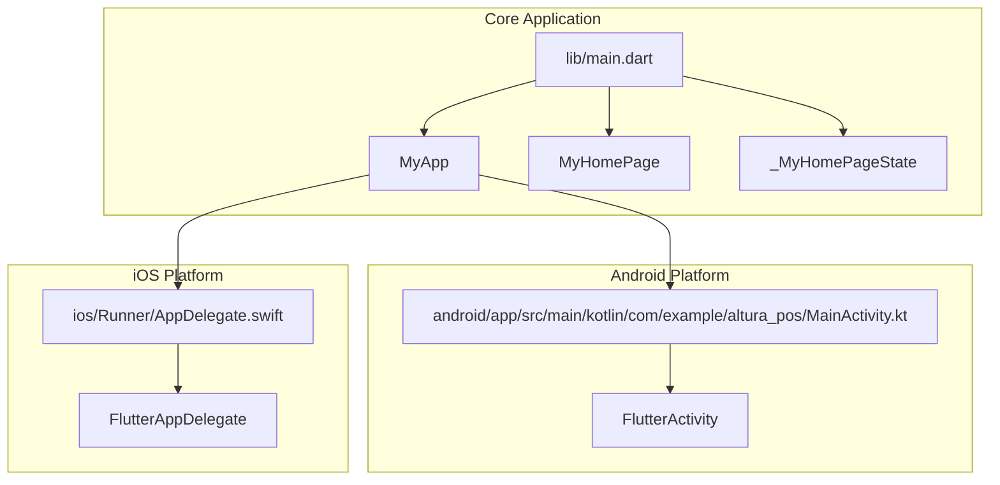
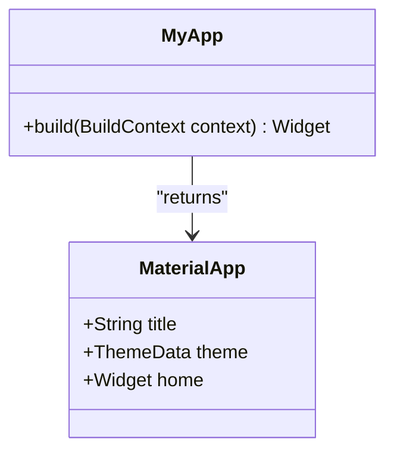
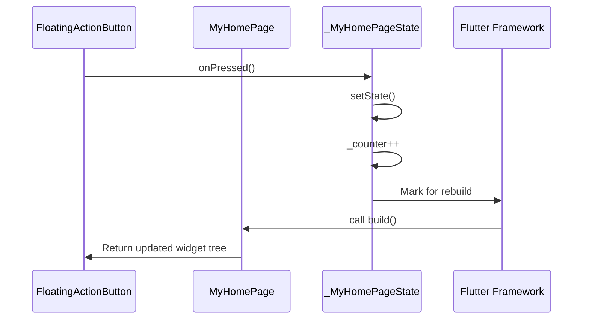
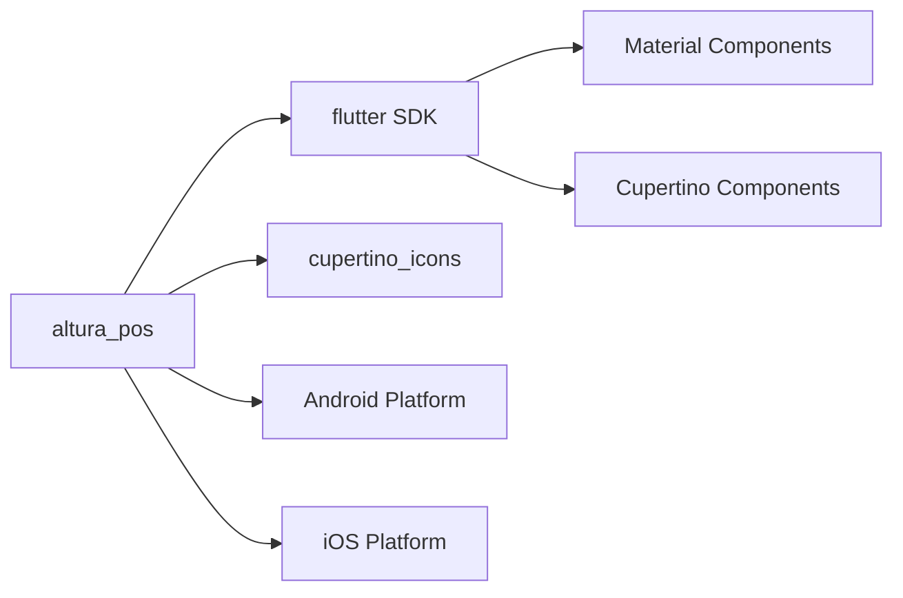

# Code Architecture

<cite>
**Referenced Files in This Document**   
- [main.dart](file://lib/main.dart)
- [MainActivity.kt](file://android/app/src/main/kotlin/com/example/altura_pos/MainActivity.kt)
- [AppDelegate.swift](file://ios/Runner/AppDelegate.swift)
- [pubspec.yaml](file://pubspec.yaml)
</cite>

## Table of Contents
1. [Introduction](#introduction)
2. [Project Structure](#project-structure)
3. [Core Components](#core-components)
4. [Architecture Overview](#architecture-overview)
5. [Detailed Component Analysis](#detailed-component-analysis)
6. [Dependency Analysis](#dependency-analysis)
7. [Performance Considerations](#performance-considerations)
8. [Troubleshooting Guide](#troubleshooting-guide)
9. [Conclusion](#conclusion)

## Introduction
The `altura_pos` application is a Flutter-based point-of-sale (POS) starter project structured around Flutter's declarative widget composition model. This document outlines the architectural design, focusing on the root widget configuration, state management patterns, and integration between Dart code and native platform components. The architecture leverages Flutter's reactive framework, Material Design principles, and platform channels for potential native interoperability. The current implementation provides a foundation that can be extended into a full-featured POS system with multiple screens, data persistence, and external integrations.

## Project Structure
The project follows standard Flutter directory conventions, organizing platform-specific code under `android/`, `ios/`, `windows/`, `macos/`, and `linux/` directories, while the core Dart logic resides in `lib/`. The `test/` directory contains widget tests, and configuration files such as `pubspec.yaml` and `analysis_options.yaml` manage dependencies and code quality rules. The web assets are located in the `web/` folder. This separation ensures cross-platform compatibility while allowing platform-specific customization when needed.



**Diagram sources**
- [main.dart](file://lib/main.dart#L6-L35)
- [MainActivity.kt](file://android/app/src/main/kotlin/com/example/altura_pos/MainActivity.kt#L1-L6)
- [AppDelegate.swift](file://ios/Runner/AppDelegate.swift#L1-L14)

**Section sources**
- [main.dart](file://lib/main.dart#L1-L122)
- [MainActivity.kt](file://android/app/src/main/kotlin/com/example/altura_pos/MainActivity.kt#L1-L6)
- [AppDelegate.swift](file://ios/Runner/AppDelegate.swift#L1-L14)

## Core Components
The core of the application is built around three primary components: `MyApp`, `MyHomePage`, and `_MyHomePageState`. `MyApp` serves as the root widget, configuring the `MaterialApp` with theme settings and setting the initial route. `MyHomePage` is a stateful widget that manages mutable UI state, specifically the counter value. `_MyHomePageState` contains the business logic for state mutation via the `_incrementCounter` method, which triggers UI updates through `setState`. This pattern exemplifies Flutter’s reactive programming model, where UI is a function of state.

**Section sources**
- [main.dart](file://lib/main.dart#L12-L122)

## Architecture Overview
The application architecture follows Flutter’s widget tree composition pattern, where the UI is constructed hierarchically from small, reusable widgets. The entry point `main()` calls `runApp()` with `MyApp`, which returns a `MaterialApp` configured with a color scheme and home screen. The `MyHomePage` widget uses a `Scaffold` to provide a Material Design layout structure, including an `AppBar`, body `Center`, and `FloatingActionButton`. State changes are managed locally within the widget using the `StatefulWidget` pattern, ensuring efficient rebuilds when `setState` is called.

```mermaid
graph TD
A[main()] --> B[runApp(MyApp)]
B --> C[MyApp builds MaterialApp]
C --> D[MaterialApp configures theme and home]
D --> E[MyHomePage StatefulWidget]
E --> F[_MyHomePageState manages counter]
F --> G[build() returns Scaffold]
G --> H[AppBar, Body, FloatingActionButton]
H --> I[UI reflects current _counter state]
```

**Diagram sources**
- [main.dart](file://lib/main.dart#L6-L35)
- [main.dart](file://lib/main.dart#L37-L53)
- [main.dart](file://lib/main.dart#L55-L121)

## Detailed Component Analysis

### MyApp Analysis
`MyApp` is a `StatelessWidget` that serves as the root of the widget tree. It configures the `MaterialApp` with a title, theme, and initial route (`home`). The theme uses `ColorScheme.fromSeed` to generate a consistent color palette from a seed color (`Colors.deepPurple`), enabling dynamic theming and supporting both light and dark modes. This approach ensures visual consistency across the app and aligns with Material Design guidelines.



**Diagram sources**
- [main.dart](file://lib/main.dart#L6-L35)

**Section sources**
- [main.dart](file://lib/main.dart#L6-L35)

### MyHomePage and State Management
`MyHomePage` is a `StatefulWidget`, indicating it holds mutable state. It delegates state management to its associated `State` object, `_MyHomePageState`. This separation allows configuration (like `title`) to remain immutable while state (like `_counter`) can change over time. The `_incrementCounter` method modifies `_counter` and calls `setState`, signaling Flutter to re-execute the `build` method and update the UI. This reactive pattern ensures the UI is always consistent with the underlying state.



**Diagram sources**
- [main.dart](file://lib/main.dart#L37-L53)
- [main.dart](file://lib/main.dart#L55-L121)

**Section sources**
- [main.dart](file://lib/main.dart#L37-L121)

## Dependency Analysis
The application has minimal external dependencies, relying primarily on the Flutter SDK and `cupertino_icons`. The `pubspec.yaml` file declares these dependencies and enables Material Design assets via `uses-material-design: true`. Platform-specific dependencies are automatically managed through Flutter’s plugin system, with `GeneratedPluginRegistrant` classes on Android and iOS handling plugin initialization. No circular dependencies or tight coupling are present, promoting maintainability and testability.



**Diagram sources**
- [pubspec.yaml](file://pubspec.yaml#L1-L89)

**Section sources**
- [pubspec.yaml](file://pubspec.yaml#L1-L89)

## Performance Considerations
The current implementation is lightweight and performs efficiently due to Flutter’s optimized rendering engine. The use of `const` constructors where possible reduces object allocation, and the reactive `setState` model ensures only necessary parts of the UI are rebuilt. For scalability, future enhancements should consider using state management solutions like Provider or Riverpod for complex state, and lazy loading for large lists. Hot reload support allows rapid iteration without losing state, improving developer productivity.

## Troubleshooting Guide
Common issues in this architecture include state not updating (often due to missing `setState`), theme inconsistencies (misconfigured `ThemeData`), or platform channel errors (if native integrations are added). Debugging can be facilitated using Flutter’s DevTools, particularly the widget inspector and performance overlays. Ensuring proper use of `const` constructors and avoiding unnecessary rebuilds will help maintain smooth UI performance.

## Conclusion
The `altura_pos` application demonstrates a clean, scalable Flutter architecture based on widget composition and reactive state management. By using `StatefulWidget` for mutable state and `MaterialApp` for consistent theming, the app adheres to Flutter best practices. The integration with native platforms is seamless through `MainActivity.kt` and `AppDelegate.swift`, which serve as entry points for Android and iOS, respectively. This foundation can be extended into a full POS system by adding navigation, data persistence (e.g., Hive or SQLite), network integration, and additional screens, all while maintaining architectural integrity.