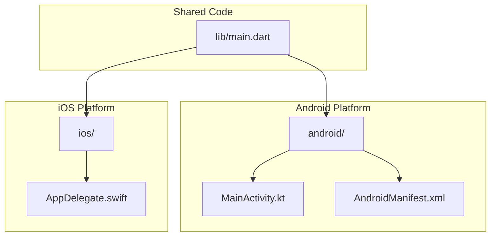
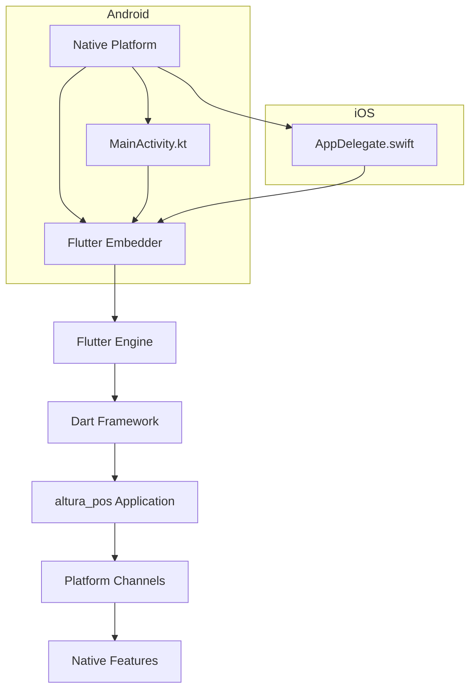
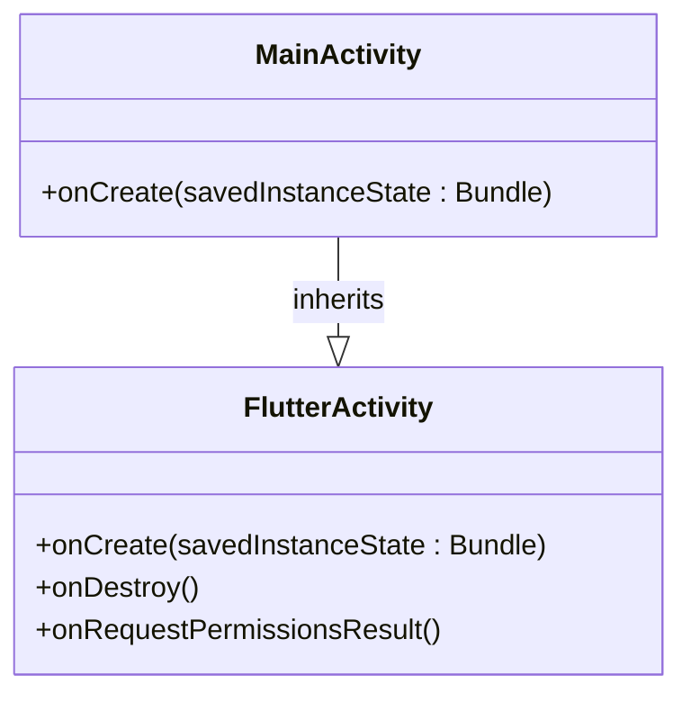
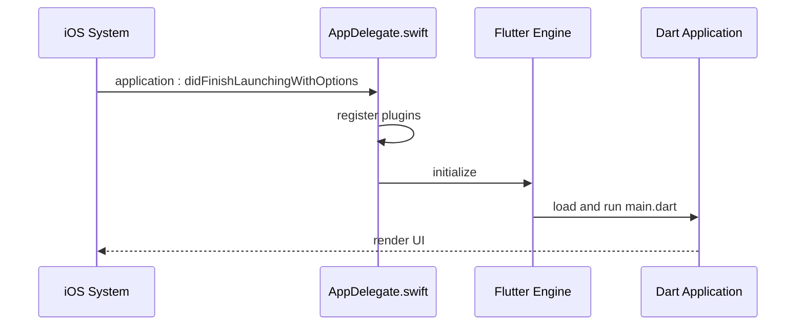
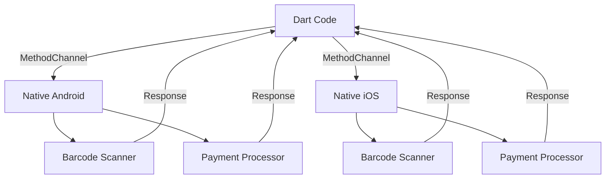
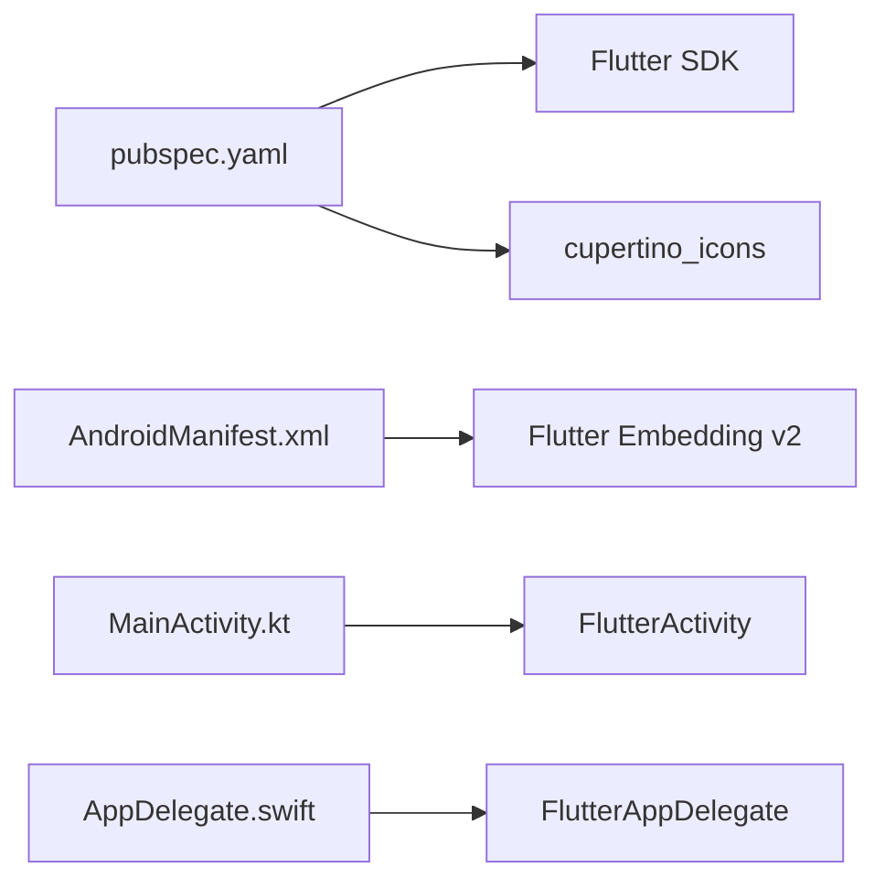

# Platform Integration

<cite>
**Referenced Files in This Document**  
- [MainActivity.kt](file://android/app/src/main/kotlin/com/example/altura_pos/MainActivity.kt)
- [AppDelegate.swift](file://ios/Runner/AppDelegate.swift)
- [main.dart](file://lib/main.dart)
- [AndroidManifest.xml](file://android/app/src/main/AndroidManifest.xml)
- [pubspec.yaml](file://pubspec.yaml)
- [README.md](file://README.md)
</cite>

## Table of Contents
1. [Introduction](#introduction)
2. [Project Structure](#project-structure)
3. [Core Components](#core-components)
4. [Architecture Overview](#architecture-overview)
5. [Detailed Component Analysis](#detailed-component-analysis)
6. [Platform Channel Considerations](#platform-channel-considerations)
7. [Dependency Analysis](#dependency-analysis)
8. [Performance Considerations](#performance-considerations)
9. [Troubleshooting Guide](#troubleshooting-guide)
10. [Conclusion](#conclusion)

## Introduction

This document provides comprehensive architectural documentation for platform integration in the `altura_pos` Flutter application. It details how the Flutter framework bridges Dart code with native Android and iOS platforms, focusing on initialization mechanisms, entry points for native execution, and potential expansion through platform channels. The analysis highlights the separation between platform-specific code and shared Dart logic, providing insights into scalability for POS-specific features such as barcode scanning and payment processing.

## Project Structure

The `altura_pos` application follows the standard Flutter project structure with clearly separated platform-specific directories (`android/`, `ios/`) and shared Dart code in the `lib/` directory. The core application logic resides in Dart files, while native platform integration is handled through Kotlin (Android) and Swift (iOS) entry points. Configuration files like `pubspec.yaml` manage dependencies and assets, while platform manifests handle native application settings.

**Diagram sources**  
- [main.dart](file://lib/main.dart)
- [MainActivity.kt](file://android/app/src/main/kotlin/com/example/altura_pos/MainActivity.kt)
- [AppDelegate.swift](file://ios/Runner/AppDelegate.swift)
- [AndroidManifest.xml](file://android/app/src/main/AndroidManifest.xml)

**Section sources**  
- [main.dart](file://lib/main.dart)
- [android/](file://android/)
- [ios/](file://ios/)

## Core Components

The core components of the platform integration architecture include the Android `MainActivity.kt`, iOS `AppDelegate.swift`, and the central `main.dart` file. These components serve as entry points for their respective platforms and coordinate the initialization of the Flutter engine and application lifecycle. The current implementation shows a clean separation between platform-specific initialization code and shared business logic written in Dart.

**Section sources**  
- [MainActivity.kt](file://android/app/src/main/kotlin/com/example/altura_pos/MainActivity.kt)
- [AppDelegate.swift](file://ios/Runner/AppDelegate.swift)
- [main.dart](file://lib/main.dart)

## Architecture Overview

The Flutter architecture in `altura_pos` follows a layered approach where the Dart application runs within a Flutter engine embedded in native containers on both Android and iOS. The engine acts as a bridge between the high-level Dart framework and low-level platform capabilities. Platform-specific entry points initialize the Flutter runtime, which then loads and executes the shared Dart codebase.

**Diagram sources**  
- [MainActivity.kt](file://android/app/src/main/kotlin/com/example/altura_pos/MainActivity.kt)
- [AppDelegate.swift](file://ios/Runner/AppDelegate.swift)
- [main.dart](file://lib/main.dart)

## Detailed Component Analysis

### Android Platform Integration

The Android integration is centered around `MainActivity.kt`, which extends `FlutterActivity`. This inheritance provides the necessary infrastructure to host the Flutter application within an Android Activity. The `MainActivity` serves as the entry point for the Android platform, responsible for initializing the Flutter engine and setting up the display surface for the Flutter UI.

**Diagram sources**  
- [MainActivity.kt](file://android/app/src/main/kotlin/com/example/altura_pos/MainActivity.kt)

**Section sources**  
- [MainActivity.kt](file://android/app/src/main/kotlin/com/example/altura_pos/MainActivity.kt)
- [AndroidManifest.xml](file://android/app/src/main/AndroidManifest.xml)

### iOS Platform Integration

On iOS, the `AppDelegate.swift` file implements the `FlutterAppDelegate` protocol, serving as the application delegate that manages the app lifecycle. The `application(_:didFinishLaunchingWithOptions:)` method is the primary entry point where the Flutter engine is initialized and configured. This method calls `GeneratedPluginRegistrant.register(with: self)` to ensure any registered plugins are properly connected to the Flutter engine.

**Diagram sources**  
- [AppDelegate.swift](file://ios/Runner/AppDelegate.swift)

**Section sources**  
- [AppDelegate.swift](file://ios/Runner/AppDelegate.swift)

### Dart Application Entry Point

The `main.dart` file contains the primary Dart entry point for the application. The `main()` function calls `runApp()` with the root widget (`MyApp`), which bootstraps the Flutter framework and begins rendering the UI. This shared codebase is executed identically on both platforms, ensuring consistent behavior across Android and iOS devices.

**Section sources**  
- [main.dart](file://lib/main.dart)

## Platform Channel Considerations

Although no explicit platform channel implementations are currently present in the codebase, the architecture is prepared for future integration of POS-specific functionality. Platform channels would enable communication between the Dart code and native platform features such as barcode scanners, payment terminals, and receipt printers. The current setup with proper plugin registrants in both Android and iOS manifests indicates readiness for plugin integration.

For future implementation, MethodChannels could be used to invoke native barcode scanning APIs or process payment transactions, while EventChannels could stream data from connected POS hardware. This approach maintains the separation of concerns while allowing access to platform-specific capabilities.

**Diagram sources**  
- [MainActivity.kt](file://android/app/src/main/kotlin/com/example/altura_pos/MainActivity.kt)
- [AppDelegate.swift](file://ios/Runner/AppDelegate.swift)

## Dependency Analysis

The dependency structure shows minimal direct dependencies between platform-specific code and the shared Dart application. The `pubspec.yaml` file defines only core Flutter dependencies, indicating a clean base without third-party packages. This simplicity enhances maintainability and reduces potential compatibility issues when adding platform-specific features in the future.

The AndroidManifest.xml includes necessary metadata for Flutter embedding (version 2), confirming the use of the modern Flutter embedding API. The absence of additional permissions or queries beyond the default Flutter requirements suggests a focus on core functionality, with room for expansion as POS features are implemented.

**Diagram sources**  
- [pubspec.yaml](file://pubspec.yaml)
- [AndroidManifest.xml](file://android/app/src/main/AndroidManifest.xml)
- [MainActivity.kt](file://android/app/src/main/kotlin/com/example/altura_pos/MainActivity.kt)
- [AppDelegate.swift](file://ios/Runner/AppDelegate.swift)

**Section sources**  
- [pubspec.yaml](file://pubspec.yaml)
- [AndroidManifest.xml](file://android/app/src/main/AndroidManifest.xml)

## Performance Considerations

The current architecture demonstrates good performance practices by leveraging Flutter's compiled Dart code for the UI layer while maintaining lightweight native entry points. The separation of platform-specific initialization from shared business logic ensures that most application code benefits from Flutter's high-performance rendering engine. Future additions of platform channels should be designed with asynchronous communication patterns to prevent blocking the UI thread during native operations.

## Troubleshooting Guide

When integrating platform-specific features, common issues may arise from incorrect plugin registration or mismatched channel names between Dart and native code. Ensure that any new native functionality follows the existing patterns established in `MainActivity.kt` and `AppDelegate.swift`. Verify that the `flutterEmbedding` meta-data tag remains present in AndroidManifest.xml when adding new features.

**Section sources**  
- [MainActivity.kt](file://android/app/src/main/kotlin/com/example/altura_pos/MainActivity.kt)
- [AppDelegate.swift](file://ios/Runner/AppDelegate.swift)
- [AndroidManifest.xml](file://android/app/src/main/AndroidManifest.xml)

## Conclusion

The `altura_pos` application demonstrates a well-structured Flutter architecture with clear separation between platform-specific code and shared Dart logic. The current implementation provides a solid foundation for expanding POS functionality through platform channels. By maintaining the existing architectural patterns, developers can seamlessly integrate features like barcode scanning and payment processing while preserving cross-platform consistency and performance.

The initialization mechanisms on both Android (`MainActivity.kt`) and iOS (`AppDelegate.swift`) follow Flutter best practices, ensuring reliable startup and proper engine configuration. As the application evolves, this architecture will support scalable addition of native features without compromising the benefits of cross-platform development.