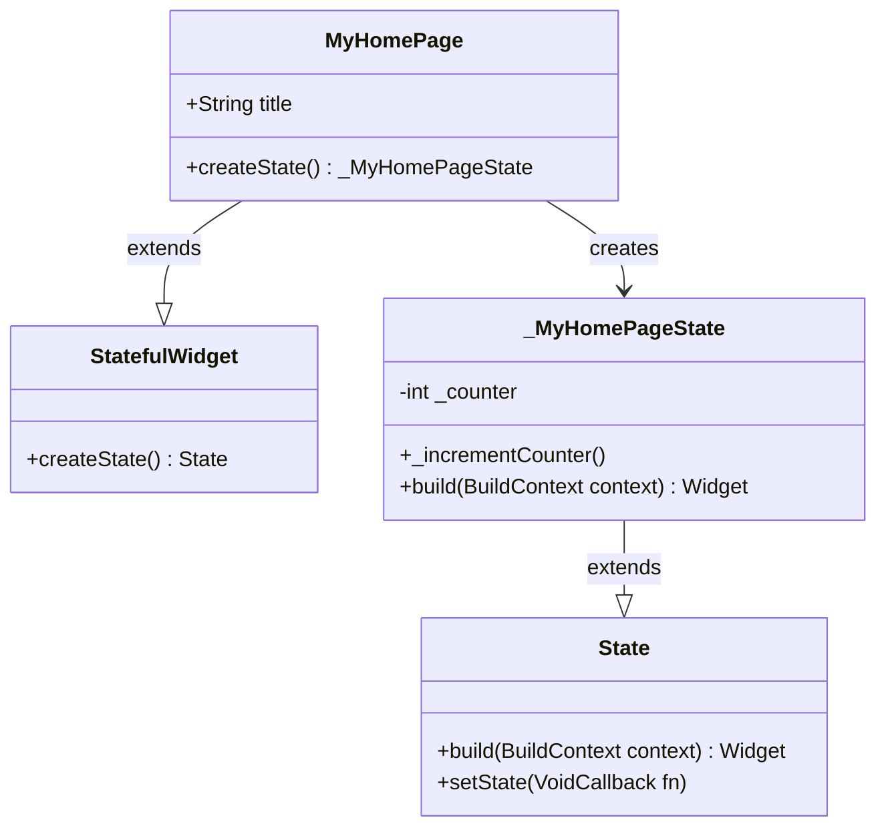
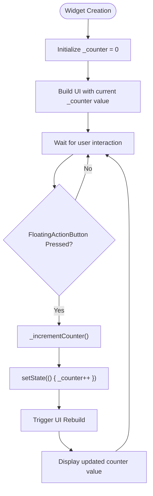
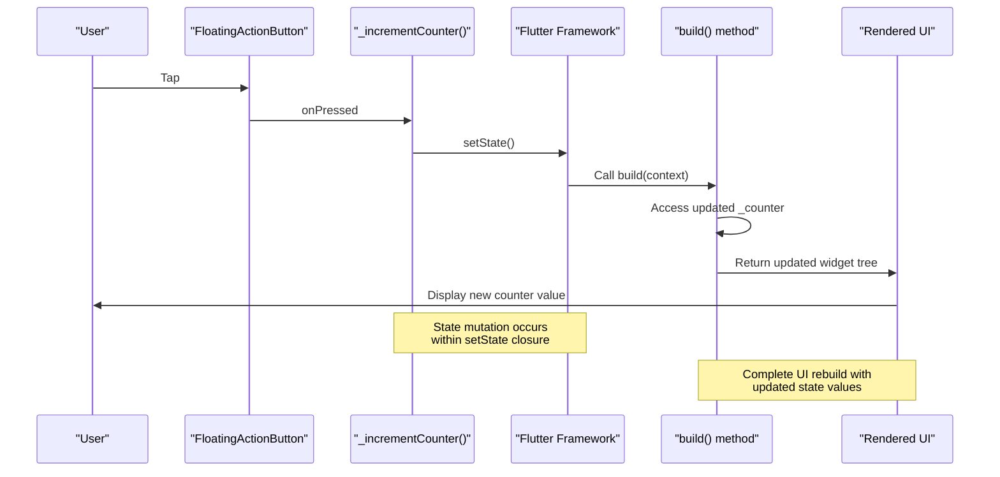
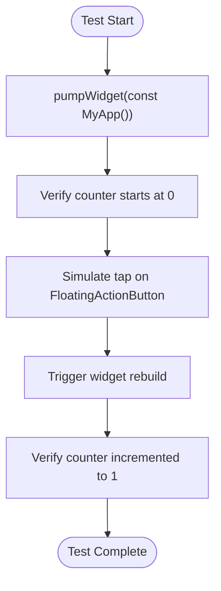

# State Management

<cite>
**Referenced Files in This Document**   
- [main.dart](file://lib/main.dart)
- [widget_test.dart](file://test/widget_test.dart)
</cite>

## Table of Contents
1. [Introduction](#introduction)
2. [Stateful vs Stateless Widgets](#stateful-vs-stateless-widgets)
3. [Core State Management Implementation](#core-state-management-implementation)
4. [setState Mechanism and UI Rebuilds](#setstate-mechanism-and-ui-rebuilds)
5. [State Persistence: Hot Reload vs Hot Restart](#state-persistence-hot-reload-vs-hot-restart)
6. [Performance Implications](#performance-implications)
7. [Best Practices for Local State Management](#best-practices-for-local-state-management)
8. [Scaling State Management](#scaling-state-management)
9. [Testing State Management](#testing-state-management)
10. [Conclusion](#conclusion)

## Introduction

This document provides a comprehensive analysis of the state management implementation in the altura_pos application using Flutter's StatefulWidget pattern. The focus is on the `_MyHomePageState` class as the state object managing the `_counter` variable, demonstrating how `setState()` triggers UI rebuilds and ensures reactive updates to the displayed counter value. The document explains the rationale behind choosing StatefulWidget for MyHomePage, addresses state persistence behavior during development, and provides guidance on when to use this pattern versus more advanced state management solutions as the POS system scales.

**Section sources**
- [main.dart](file://lib/main.dart#L1-L122)

## Stateful vs Stateless Widgets

In Flutter, widgets are categorized as either stateless or stateful based on whether they maintain mutable state. Stateless widgets are immutable and their properties cannot change after creation, while stateful widgets maintain state that can change over time and trigger UI updates.

The MyHomePage widget is implemented as a StatefulWidget because it needs to manage dynamic data (the counter value) that changes in response to user interactions. This choice allows the widget to maintain its internal state across rebuilds and provide a reactive user interface. The separation between the StatefulWidget (MyHomePage) and its State object (_MyHomePageState) follows Flutter's design pattern where the widget class holds configuration data while the state class manages mutable state and business logic.

**Diagram sources**
- [main.dart](file://lib/main.dart#L31-L55)

**Section sources**
- [main.dart](file://lib/main.dart#L31-L55)

## Core State Management Implementation

The core state management in the altura_pos app centers around the `_MyHomePageState` class which manages the `_counter` variable as its primary state. This implementation demonstrates Flutter's local state management pattern where state is contained within a specific widget and its descendants.

The `_counter` variable is declared as a private instance field within `_MyHomePageState`, making it accessible only to methods within the state class. This encapsulation ensures that state modifications occur through controlled methods rather than direct manipulation. The `_incrementCounter` method serves as the sole interface for modifying the counter value, following the principle of providing controlled access to state changes.

**Diagram sources**
- [main.dart](file://lib/main.dart#L55-L94)

**Section sources**
- [main.dart](file://lib/main.dart#L55-L94)

## setState Mechanism and UI Rebuilds

The `setState()` method is the core mechanism that enables reactive UI updates in Flutter's StatefulWidget pattern. When `_incrementCounter` calls `setState()`, it notifies the Flutter framework that the state has changed, triggering a rebuild of the widget's `build()` method.

This implementation ensures that any changes to the `_counter` variable are properly synchronized with the UI display. The closure passed to `setState()` contains the state mutation logic (`_counter++`), and the framework guarantees that this mutation and the subsequent UI rebuild occur atomically. Without calling `setState()`, changes to `_counter` would not trigger UI updates, leaving the display out of sync with the actual state.

The rebuild process is optimized by Flutter's framework, which efficiently compares the previous and new widget trees to determine the minimal set of changes needed in the underlying render tree. This optimization allows developers to rebuild entire widget subtrees without significant performance penalties, promoting a declarative programming style.

**Diagram sources**
- [main.dart](file://lib/main.dart#L65-L94)
- [main.dart](file://lib/main.dart#L93-L121)

**Section sources**
- [main.dart](file://lib/main.dart#L65-L121)

## State Persistence: Hot Reload vs Hot Restart

The altura_pos application demonstrates important differences between hot reload and hot restart in Flutter development. As noted in the code comments, the counter state persists during hot reload but resets during hot restart.

Hot reload preserves the application state by injecting updated code into the running Dart VM without destroying existing objects. This means that the `_counter` variable retains its current value across code changes, allowing developers to continue testing from their current state. This behavior is particularly useful for UI development and debugging, as it maintains the application's context.

In contrast, hot restart completely rebuilds the application by destroying and recreating all objects, including the state objects. This resets the `_counter` to its initial value of 0, simulating a fresh application launch. Developers should understand this distinction when testing state-dependent functionality, using hot reload for iterative UI improvements and hot restart for testing initial state and startup behavior.

**Section sources**
- [main.dart](file://lib/main.dart#L15-L25)

## Performance Implications

While the StatefulWidget pattern with `setState()` provides a simple and effective approach to state management, it has important performance considerations. Each call to `setState()` triggers a rebuild of the entire widget subtree returned by the `build()` method, regardless of whether all widgets in that subtree actually need updating.

In the current implementation, the entire home page UI rebuilds when the counter increments, including the AppBar, body content, and FloatingActionButton. For simple interfaces like this counter example, the performance impact is negligible due to Flutter's optimized rendering pipeline. However, as the POS system grows in complexity, unnecessary rebuilds could lead to performance degradation.

To mitigate this, Flutter's widget composition model allows developers to extract frequently changing parts of the UI into separate stateful widgets. This way, only the specific widget displaying the counter would need to rebuild, while the rest of the interface remains unchanged. This approach leverages Flutter's fine-grained rebuild mechanism to optimize performance.

**Section sources**
- [main.dart](file://lib/main.dart#L70-L94)

## Best Practices for Local State Management

The implementation in altura_pos follows several best practices for effective local state management in Flutter:

1. **Encapsulation**: State is kept private within the state class using underscore prefix (`_counter`)
2. **Controlled mutations**: State changes occur through dedicated methods (`_incrementCounter`) rather than direct access
3. **Atomic updates**: All state modifications occur within `setState()` calls to ensure proper UI synchronization
4. **Separation of concerns**: The StatefulWidget handles configuration while the State class manages mutable data

Additional best practices include minimizing the scope of `setState()` calls by extracting frequently changing UI elements into their own widgets, avoiding complex logic within `setState()` closures, and using const constructors where possible to reduce rebuild overhead.

**Section sources**
- [main.dart](file://lib/main.dart#L55-L94)

## Scaling State Management

As the POS system grows with multiple screens and shared state, the simple StatefulWidget pattern may become insufficient. While effective for local state, this approach doesn't easily support state sharing between unrelated widgets or across different parts of the application.

For scaling, consider the following progression:
1. **Local state**: Continue using StatefulWidget for screen-specific state
2. **Inherited widgets**: Use InheritedWidget or Provider for state that needs to be shared down the widget tree
3. **State management packages**: Implement solutions like Riverpod, Bloc, or MobX for complex state that needs to be accessed across multiple screens
4. **State persistence**: Add local storage solutions for critical POS data that must survive app restarts

The current implementation provides a solid foundation that can be extended by extracting the counter logic into a separate service class that could later be integrated with more sophisticated state management solutions.

**Section sources**
- [main.dart](file://lib/main.dart#L31-L122)

## Testing State Management

The widget_test.dart file demonstrates proper testing practices for state management in Flutter. The test verifies that the counter increments correctly when the FloatingActionButton is tapped, ensuring that both the state mutation and UI update occur as expected.

The test uses Flutter's testing framework to simulate user interaction (tapping the increment button) and verify the resulting state changes (counter value update). This approach validates not only that the `_incrementCounter` method works but also that `setState()` properly triggers UI rebuilds to reflect the new state.

**Diagram sources**
- [widget_test.dart](file://test/widget_test.dart#L10-L30)

**Section sources**
- [widget_test.dart](file://test/widget_test.dart#L10-L30)

## Conclusion

The altura_pos application effectively demonstrates Flutter's StatefulWidget pattern for local state management. The implementation of `_MyHomePageState` managing the `_counter` variable through `setState()` provides a clear example of reactive UI updates in Flutter. This approach is appropriate for screen-specific state and offers a simple, intuitive way to manage dynamic data.

As the POS system evolves, developers should consider the limitations of this pattern for shared or global state, potentially incorporating more advanced state management solutions. However, for many use cases, especially those involving localized state changes, the StatefulWidget pattern with `setState()` remains an excellent choice due to its simplicity, predictability, and tight integration with Flutter's rendering pipeline.

The distinction between hot reload and hot restart behavior, as documented in the code, highlights important development considerations for maintaining state during the development process. By following best practices for state encapsulation and controlled mutations, the current implementation provides a solid foundation that can be extended as the application's requirements grow.

**Section sources**
- [main.dart](file://lib/main.dart#L1-L122)
- [widget_test.dart](file://test/widget_test.dart#L1-L30)