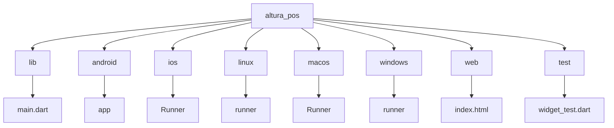
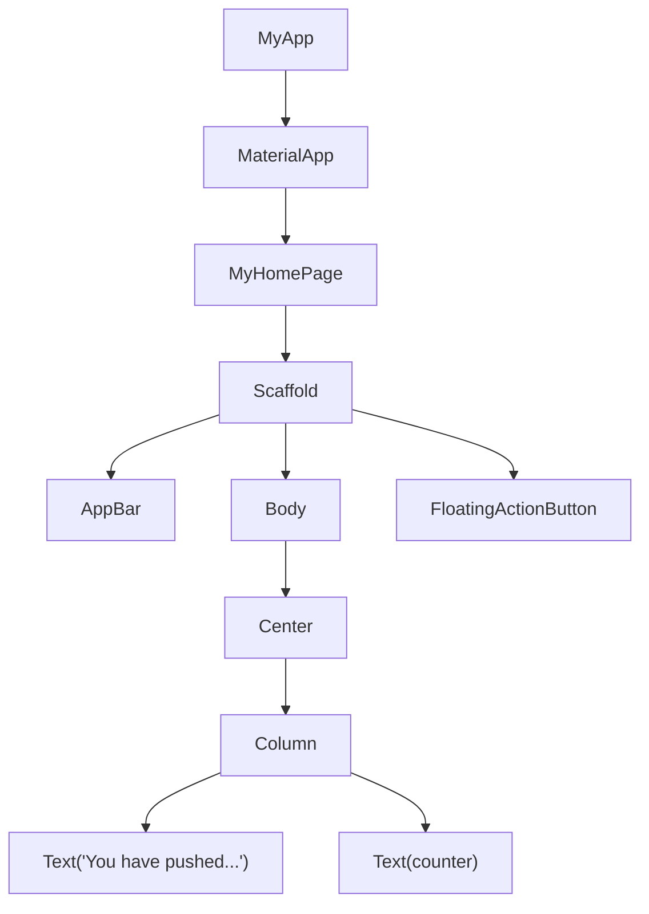
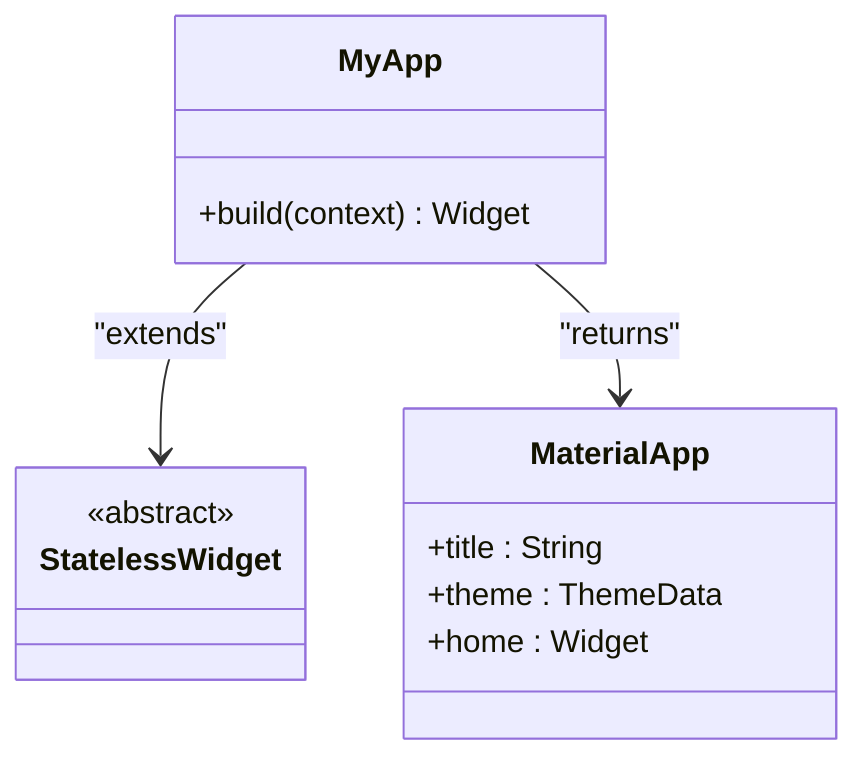
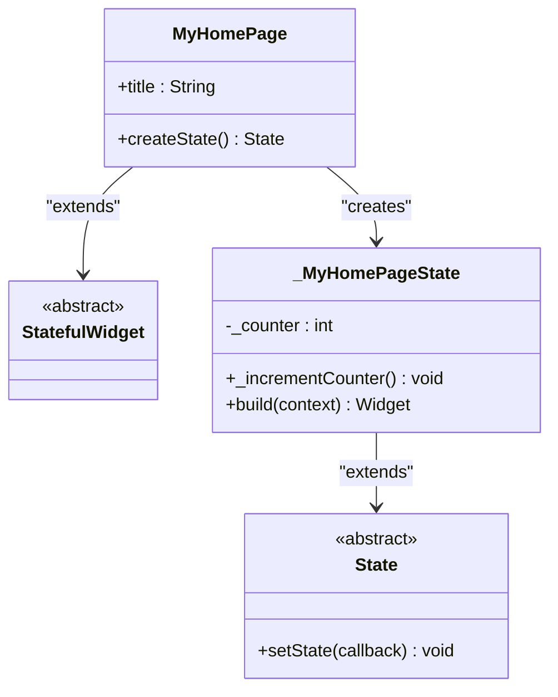
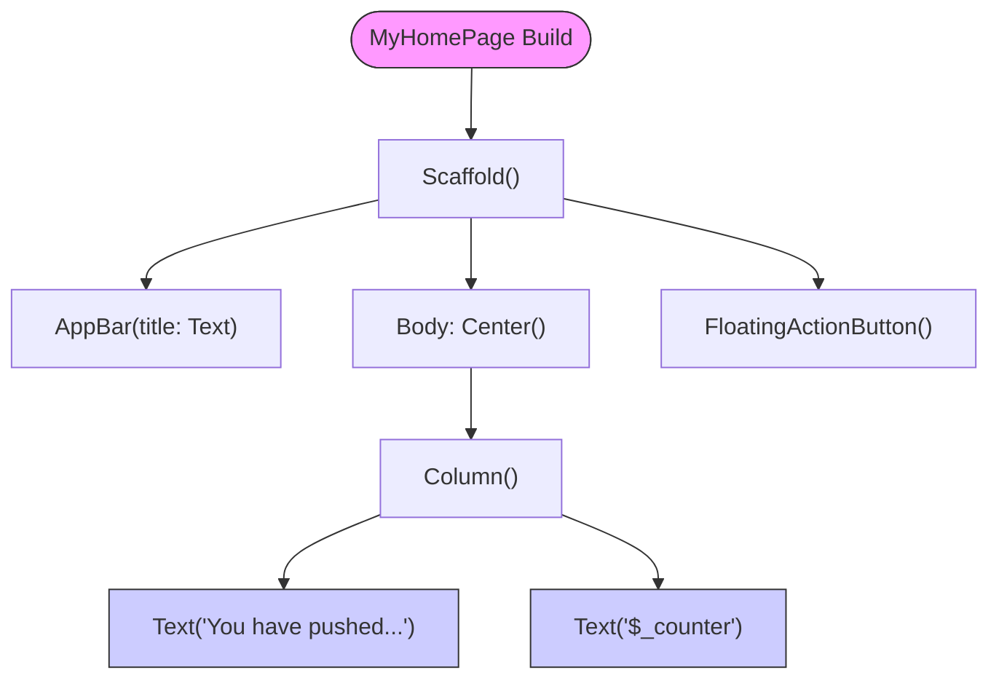

# Widget Hierarchy

<cite>
**Referenced Files in This Document**   
- [main.dart](file://lib/main.dart)
- [README.md](file://README.md)
</cite>

## Table of Contents
1. [Introduction](#introduction)
2. [Project Structure](#project-structure)
3. [Core Components](#core-components)
4. [Architecture Overview](#architecture-overview)
5. [Detailed Component Analysis](#detailed-component-analysis)
6. [Dependency Analysis](#dependency-analysis)
7. [Performance Considerations](#performance-considerations)
8. [Troubleshooting Guide](#troubleshooting-guide)
9. [Conclusion](#conclusion)

## Introduction
This document provides comprehensive architectural documentation for the widget hierarchy in the altura_pos Flutter application. It details the parent-child relationships starting from the root widget MyApp, which serves as the entry point for the application. The documentation explains how MyApp configures the MaterialApp widget and establishes the global theme using ColorScheme.fromSeed. It further describes how MyApp renders MyHomePage as the home screen, passing configuration data through constructor parameters. The composition of MyHomePage's user interface is analyzed, focusing on the use of fundamental Flutter widgets such as Scaffold, AppBar, Center, Column, Text, and FloatingActionButton. This document also illustrates how layout widgets structure the UI and how stateful widgets maintain dynamic data, providing insights into effective Flutter application architecture.

## Project Structure
The altura_pos application follows the standard Flutter project structure with a clear separation of concerns. The core functionality resides in the lib/ directory, which contains the main.dart file housing the application's widget hierarchy. Platform-specific configurations are organized in android/, ios/, linux/, macos/, windows/, and web/ directories, each containing necessary native code and resources. The test/ directory contains widget_test.dart for UI testing, while configuration files like pubspec.yaml and analysis_options.yaml are located at the root level. This structure enables cross-platform development while maintaining platform-specific customizations when needed.

**Diagram sources**
- [main.dart](file://lib/main.dart)
- [README.md](file://README.md)

**Section sources**
- [main.dart](file://lib/main.dart)
- [README.md](file://README.md)

## Core Components
The core components of the altura_pos application consist of MyApp and MyHomePage widgets that form the foundation of the widget tree. MyApp serves as the root widget that bootstraps the Flutter application by calling runApp() and provides the top-level configuration for MaterialApp, including the application title and global theme. MyHomePage acts as the home screen widget that displays the primary user interface and manages dynamic state through its StatefulWidget implementation. These components demonstrate the fundamental Flutter pattern of separating configuration (MyApp) from interactive UI (MyHomePage), enabling modular and maintainable code organization.

**Section sources**
- [main.dart](file://lib/main.dart#L1-L122)

## Architecture Overview
The widget architecture of the altura_pos application follows a hierarchical composition pattern typical of Flutter applications. At the root level, MyApp extends StatelessWidget and serves as the application container, configuring the MaterialApp with global theming and setting MyHomePage as the initial screen. MyHomePage extends StatefulWidget, indicating it maintains mutable state that can change over time. The widget tree flows from MyApp to MyHomePage, which in turn composes various layout and presentation widgets to create the complete user interface. This architecture leverages Flutter's declarative UI approach, where the interface is described as a tree of widgets that respond to state changes by rebuilding.

**Diagram sources**
- [main.dart](file://lib/main.dart#L1-L122)

## Detailed Component Analysis

### MyApp Analysis
MyApp represents the root widget of the altura_pos application and extends StatelessWidget, indicating it does not maintain mutable state. It serves as the entry point that configures the MaterialApp widget with essential application-wide settings. The build method returns a MaterialApp instance that establishes the application title and defines the global theme using ColorScheme.fromSeed with a deep purple seed color. This approach enables consistent theming across the entire application while allowing for easy theme modifications. MyApp also specifies MyHomePage as the home screen through the home parameter, establishing the initial route of the application.

**Diagram sources**
- [main.dart](file://lib/main.dart#L14-L30)

**Section sources**
- [main.dart](file://lib/main.dart#L14-L30)

### MyHomePage Analysis
MyHomePage represents the primary screen of the application and extends StatefulWidget, indicating it maintains mutable state that can change during the application's lifecycle. It receives a title parameter through its constructor, demonstrating how data is passed from parent to child widgets in Flutter. The widget creates a corresponding State object (_MyHomePageState) that holds the mutable counter state and provides the _incrementCounter method to modify this state. This separation between the widget configuration (MyHomePage) and its mutable state (_MyHomePageState) is a fundamental Flutter pattern that enables efficient state management and UI updates.

**Diagram sources**
- [main.dart](file://lib/main.dart#L32-L70)

**Section sources**
- [main.dart](file://lib/main.dart#L32-L70)

### UI Composition Analysis
The user interface of MyHomePage is composed using a hierarchy of layout and presentation widgets that demonstrate Flutter's compositional approach to UI design. The Scaffold widget provides the basic material design visual structure, including slots for AppBar, body content, and FloatingActionButton. The AppBar displays the title passed from MyApp, showing how data flows down the widget tree. The body content is structured using Center and Column layout widgets, which position their children in the center of the screen and arrange them vertically, respectively. This nested composition of layout widgets enables precise control over the UI structure while maintaining readability and maintainability.

**Diagram sources**
- [main.dart](file://lib/main.dart#L71-L122)

**Section sources**
- [main.dart](file://lib/main.dart#L71-L122)

## Dependency Analysis
The widget hierarchy in the altura_pos application demonstrates a clear dependency structure where higher-level widgets compose and configure lower-level widgets. MyApp depends on MaterialApp for application-level configuration and on MyHomePage as the initial screen. MyHomePage depends on various Flutter material design widgets including Scaffold, AppBar, Center, Column, Text, and FloatingActionButton. These dependencies are managed through composition rather than inheritance, allowing for flexible and reusable UI components. The application does not have external package dependencies beyond the core Flutter framework, as evidenced by the minimal pubspec.yaml configuration, resulting in a lightweight and focused dependency graph.

**Diagram sources**
- [main.dart](file://lib/main.dart)

**Section sources**
- [main.dart](file://lib/main.dart)
- [pubspec.yaml](file://pubspec.yaml)

## Performance Considerations
The widget hierarchy in altura_pos follows several Flutter performance best practices. The separation of MyApp as a StatelessWidget and MyHomePage as a StatefulWidget ensures that only the components with mutable state are rebuilt when state changes occur. The use of const constructors for immutable widgets (const MyApp, const MyHomePage, const Icon, etc.) enables compile-time optimizations and reduces runtime overhead. The state management is localized to the _MyHomePageState class, minimizing the scope of rebuilds when setState is called. Layout widgets like Center and Column are used appropriately to structure the UI without unnecessary nesting that could impact performance. The application leverages Flutter's efficient rendering pipeline by rebuilding only the Text widget that displays the counter value, while other UI elements remain unchanged.

**Section sources**
- [main.dart](file://lib/main.dart)

## Troubleshooting Guide
When working with the widget hierarchy in altura_pos, several common issues may arise. If the application fails to start, verify that MyApp is properly configured as the root widget in the main() function. If the theme is not applying correctly, check that ColorScheme.fromSeed is properly configured with the desired seedColor. For state management issues where the counter does not update, ensure that setState is being called within the _incrementCounter method and that the widget tree is properly rebuilding. If layout issues occur, use Flutter's debug painting feature (activated by pressing 'p' in the console) to visualize the boundaries of each widget and diagnose alignment or sizing problems. When modifying the widget tree, remember that hot reload preserves application state, while hot restart resets it, which can affect testing of initialization logic.

**Section sources**
- [main.dart](file://lib/main.dart)
- [README.md](file://README.md)

## Conclusion
The widget hierarchy in the altura_pos application exemplifies fundamental Flutter architectural patterns and best practices. By starting with MyApp as the root StatelessWidget that configures MaterialApp and sets the global theme, the application establishes a solid foundation for consistent UI behavior. The composition of MyHomePage as a StatefulWidget demonstrates effective state management, with clear separation between configuration and mutable state. The use of layout widgets like Scaffold, Center, and Column enables structured and responsive UI design, while the FloatingActionButton provides interactive functionality. This architecture showcases Flutter's strength in creating modular, reusable, and maintainable UI components through widget composition. The application serves as an excellent reference implementation for understanding Flutter's widget-based approach to UI development and provides a scalable foundation for future feature additions.