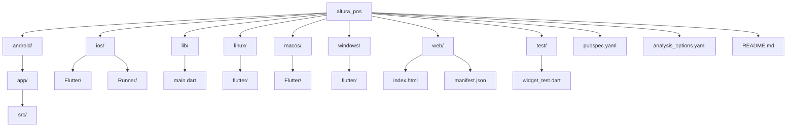

# Codebase Structure

<cite>
**Referenced Files in This Document**   
- [main.dart](file://lib/main.dart)
- [pubspec.yaml](file://pubspec.yaml)
- [analysis_options.yaml](file://analysis_options.yaml)
- [MainActivity.kt](file://android/app/src/main/kotlin/com/example/altura_pos/MainActivity.kt)
- [Runner-Bridging-Header.h](file://ios/Runner/Runner-Bridging-Header.h)
- [manifest.json](file://web/manifest.json)
- [GeneratedPluginRegistrant.java](file://android/app/src/main/java/io/flutter/plugins/GeneratedPluginRegistrant.java)
- [GeneratedPluginRegistrant.h](file://ios/Flutter/ephemeral/GeneratedPluginRegistrant.h)
- [CMakeLists.txt](file://windows/flutter/CMakeLists.txt)
</cite>

## Table of Contents
1. [Introduction](#introduction)
2. [Directory Layout Overview](#directory-layout-overview)
3. [Core Source Directory (lib/)](#core-source-directory-lib)
4. [Platform-Specific Directories](#platform-specific-directories)
   - [android/](#android)
   - [ios/](#ios)
   - [windows/, linux/, macos/](#windows-linux-macos)
   - [web/](#web)
5. [Testing Directory (test/)](#testing-directory-test)
6. [Critical Configuration Files](#critical-configuration-files)
   - [pubspec.yaml](#pubspecyaml)
   - [analysis_options.yaml](#analysis_optionsyaml)
7. [Application Entry Point (main.dart)](#application-entry-point-maindart)
8. [Platform Integration and Plugin Registration](#platform-integration-and-plugin-registration)
9. [Asset and Font Management](#asset-and-font-management)
10. [Best Practices for Extending the Codebase](#best-practices-for-extending-the-codebase)

## Introduction
This document provides a comprehensive overview of the directory layout and key files in the `altura_pos` Flutter codebase. It explains the purpose of each top-level directory and critical configuration files, illustrating how Flutter organizes multi-platform applications. The analysis includes guidance on where to add new features, assets, and fonts according to Flutter conventions, and how configuration affects application behavior.

## Directory Layout Overview
The `altura_pos` project follows the standard Flutter project structure, designed to support development across multiple platforms including mobile (Android and iOS), desktop (Windows, Linux, macOS), and web. This organization enables a shared codebase in `lib/` while providing dedicated directories for platform-specific code and assets.

**Diagram sources**
- [android/app/src/main/kotlin/com/example/altura_pos/MainActivity.kt](file://android/app/src/main/kotlin/com/example/altura_pos/MainActivity.kt)
- [ios/Runner/Runner-Bridging-Header.h](file://ios/Runner/Runner-Bridging-Header.h)
- [lib/main.dart](file://lib/main.dart)
- [web/manifest.json](file://web/manifest.json)

**Section sources**
- [android/](file://android/)
- [ios/](file://ios/)
- [lib/](file://lib/)
- [windows/](file://windows/)
- [linux/](file://linux/)
- [macos/](file://macos/)
- [web/](file://web/)
- [test/](file://test/)

## Core Source Directory (lib/)
The `lib/` directory contains the core Dart logic of the application, which is shared across all platforms. This is where the primary business logic, UI components, and state management reside. The entry point of the application is `main.dart`, which defines the root widget and initializes the Flutter framework.

**Section sources**
- [lib/main.dart](file://lib/main.dart)

## Platform-Specific Directories

### android/
The `android/` directory contains native Android code and configuration files necessary for building and running the application on Android devices. It includes:
- `MainActivity.kt`: The main activity class that extends `FlutterActivity`, serving as the entry point for the Android application.
- `AndroidManifest.xml`: Configuration files in debug, main, and profile directories that define app permissions, activities, and metadata.
- Gradle build scripts (`build.gradle.kts`, `settings.gradle.kts`) for managing dependencies and build configurations.

The directory also contains resources such as `styles.xml` and `launch_background.xml` for customizing the app's appearance during launch.

**Section sources**
- [android/app/src/main/kotlin/com/example/altura_pos/MainActivity.kt](file://android/app/src/main/kotlin/com/example/altura_pos/MainActivity.kt)
- [android/app/src/main/AndroidManifest.xml](file://android/app/src/main/AndroidManifest.xml)

### ios/
The `ios/` directory holds the native iOS code and assets required for running the application on Apple devices. Key components include:
- `Runner` project with `AppDelegate.swift` and `SceneDelegate.swift` (not shown but standard in Flutter iOS setup).
- `Assets.xcassets` for managing app icons and launch images.
- `Runner-Bridging-Header.h`: Enables interoperability between Swift/Objective-C and Flutter plugins.
- Generated plugin registrants (`GeneratedPluginRegistrant.h` and `.m`) that connect Flutter plugins with native iOS code.

**Section sources**
- [ios/Runner/Runner-Bridging-Header.h](file://ios/Runner/Runner-Bridging-Header.h)
- [ios/Flutter/ephemeral/GeneratedPluginRegistrant.h](file://ios/Flutter/ephemeral/GeneratedPluginRegistrant.h)

### windows/, linux/, macos/
These directories support desktop platforms, each containing platform-specific native code and build configurations:
- `flutter/` subdirectory with auto-generated plugin registrants (`generated_plugin_registrant.cc`, `.h`) that link Flutter plugins to native desktop code.
- `runner/` directory with application entry points (`main.cc`, `main.cpp`) and window management classes.
- `CMakeLists.txt` files for configuring the build process using CMake.

The structure is consistent across Windows, Linux, and macOS, enabling cross-platform desktop support with minimal platform-specific code.

**Section sources**
- [windows/flutter/generated_plugin_registrant.cc](file://windows/flutter/generated_plugin_registrant.cc)
- [windows/runner/main.cpp](file://windows/runner/main.cpp)
- [linux/flutter/CMakeLists.txt](file://linux/flutter/CMakeLists.txt)

### web/
The `web/` directory contains assets specific to the web platform:
- `index.html`: The main HTML file that hosts the Flutter application.
- `manifest.json`: Defines web app metadata such as name, icons, display mode, and theme colors, enabling Progressive Web App (PWA) capabilities.
- `icons/` directory (referenced in manifest) containing various icon sizes for different devices and display modes.

**Section sources**
- [web/index.html](file://web/index.html)
- [web/manifest.json](file://web/manifest.json)

## Testing Directory (test/)
The `test/` directory is dedicated to testing utilities and test cases. It contains `widget_test.dart`, which demonstrates how to write widget tests for Flutter UI components. This directory follows Flutter's testing conventions, allowing developers to add unit, widget, and integration tests as the application grows.

**Section sources**
- [test/widget_test.dart](file://test/widget_test.dart)

## Critical Configuration Files

### pubspec.yaml
The `pubspec.yaml` file is the central configuration file for the Flutter project, managing dependencies, assets, fonts, and application metadata. Key aspects include:
- **Dependencies**: Specifies `flutter` SDK and third-party packages like `cupertino_icons`.
- **Dev Dependencies**: Includes `flutter_test` and `flutter_lints` for testing and code quality.
- **Flutter Configuration**: Enables Material Design icons via `uses-material-design: true`, allowing the use of the full Material icon set.
- **Versioning**: Defines the application version (`1.0.0+1`) used across platforms.
- **Assets and Fonts**: Although currently commented out, the file structure shows where to declare images and custom fonts.

This file directly affects application behavior, such as enabling Material icons and defining the app's version across platforms.

**Section sources**
- [pubspec.yaml](file://pubspec.yaml#L1-L89)

### analysis_options.yaml
The `analysis_options.yaml` file configures the Dart analyzer to enforce code quality standards. It:
- Includes the recommended Flutter lints from `flutter_lints` package.
- Allows customization of lint rules to encourage good coding practices.
- Can be extended to disable specific rules or enable additional ones based on project needs.

This configuration helps maintain code consistency and catch potential issues during development.

**Section sources**
- [analysis_options.yaml](file://analysis_options.yaml#L1-L28)

## Application Entry Point (main.dart)
The `lib/main.dart` file serves as the application entry point, containing the `main()` function that calls `runApp()` with the root widget. It defines:
- `MyApp`: A `StatelessWidget` that configures the `MaterialApp` with title, theme, and home page.
- `MyHomePage`: A `StatefulWidget` demonstrating state management with a counter example.
- Theme configuration using `ColorScheme.fromSeed` for dynamic color generation.

This file exemplifies Flutter's widget-based architecture and serves as the starting point for application logic.

**Section sources**
- [lib/main.dart](file://lib/main.dart#L1-L122)

## Platform Integration and Plugin Registration
The project leverages Flutter's auto-generated plugin registrants to integrate native functionality:
- Android uses `GeneratedPluginRegistrant.java` to register plugins with the native Android code.
- iOS uses `GeneratedPluginRegistrant.h` and `.m` files, with the bridging header enabling communication between Swift/Objective-C and Flutter.
- Desktop platforms use C++ registrants (`generated_plugin_registrant.cc`) to connect plugins with native desktop code.

These auto-generated files eliminate the need for manual plugin registration, streamlining the development process.

**Section sources**
- [android/app/src/main/java/io/flutter/plugins/GeneratedPluginRegistrant.java](file://android/app/src/main/java/io/flutter/plugins/GeneratedPluginRegistrant.java)
- [ios/Flutter/ephemeral/GeneratedPluginRegistrant.h](file://ios/Flutter/ephemeral/GeneratedPluginRegistrant.h)
- [windows/flutter/generated_plugin_registrant.cc](file://windows/flutter/generated_plugin_registrant.cc)

## Asset and Font Management
While the current project does not include custom assets or fonts, the `pubspec.yaml` file shows the correct structure for adding them:
- **Assets**: Can be added under the `assets:` section, with paths specified relative to the project root.
- **Fonts**: Custom fonts are declared under the `fonts:` section with family name and asset paths.

The `uses-material-design: true` setting enables the use of Material Design icons throughout the application, a key feature for UI development.

**Section sources**
- [pubspec.yaml](file://pubspec.yaml#L70-L89)

## Best Practices for Extending the Codebase
To maintain code organization and follow Flutter conventions:
- Add new Dart code in `lib/`, organizing by feature or domain.
- Place platform-specific modifications in the respective platform directories (android/, ios/, etc.).
- Add assets and fonts in `pubspec.yaml` under the appropriate sections.
- Write tests in the `test/` directory, mirroring the structure of `lib/`.
- Use the auto-generated plugin registrants rather than manual registration.

This structure ensures maintainability and scalability as the application evolves.