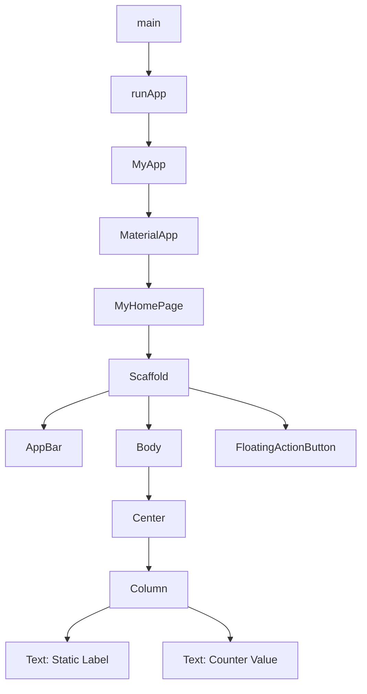
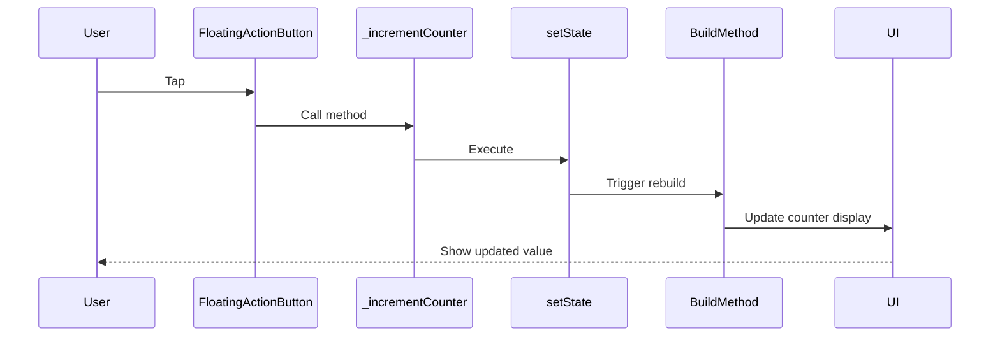

# Core Components

<cite>
**Referenced Files in This Document**   
- [main.dart](file://lib/main.dart)
- [widget_test.dart](file://test/widget_test.dart)
</cite>

## Table of Contents
1. [Introduction](#introduction)
2. [Core UI Components](#core-ui-components)
3. [Widget Composition Hierarchy](#widget-composition-hierarchy)
4. [State Management Implementation](#state-management-implementation)
5. [Common Issues and Solutions](#common-issues-and-solutions)
6. [Foundation for POS Functionality](#foundation-for-pos-functionality)

## Introduction
This document provides a comprehensive analysis of the core UI components in the altura_pos Flutter application. The application follows Flutter's widget-based architecture, utilizing a clear separation between stateless configuration and stateful behavior. The implementation demonstrates fundamental Flutter concepts including widget composition, state management, and Material Design components. This documentation will explore the MyApp, MyHomePage, and _MyHomePageState components in detail, explaining their roles, relationships, and implementation patterns.

## Core UI Components

The altura_pos application is built around three primary UI components that demonstrate Flutter's widget hierarchy and state management principles. The MyApp class serves as the root StatelessWidget that configures the MaterialApp with theming and sets the initial home screen. This component is stateless because it only provides configuration that doesn't change during the application's lifecycle. The MyHomePage class is a StatefulWidget that represents the main screen of the application, designed to be stateful because it needs to respond to user interactions and update its display accordingly. The _MyHomePageState class manages the mutable state for MyHomePage, containing the counter variable and the logic for updating it. This separation follows Flutter's design pattern where StatefulWidget classes define the configuration while their corresponding State classes manage the mutable data and UI updates.

**Section sources**
- [main.dart](file://lib/main.dart#L1-L122)

## Widget Composition Hierarchy

The widget composition hierarchy in the altura_pos application follows a standard Flutter pattern that demonstrates proper component organization. The execution begins with the main() function, which calls runApp() with MyApp as the root widget. MyApp returns a MaterialApp widget, which provides the overall application structure, theming, and navigation framework. The MaterialApp is configured with a title and theme, and its home property is set to MyHomePage, establishing it as the initial screen. MyHomePage creates a Scaffold widget, which implements the basic material design visual layout structure. The Scaffold contains three main components: an AppBar for the top navigation bar, a body for the main content area, and a FloatingActionButton for primary actions. The body uses a Center widget to position its child in the middle of the screen, which is a Column widget that arranges its children vertically. This Column contains two Text widgets that display static and dynamic content. The FloatingActionButton is configured with an onPressed callback that references the _incrementCounter method, creating the interactive element of the UI.

**Diagram sources**
- [main.dart](file://lib/main.dart#L1-L122)

**Section sources**
- [main.dart](file://lib/main.dart#L1-L122)

## State Management Implementation

The state management implementation in the altura_pos application demonstrates Flutter's setState() mechanism for managing mutable state. The _MyHomePageState class contains a private integer variable _counter initialized to zero, representing the application's state. When the user interacts with the FloatingActionButton, the onPressed callback triggers the _incrementCounter method. This method calls setState(), which accepts a function that modifies the state variables. The setState() call is crucial because it notifies the Flutter framework that the state has changed, prompting a rebuild of the widget tree. During the rebuild, the Text widget that displays '$_counter' accesses the updated value of the counter variable. This pattern ensures that the UI always reflects the current state of the application. The separation between MyHomePage (stateless configuration) and _MyHomePageState (stateful logic) follows Flutter's best practices, allowing the framework to optimize performance by only rebuilding components that need to change.

**Diagram sources**
- [main.dart](file://lib/main.dart#L1-L122)

**Section sources**
- [main.dart](file://lib/main.dart#L1-L122)

## Common Issues and Solutions

A common issue in Flutter applications like altura_pos is state not updating when the user interacts with the UI. This typically occurs when developers forget to wrap state modifications in setState(), as indicated in the code comments. If the _counter variable were incremented directly without calling setState(), the build method would not be triggered, and the UI would not reflect the updated value. The solution is to always use setState() when modifying state variables that affect the UI. Another potential issue is improper widget composition, such as placing interactive elements outside of proper layout containers. The current implementation avoids these issues by following Flutter best practices: using MaterialApp for proper theming, Scaffold for material design layout, and proper state management with StatefulWidget and State separation. The widget_test.dart file demonstrates how to test this functionality by simulating user interactions and verifying the counter increments correctly.

**Section sources**
- [main.dart](file://lib/main.dart#L1-L122)
- [widget_test.dart](file://test/widget_test.dart#L1-L30)

## Foundation for POS Functionality

The current counter logic in the altura_pos application serves as a foundational framework for future point-of-sale (POS) functionality. The state management pattern demonstrated with the counter can be extended to manage more complex state such as shopping cart items, order totals, and inventory levels. The FloatingActionButton could be repurposed as a "Add Item" button, while the AppBar could display the current order total. The Column layout can be expanded to show a list of purchased items with their quantities and prices. The separation of configuration (MyHomePage) from state (_MyHomePageState) provides a scalable architecture that can accommodate additional features like customer management, payment processing, and receipt generation. The existing structure with MaterialApp, Scaffold, and proper state management creates a solid foundation that can be incrementally enhanced to build a complete POS system while maintaining code organization and performance.

**Section sources**
- [main.dart](file://lib/main.dart#L1-L122)