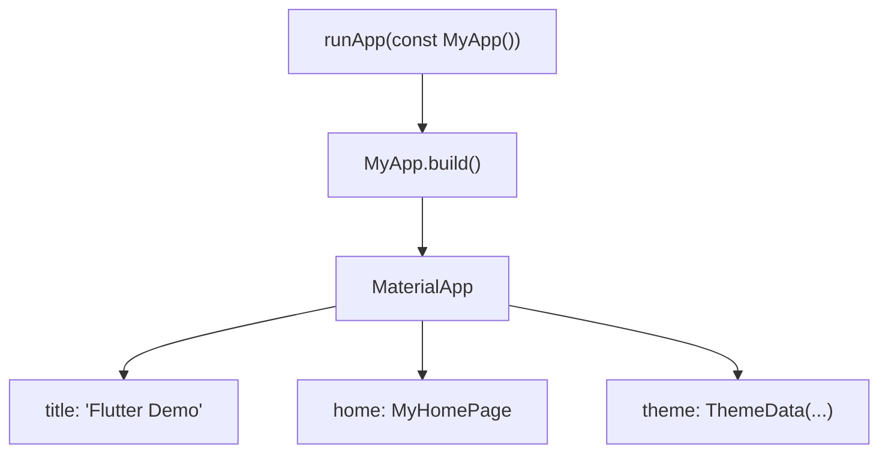
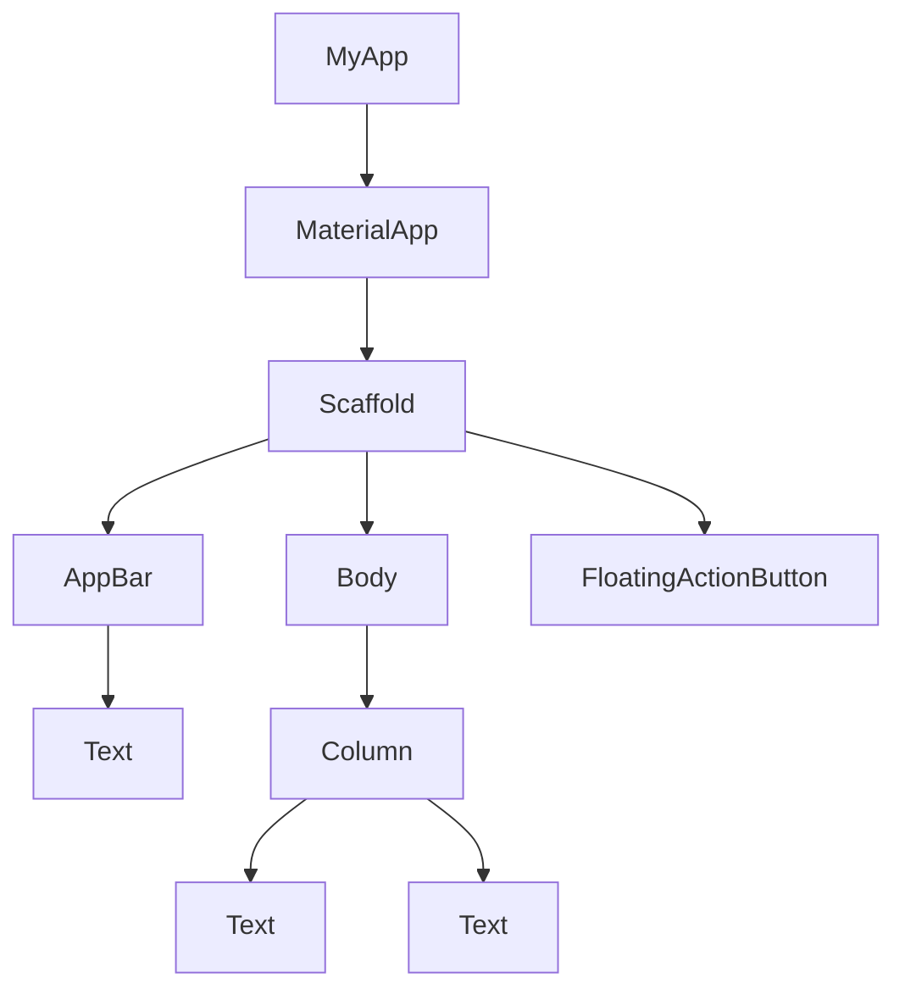

# MyApp - Root Application

<cite>
**Referenced Files in This Document**   
- [main.dart](file://lib/main.dart)
</cite>

## Table of Contents
1. [Introduction](#introduction)
2. [Core Configuration](#core-configuration)
3. [Theme and Styling](#theme-and-styling)
4. [Widget Tree and Application Shell](#widget-tree-and-application-shell)
5. [Hot Reload and State Preservation](#hot-reload-and-state-preservation)
6. [Common Issues and Debugging](#common-issues-and-debugging)
7. [Conclusion](#conclusion)

## Introduction
The `MyApp` class serves as the root `StatelessWidget` of the `altura_pos` application, acting as the foundational entry point for the Flutter app. It is instantiated and launched via the `runApp()` function in the `main()` method, which initializes the Flutter framework and attaches the widget tree to the device's screen. As the configuration layer for the application shell, `MyApp` is responsible for setting up the core application structure, including the app title, theme, and initial route. This class plays a critical role in defining the visual and behavioral consistency of the entire application, making it the cornerstone for future POS-specific theming and routing configurations.

**Section sources**
- [main.dart](file://lib/main.dart#L5-L37)

## Core Configuration
The `MyApp` class configures the application through the `MaterialApp` widget, which provides a rich set of Material Design components and navigation capabilities. The `build` method returns a `MaterialApp` instance with several key properties. The `title` property sets the application's name, which is used by the operating system to identify the app in the task manager or app switcher. The `home` property specifies the initial route of the application, pointing to the `MyHomePage` widget, which is displayed when the app is launched. This configuration establishes the application's routing foundation, ensuring a seamless user experience from the moment the app starts.

**Diagram sources**
- [main.dart](file://lib/main.dart#L15-L37)

**Section sources**
- [main.dart](file://lib/main.dart#L15-L37)

## Theme and Styling
The `MyApp` class configures the application's visual theme using the `ThemeData` class, which enables consistent UI styling across all components. The theme is defined with a `ColorScheme` generated from a seed color of `Colors.deepPurple`, which automatically computes a harmonious palette of colors for various UI elements. This approach simplifies theme management and ensures visual consistency throughout the application. The `ThemeData` object is propagated down the widget tree, allowing descendant widgets to inherit and utilize the defined colors, typography, and other styling properties. This centralized theming mechanism is essential for maintaining a cohesive and professional appearance in the POS application.

**Section sources**
- [main.dart](file://lib/main.dart#L20-L30)

## Widget Tree and Application Shell
The `MyApp` class acts as the root of the widget tree, forming the application shell that encapsulates all other widgets. It serves as the configuration layer, providing a consistent environment for the entire application. The `MaterialApp` widget, returned by the `build` method, introduces a set of default behaviors and visual elements, such as the app bar and navigation system. This hierarchical structure ensures that all descendant widgets have access to the application's theme, localization, and routing information. The relationship between `MyApp` and the overall widget tree is fundamental to the application's architecture, as it establishes the context in which all other components operate.

**Diagram sources**
- [main.dart](file://lib/main.dart#L15-L37)

**Section sources**
- [main.dart](file://lib/main.dart#L15-L37)

## Hot Reload and State Preservation
One of the key advantages of the `MyApp` class is its compatibility with Flutter's hot reload feature, which allows developers to experiment with theme changes without losing the application's state. When the `seedColor` in the `ColorScheme` is modified and hot reload is triggered, the UI updates instantly to reflect the new theme, while the current state of the application, such as the counter value in `MyHomePage`, remains unchanged. This capability significantly accelerates the development process, enabling rapid iteration and experimentation with different visual styles. The state preservation during hot reload is a powerful feature that enhances developer productivity and facilitates real-time design adjustments.

**Section sources**
- [main.dart](file://lib/main.dart#L20-L30)

## Common Issues and Debugging
Common issues with the `MyApp` class typically involve incorrect theme propagation or missing home routes. If the theme is not applied correctly, it may be due to a missing `MaterialApp` widget or an incorrect configuration of the `ThemeData` object. To debug theme issues, developers should verify that the `MaterialApp` widget is properly configured and that the `ThemeData` object is correctly defined. If the home route is missing or incorrectly specified, the application may fail to launch or display a blank screen. To resolve this, ensure that the `home` property in the `MaterialApp` widget points to a valid widget, such as `MyHomePage`. Additionally, checking the console for error messages and using Flutter's debugging tools can help identify and fix these issues.

**Section sources**
- [main.dart](file://lib/main.dart#L15-L37)

## Conclusion
The `MyApp` class is the foundational container for the `altura_pos` application, serving as the root `StatelessWidget` that initializes the Flutter app and configures the `MaterialApp` widget. It plays a crucial role in defining the application's title, theme, and initial route, ensuring a consistent and cohesive user experience. By leveraging the `ThemeData` class and the `ColorScheme` from a seed color, `MyApp` enables uniform UI styling across the entire application. Its compatibility with hot reload allows for efficient theme experimentation while preserving application state. As the configuration layer for the application shell, `MyApp` provides the structural foundation for future POS-specific theming and routing, making it an essential component of the application's architecture.