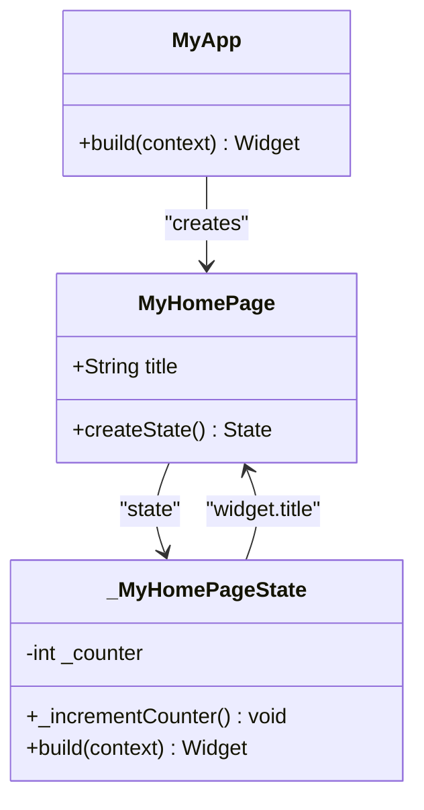

# MyHomePage - Main UI Screen

<cite>
**Referenced Files in This Document**   
- [main.dart](file://lib/main.dart)
- [README.md](file://README.md)
</cite>

## Table of Contents
1. [Introduction](#introduction)
2. [Core Components](#core-components)
3. [Widget Composition and Layout](#widget-composition-and-layout)
4. [State Management and User Interaction](#state-management-and-user-interaction)
5. [Accessibility Considerations](#accessibility-considerations)
6. [Common Layout Issues and Solutions](#common-layout-issues-and-solutions)
7. [Extensibility for POS Features](#extensibility-for-pos-features)
8. [Conclusion](#conclusion)

## Introduction
The MyHomePage widget serves as the primary user interface screen for the altura_pos application, demonstrating fundamental Flutter UI patterns and widget composition. As a stateful widget, it receives a title parameter from the MyApp widget and renders it in the AppBar, establishing a clean, scalable foundation for a point-of-sale (POS) interface. This documentation provides a comprehensive analysis of its implementation, layout mechanics, and extensibility for future POS features such as product grids and cart summaries.

**Section sources**
- [main.dart](file://lib/main.dart#L31-L70)

## Core Components
The MyHomePage widget is implemented as a StatefulWidget, allowing it to maintain mutable state that affects its appearance. It receives a required title parameter from its parent widget (MyApp), which is then displayed in the AppBar. The widget's state is managed by the _MyHomePageState class, which contains the counter variable and the _incrementCounter method. The MyApp widget serves as the root of the application, configuring the MaterialApp with a theme and setting MyHomePage as the home screen with an initial title.



**Diagram sources**
- [main.dart](file://lib/main.dart#L15-L31)
- [main.dart](file://lib/main.dart#L31-L70)

**Section sources**
- [main.dart](file://lib/main.dart#L15-L31)
- [main.dart](file://lib/main.dart#L31-L70)

## Widget Composition and Layout
The MyHomePage widget employs a hierarchical composition of Flutter's core layout widgets to create a structured user interface. At the foundation is the Scaffold widget, which provides the basic material design visual structure including AppBar, body, and FloatingActionButton. The AppBar displays the title passed from the parent widget, while the body is centered using the Center widget. Within the Center widget, a Column arranges its children vertically, with mainAxisAlignment.center ensuring vertical centering of content. This layout structure creates a balanced, responsive interface that adapts to different screen sizes.

```mermaid
flowchart TD
Scaffold --> AppBar
Scaffold --> Body
Scaffold --> FloatingActionButton
Body --> Center
Center --> Column
Column --> Text1["Text: 'You have pushed...'"]
Column --> Text2["Text: '$_counter'"]
FloatingActionButton --> "_incrementCounter()"
```

**Diagram sources**
- [main.dart](file://lib/main.dart#L70-L121)

**Section sources**
- [main.dart](file://lib/main.dart#L70-L94)

## State Management and User Interaction
The MyHomePage widget demonstrates Flutter's state management pattern through the _MyHomePageState class, which maintains the _counter state variable. User interaction is facilitated by the FloatingActionButton, which triggers the _incrementCounter method when pressed. This method calls setState(), signaling to the Flutter framework that the state has changed and prompting a rebuild of the widget tree. The counter value is then displayed in the second Text widget, demonstrating how state changes are reflected in the UI. This pattern provides a foundation for more complex state management in POS applications, such as tracking cart items or order totals.

**Section sources**
- [main.dart](file://lib/main.dart#L75-L85)

## Accessibility Considerations
While the current implementation does not explicitly configure accessibility features, it leverages Flutter's built-in accessibility support through the use of standard Material widgets. The Text widgets automatically support text scaling, allowing users to adjust font sizes according to their preferences. The color scheme is derived from the ThemeData, which can be configured to ensure sufficient contrast ratios for readability. For a POS application, additional accessibility considerations would include ensuring adequate touch target sizes for the FloatingActionButton and providing appropriate semantic labels for screen readers.

**Section sources**
- [main.dart](file://lib/main.dart#L15-L31)
- [main.dart](file://lib/main.dart#L70-L121)

## Common Layout Issues and Solutions
The MyHomePage implementation avoids common layout issues through proper use of Flutter's layout widgets. The Center widget prevents content from being aligned to the top-left corner, while the Column with mainAxisAlignment.center ensures vertical centering. Potential overflow issues are mitigated by the Scaffold's built-in scrolling behavior and the Column's default sizing to fit its children. For more complex POS layouts, developers can extend this foundation by incorporating additional layout widgets such as Expanded, Flexible, or ListView to handle dynamic content and prevent overflow errors.

**Section sources**
- [main.dart](file://lib/main.dart#L94-L105)

## Extensibility for POS Features
The MyHomePage structure provides an excellent foundation for extending the altura_pos application with POS-specific features. The current layout can be enhanced by replacing the simple counter display with a product grid using GridView or Wrap widgets. The FloatingActionButton could be repurposed as a "Add to Cart" button, with the state management pattern extended to track cart items and totals. The AppBar can be customized with additional actions for navigating between different POS screens such as inventory management, sales history, or customer management. This modular approach allows for incremental development of a comprehensive POS system.

**Section sources**
- [main.dart](file://lib/main.dart#L31-L121)

## Conclusion
The MyHomePage widget exemplifies effective Flutter UI design through its clean composition of layout widgets, proper state management, and extensible architecture. By leveraging the Scaffold, AppBar, Center, Column, and FloatingActionButton widgets, it creates a responsive, user-friendly interface that serves as an ideal foundation for a point-of-sale application. The implementation demonstrates best practices in widget composition and state management, providing a scalable template for adding POS-specific features while maintaining code clarity and maintainability.