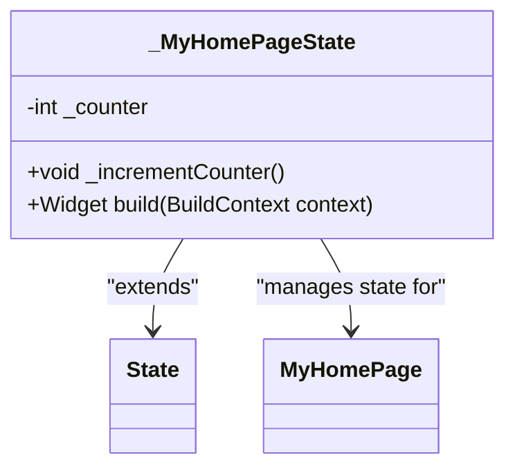
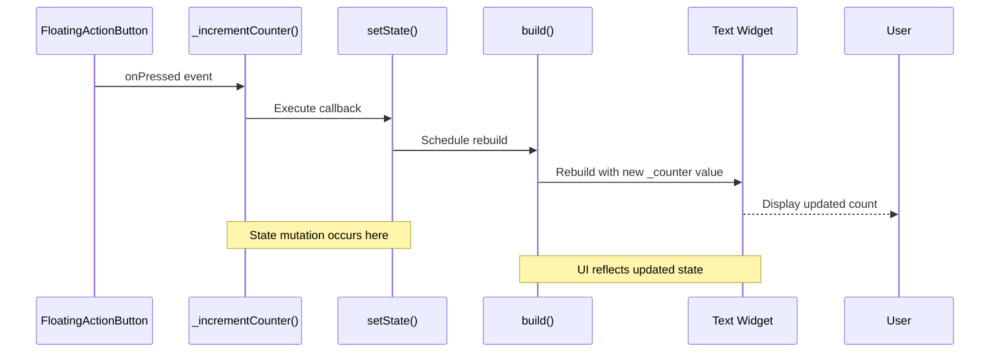

# State Management - Counter Logic

<cite>
**Referenced Files in This Document**   
- [main.dart](file://lib/main.dart)
</cite>

## Table of Contents
1. [Introduction](#introduction)
2. [Core Components](#core-components)
3. [State Management Flow](#state-management-flow)
4. [Local vs Global State](#local-vs-global-state)
5. [Best Practices and Pitfalls](#best-practices-and-pitfalls)
6. [Conclusion](#conclusion)

## Introduction
This document provides a comprehensive analysis of the state management pattern implemented in the _MyHomePageState class within the altura_pos Flutter application. The counter functionality serves as a foundational example of Flutter's reactive programming model, demonstrating how user interactions trigger state changes and UI updates. This pattern forms the basis for all interactive features in the POS system and illustrates core principles that will be extended to more complex state management scenarios.

## Core Components

The _MyHomePageState class is the mutable state holder for the MyHomePage widget, implementing Flutter's StatefulWidget pattern. It contains the private _counter integer field that stores the current count value and the _incrementCounter method that handles the increment logic. The class extends State<MyHomePage>, connecting it to its corresponding StatefulWidget and enabling the framework to manage its lifecycle.

Central to this implementation is the setState() method, which serves as the communication channel between business logic and the rendering system. When called, setState() notifies the Flutter framework that the state has changed, scheduling a rebuild of the widget tree. This reactive approach ensures that the UI always reflects the current application state.

**Diagram sources**
- [main.dart](file://lib/main.dart#L55-L122)

**Section sources**
- [main.dart](file://lib/main.dart#L55-L122)

## State Management Flow

The data flow in the counter implementation follows a clear, unidirectional pattern that exemplifies Flutter's reactive architecture. This flow begins with user interaction and concludes with UI updates, creating a predictable and maintainable system.

**Diagram sources**
- [main.dart](file://lib/main.dart#L60-L122)

**Section sources**
- [main.dart](file://lib/main.dart#L60-L122)

The process begins when the user taps the FloatingActionButton, triggering its onPressed callback that references the _incrementCounter method. This method calls setState() with a callback function that increments the _counter variable. The setState() method is critical—it not only executes the state mutation but also notifies the framework that the state has changed, which triggers the build() method to be called again. During this rebuild, the Text widget accesses the updated _counter value and displays it to the user.

A crucial aspect of this pattern is that direct mutation of _counter without calling setState() would have no visual effect. The framework relies on setState() to know when to rebuild the UI, making it the essential bridge between state changes and visual updates.

## Local vs Global State

While the current implementation uses local state management suitable for isolated components, a POS application will require more sophisticated state management solutions as complexity grows. The _MyHomePageState pattern works well for component-specific state like a counter, but order management, inventory tracking, and user authentication will demand global state solutions.

Potential future state management approaches include:

- **Provider**: A wrapper around InheritedWidget that makes it easier to use and more reusable
- **Bloc (Business Logic Component)**: Implements the BLoC pattern using streams for complex state management
- **Riverpod**: An evolution of Provider with improved testability and flexibility
- **GetX**: A lightweight solution combining state management, routing, and dependency injection

These solutions would allow state to be shared across multiple screens and components, enabling features like real-time order updates, shared shopping carts, and synchronized inventory levels across different parts of the application.

## Best Practices and Pitfalls

When working with Flutter's setState() mechanism, several best practices should be followed to ensure optimal performance and maintainability:

1. **Minimize rebuild scope**: Keep stateful widgets as low as possible in the widget tree to limit the scope of rebuilds
2. **Avoid synchronous state updates**: Never perform long-running operations inside setState() callbacks
3. **Batch state changes**: When multiple state variables need to be updated, do so within a single setState() call
4. **Use const constructors**: Mark widgets as const when possible to enable compiler optimizations
5. **Separate business logic**: Keep complex logic outside the build method and setState callbacks

Common pitfalls to avoid include:
- Calling setState() after disposing the widget (can cause memory leaks)
- Performing expensive computations inside build methods
- Updating state from asynchronous callbacks without checking mounted
- Creating unnecessary rebuilds by modifying state too frequently

Performance optimization should focus on reducing the number and scope of rebuilds, leveraging Flutter's efficient diffing algorithm while being mindful of the computational cost of each build cycle.

## Conclusion
The _MyHomePageState implementation demonstrates the fundamental principles of Flutter's reactive state management system. By understanding the flow from user interaction to state mutation to UI update, developers can build more complex and robust POS features. The pattern established here—using setState() to coordinate state changes and UI rebuilds—forms the foundation upon which more sophisticated state management solutions can be built as the application evolves from a simple counter to a full-featured point-of-sale system.