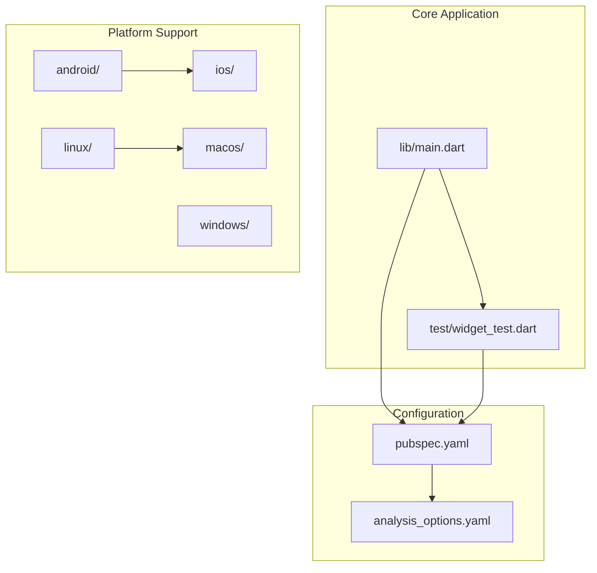
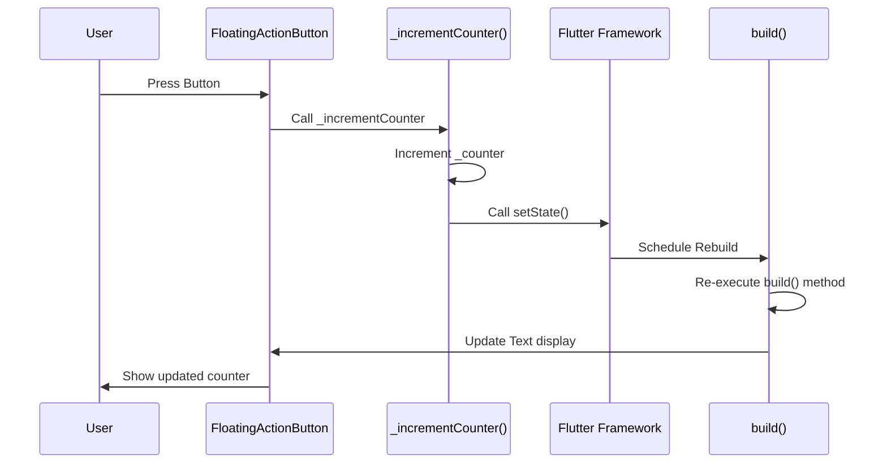
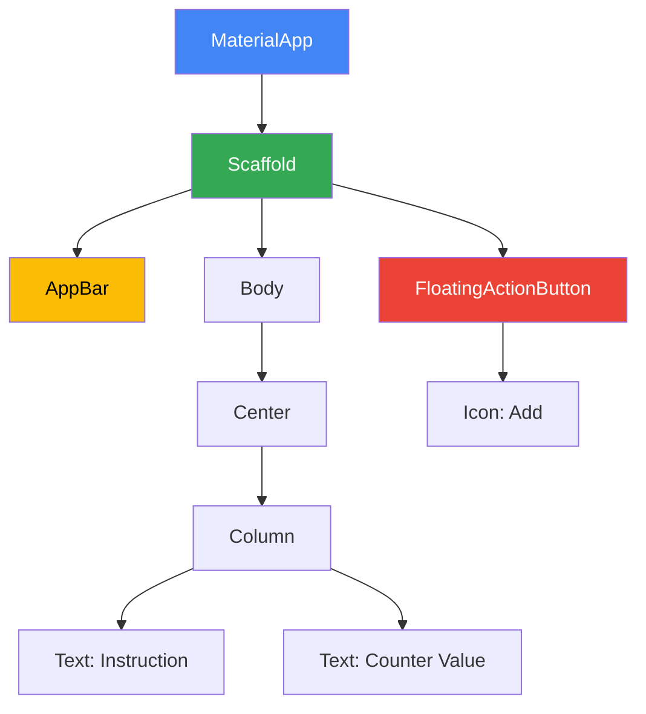

# Core Features

<cite>
**Referenced Files in This Document**   
- [main.dart](file://lib/main.dart)
- [widget_test.dart](file://test/widget_test.dart)
- [pubspec.yaml](file://pubspec.yaml)
- [README.md](file://README.md)
</cite>

## Table of Contents
1. [Introduction](#introduction)
2. [Project Structure](#project-structure)
3. [Core Components](#core-components)
4. [Architecture Overview](#architecture-overview)
5. [Detailed Component Analysis](#detailed-component-analysis)
6. [State Management Pattern](#state-management-pattern)
7. [UI Components and Material Design](#ui-components-and-material-design)
8. [Testing Practices](#testing-practices)
9. [Future POS Functionality Evolution](#future-pos-functionality-evolution)
10. [Conclusion](#conclusion)

## Introduction
The altura_pos application is a Flutter-based point-of-sale (POS) system currently demonstrating core Flutter functionality through a counter feature. This foundational implementation serves as a template for future POS-specific features such as transaction processing and inventory management. The application showcases essential Flutter concepts including state management, Material Design components, theming, and widget testing.

**Section sources**
- [README.md](file://README.md#L1-L17)

## Project Structure
The altura_pos application follows the standard Flutter project structure with key directories for platform-specific code (android, ios, linux, macos, windows), the main Dart codebase (lib), tests (test), and web assets (web). The core functionality resides in the lib directory with main.dart containing the primary application logic, while tests are organized in the test directory with widget_test.dart providing verification for UI components.



**Diagram sources **
- [main.dart](file://lib/main.dart)
- [widget_test.dart](file://test/widget_test.dart)
- [pubspec.yaml](file://pubspec.yaml)

**Section sources**
- [main.dart](file://lib/main.dart)
- [widget_test.dart](file://test/widget_test.dart)
- [pubspec.yaml](file://pubspec.yaml)

## Core Components
The application's core components include the MyApp widget as the root of the application, MyHomePage as the main screen, and _MyHomePageState which manages the counter state. The _counter variable stores the current count value, while the _incrementCounter method handles user interactions by updating this state. The MaterialApp widget provides the overall application structure with theming capabilities, and the Scaffold organizes the visual layout with standard Material Design components.

**Section sources**
- [main.dart](file://lib/main.dart#L1-L122)

## Architecture Overview
The application follows Flutter's standard architecture pattern with a stateless root widget (MyApp) that creates a MaterialApp, which in turn hosts a stateful home page (MyHomePage). The stateful widget pattern allows for dynamic UI updates based on user interactions. When the floating action button is pressed, it triggers the _incrementCounter method, which calls setState() to notify the framework of state changes, resulting in a rebuild of the affected UI components.

```mermaid
graph TD
A[User Interaction] --> B[FloatingActionButton Press]
B --> C[_incrementCounter Method]
C --> D[setState() Call]
D --> E[Widget Rebuild]
E --> F[UI Update]
F --> G[Display Updated Counter]
```

**Diagram sources **
- [main.dart](file://lib/main.dart#L60-L70)

## Detailed Component Analysis

### Counter Functionality Analysis
The counter feature demonstrates the fundamental state management pattern in Flutter applications. The _counter variable is declared as an instance variable in the _MyHomePageState class, making it part of the widget's state. This private variable (prefixed with underscore) tracks the current count value and is initially set to 0.

#### State Management Implementation
```mermaid
classDiagram
class MyHomePage {
+String title
+createState() State
}
class _MyHomePageState {
-int _counter
+_incrementCounter()
+build(BuildContext) Widget
}
MyHomePage <|-- _MyHomePageState : "StatefulWidget"
_MyHomePageState --> "setState()" : "calls"
```

**Diagram sources **
- [main.dart](file://lib/main.dart#L37-L122)

The _incrementCounter method is the primary event handler that responds to user interactions. When invoked (typically through the FloatingActionButton's onPressed callback), it calls setState() with a function that increments the _counter variable. The setState() mechanism is crucial as it notifies the Flutter framework that the widget's state has changed, triggering a rebuild of the widget's build() method to reflect the updated state in the UI.

**Section sources**
- [main.dart](file://lib/main.dart#L60-L70)

## State Management Pattern
The application implements Flutter's StatefulWidget pattern for managing mutable state. The MyHomePage widget extends StatefulWidget, requiring a corresponding State class (_MyHomePageState) that holds the mutable data (_counter) and methods that modify this data (_incrementCounter). The setState() method serves as the gateway for state mutations, ensuring that any changes to the state are properly communicated to the framework for UI updates.

When setState() is called, Flutter marks the widget as "dirty" and schedules a rebuild during the next frame. This rebuild process recreates the widget tree for the affected components, allowing the updated _counter value to be displayed in the Text widget. This pattern ensures that the UI remains consistent with the underlying application state and provides an efficient mechanism for updating only the necessary parts of the interface.



**Diagram sources **
- [main.dart](file://lib/main.dart#L60-L70)

**Section sources**
- [main.dart](file://lib/main.dart#L37-L122)

## UI Components and Material Design
The application leverages Flutter's Material Design component library to create a visually consistent interface. The Scaffold widget provides a complete visual layout structure with slots for the AppBar, body content, and FloatingActionButton. The AppBar displays the application title at the top of the screen, while the body contains a Center widget that positions its child in the middle of the available space.

The Column widget arranges its children vertically, containing two Text widgets that display static instructions and the dynamic counter value. The FloatingActionButton provides a prominent interactive element in the bottom-right corner, featuring an add icon that users can press to increment the counter. These components follow Material Design guidelines for spacing, typography, and interaction patterns.

Material theming is implemented through the ThemeData class in the MyApp widget, which configures the application's visual style. The colorScheme uses a deep purple seed color to generate a complete palette of colors for various UI elements. The uses-material-design: true setting in pubspec.yaml ensures that Material Icons are included in the application bundle.



**Diagram sources **
- [main.dart](file://lib/main.dart#L10-L30)
- [pubspec.yaml](file://pubspec.yaml#L80-L82)

**Section sources**
- [main.dart](file://lib/main.dart#L75-L122)
- [pubspec.yaml](file://pubspec.yaml#L80-L82)

## Testing Practices
The application includes widget testing through the flutter_test package, demonstrating how to verify UI behavior programmatically. The test in widget_test.dart simulates user interaction by tapping the increment button and verifying that the counter value updates correctly. This test uses the WidgetTester utility to build the application, find widgets by their properties (text or icon), and verify expected outcomes.

The testing approach follows best practices by first verifying the initial state (counter at 0), performing an interaction (tapping the FAB), and then verifying the resulting state (counter incremented to 1). This pattern ensures that both the UI rendering and state management logic work as expected. The test structure provides a foundation for more comprehensive testing of future POS functionality.

**Section sources**
- [widget_test.dart](file://test/widget_test.dart#L1-L31)

## Future POS Functionality Evolution
The current counter demonstration serves as a foundation for evolving into a full-featured POS system. The established state management pattern can be extended to handle transaction data, inventory levels, and customer information. The Material Design components can be adapted to display product catalogs, process payments, and generate receipts.

Future development could incorporate additional screens for inventory management, sales reporting, and employee management, all following the same architectural patterns demonstrated in the counter feature. The testing framework can be expanded to verify complex business logic and ensure reliability in real-world POS scenarios. The theming system allows for consistent branding across all application screens.

**Section sources**
- [main.dart](file://lib/main.dart)
- [README.md](file://README.md)

## Conclusion
The altura_pos application effectively demonstrates core Flutter concepts through its counter feature implementation. The StatefulWidget pattern provides a robust foundation for managing application state, while Material Design components ensure a professional and consistent user interface. The integration of widget testing establishes quality assurance practices that will be essential as the application evolves into a complete POS solution. This foundational codebase provides a scalable architecture for implementing transaction processing, inventory management, and other POS-specific functionality.