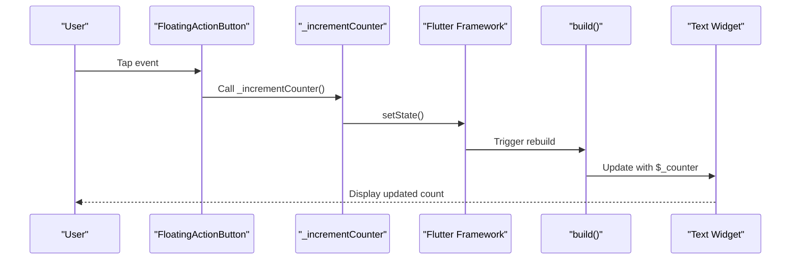

# Counter Functionality

<cite>
**Referenced Files in This Document**   
- [main.dart](file://lib/main.dart)
</cite>

## Table of Contents
1. [Introduction](#introduction)
2. [Core State Management](#core-state-management)
3. [State Mutation and UI Updates](#state-mutation-and-ui-updates)
4. [Data Flow Visualization](#data-flow-visualization)
5. [Common Pitfalls and Debugging](#common-pitfalls-and-debugging)
6. [Performance Considerations](#performance-considerations)
7. [Scalability to POS Use Cases](#scalability-to-pos-use-cases)

## Introduction
This document provides a comprehensive analysis of the counter functionality in the altura_pos Flutter application. The implementation demonstrates fundamental Flutter state management patterns through a simple yet illustrative example of user interaction tracking. The core mechanism revolves around a stateful widget that maintains an integer counter, updates it in response to user actions, and reflects those changes in the user interface. This pattern serves as a foundational example for more complex state management scenarios in point-of-sale applications, such as tracking transaction totals, inventory counts, and order statuses.

## Core State Management

The counter functionality is implemented within the `_MyHomePageState` class, which extends `State<MyHomePage>` and manages the mutable state for the `MyHomePage` widget. The state is encapsulated in the `_counter` instance variable, which is declared as an integer and initialized to 0 during object construction.

This implementation follows Flutter's recommended pattern for stateful widgets, where the state is kept in a separate class that persists across widget rebuilds. The `_counter` variable serves as the single source of truth for the current count value, ensuring consistency between the application logic and the user interface representation.

**Section sources**
- [main.dart](file://lib/main.dart#L58-L60)

## State Mutation and UI Updates

The `_incrementCounter` method is responsible for modifying the application state in response to user interactions. When invoked, this method calls `setState()`, which notifies the Flutter framework that the state has changed and triggers a rebuild of the widget tree.

The `setState()` method takes a callback function that updates the `_counter` variable by incrementing its value. This design pattern ensures that state mutations are properly coordinated with UI updates, maintaining the reactive nature of the Flutter framework. Without calling `setState()`, changes to `_counter` would not be reflected in the user interface, as the framework would have no indication that a rebuild is necessary.

The floating action button in the UI is configured to call `_incrementCounter` when pressed, establishing the connection between user input and state mutation. The updated counter value is then displayed in a Text widget using string interpolation (`'$_counter'`), which automatically reflects the current state during each rebuild.

**Section sources**
- [main.dart](file://lib/main.dart#L61-L70)
- [main.dart](file://lib/main.dart#L93-L121)
- [main.dart](file://lib/main.dart#L58-L67)

## Data Flow Visualization

**Diagram sources**
- [main.dart](file://lib/main.dart#L61-L70)
- [main.dart](file://lib/main.dart#L93-L121)

## Common Pitfalls and Debugging

A common mistake when implementing stateful widgets is forgetting to call `setState()` when modifying state variables. If `_counter++` were executed outside of `setState()`, the variable would increment in memory but the UI would not update, creating a disconnect between the application state and its visual representation.

Another important distinction is understanding the behavior of hot reload versus hot restart in Flutter. As noted in the code comments, hot reload preserves the application state, meaning the counter value persists across code changes. In contrast, hot restart resets the application state, returning the counter to its initial value of 0. This distinction is crucial for debugging state-related issues during development.

The current implementation correctly demonstrates the proper use of `setState()` to ensure UI synchronization with state changes, serving as a model for avoiding these common pitfalls.

**Section sources**
- [main.dart](file://lib/main.dart#L0-L37)
- [main.dart](file://lib/main.dart#L65-L94)

## Performance Considerations

While the current counter implementation is simple and efficient, it illustrates important performance considerations for state management in Flutter. The `setState()` method triggers a rebuild of the entire widget subtree, which can impact performance in more complex applications. For optimal performance, it's recommended to:

1. Minimize the scope of rebuilds by using smaller, more focused stateful widgets
2. Consider using more advanced state management solutions (such as Provider, Riverpod, or Bloc) for complex applications
3. Avoid unnecessary computations within the `build()` method
4. Use `const` constructors where possible to enable widget caching

In this example, the entire `_MyHomePageState` widget rebuilds when the counter changes, which is acceptable for simple cases but may need optimization in more complex UIs.

**Section sources**
- [main.dart](file://lib/main.dart#L65-L94)

## Scalability to POS Use Cases

The counter pattern demonstrated in this implementation can be extended to various point-of-sale functionality. For example:

- **Transaction Totals**: Replace the simple counter with a running total that accumulates item prices
- **Inventory Management**: Track stock levels with increment/decrement operations for sales and restocking
- **Order Counting**: Maintain a count of active orders or customers served
- **Discount Calculations**: Implement state that tracks applied discounts and adjusts totals accordingly

The same state management principles apply: maintain a single source of truth, use `setState()` to coordinate changes, and ensure the UI reflects the current state. As POS requirements grow in complexity, this basic pattern can be enhanced with more sophisticated state management architectures while maintaining the fundamental reactive programming model.

**Section sources**
- [main.dart](file://lib/main.dart#L58-L70)
- [main.dart](file://lib/main.dart#L93-L121)