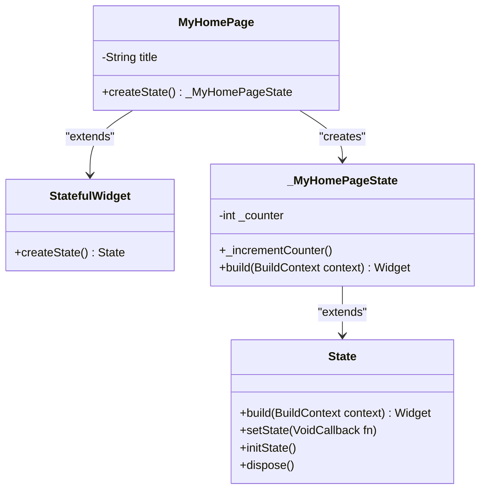
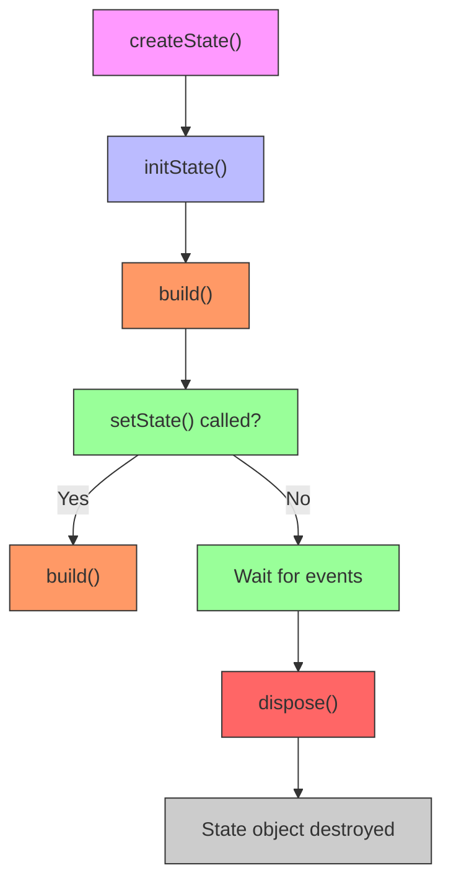
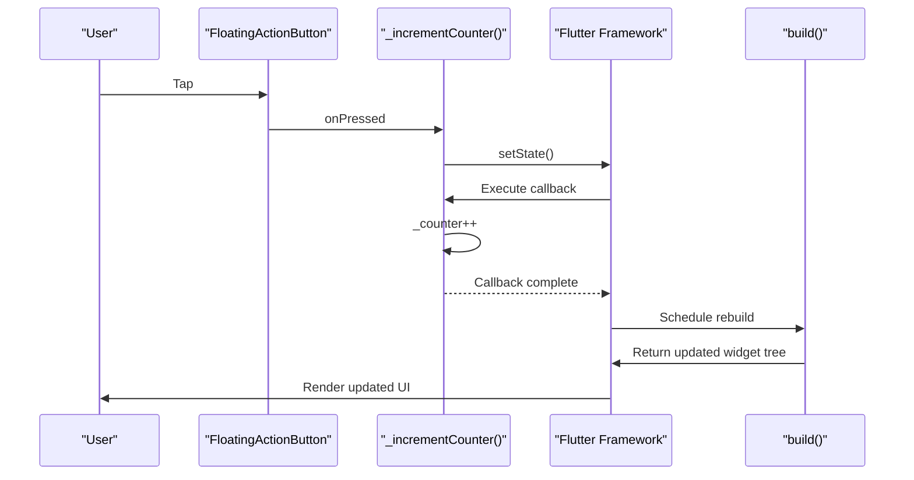
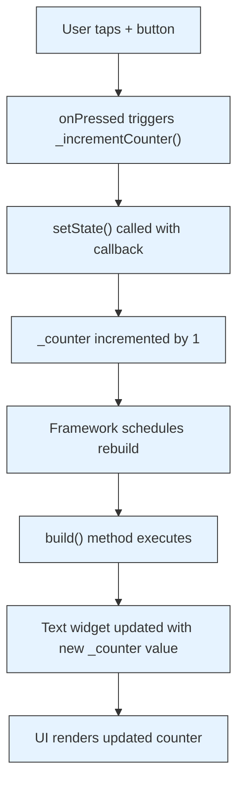
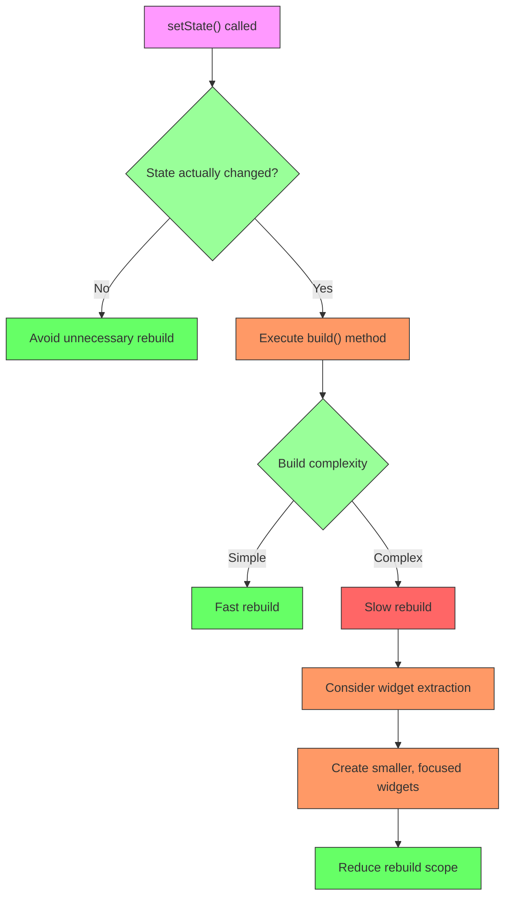
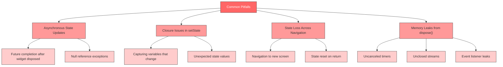
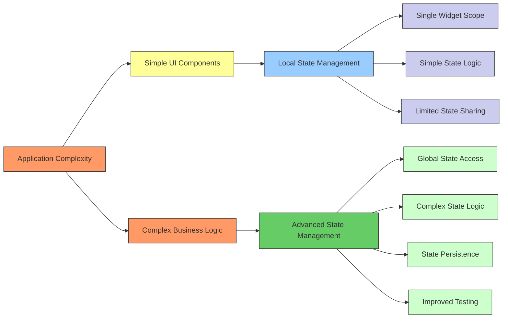

# State Management

<cite>
**Referenced Files in This Document**   
- [main.dart](file://lib/main.dart)
- [widget_test.dart](file://test/widget_test.dart)
</cite>

## Table of Contents
1. [Introduction](#introduction)
2. [StatefulWidget and State Pattern](#statefulwidget-and-state-pattern)
3. [State Management Lifecycle](#state-management-lifecycle)
4. [setState() Mechanism](#setstate-mechanism)
5. [Counter State Implementation](#counter-state-implementation)
6. [Performance Considerations](#performance-considerations)
7. [Common Pitfalls](#common-pitfalls)
8. [State Management Scaling](#state-management-scaling)
9. [Conclusion](#conclusion)

## Introduction
This document provides a comprehensive analysis of the state management pattern implemented in the altura_pos Flutter application. The focus is on the StatefulWidget and State pair pattern, which represents Flutter's fundamental approach to managing mutable state in UI components. The analysis examines how state is encapsulated, updated, and reflected in the user interface through the framework's reactive programming model.

## StatefulWidget and State Pattern

The altura_pos application implements state management using Flutter's StatefulWidget and State class pair pattern. This design pattern separates the immutable configuration of a widget from its mutable state, providing a clean separation of concerns.

The `MyHomePage` widget serves as the StatefulWidget, representing the configuration that remains constant between rebuilds. It contains immutable properties like the page title and serves as the entry point for creating its associated State object. The `_MyHomePageState` class encapsulates all mutable state and business logic, maintaining the `_counter` variable that tracks user interactions.

This separation ensures that the widget's configuration remains stable while allowing the internal state to change dynamically in response to user actions or other events. The framework manages the lifecycle of the State object independently from the StatefulWidget, allowing state to persist across widget rebuilds caused by parent updates or configuration changes.

**Diagram sources**
- [main.dart](file://lib/main.dart#L31-L70)

**Section sources**
- [main.dart](file://lib/main.dart#L31-L70)

## State Management Lifecycle

The lifecycle of a State object in Flutter follows a well-defined sequence of methods that allow for proper initialization, state updates, and cleanup. The `MyHomePage` widget initiates this lifecycle through its `createState()` method, which is called once when the widget is first inserted into the widget tree.

When the State object is created, the framework calls `initState()` to perform one-time initialization tasks. In the altura_pos application, this is where the `_counter` variable is initialized to zero. Following initialization, the `build()` method is called to generate the widget's UI representation based on the current state.

Throughout the widget's lifetime, the `build()` method may be called multiple times in response to state changes triggered by `setState()`. The framework optimizes these rebuilds by only updating the portions of the UI that have actually changed, rather than recreating the entire widget tree.

When the widget is removed from the tree, the `dispose()` method is called, providing an opportunity to clean up resources such as timers, animations, or subscriptions to prevent memory leaks. This lifecycle management ensures efficient resource utilization and prevents common memory-related issues in mobile applications.

**Diagram sources**
- [main.dart](file://lib/main.dart#L31-L70)
- [main.dart](file://lib/main.dart#L59-L63)

**Section sources**
- [main.dart](file://lib/main.dart#L31-L70)

## setState() Mechanism

The `setState()` method serves as the primary mechanism for signaling state changes in Flutter's reactive programming model. When called, it notifies the framework that the internal state of the widget has changed and that the UI needs to be updated to reflect these changes.

In the altura_pos application, the `_incrementCounter()` method demonstrates this pattern by calling `setState()` with a callback function that increments the `_counter` variable. The framework queues a rebuild of the widget, which triggers the `build()` method to execute again with the updated state value.

The `setState()` method accepts a callback function that modifies the state variables. This design ensures that all state modifications occur within a controlled context, allowing the framework to track when state changes occur and schedule UI updates appropriately. The callback is executed synchronously, and once it completes, the framework marks the widget as dirty and schedules a rebuild for the next frame.

It's important to note that calling `setState()` without actually changing the state values can lead to unnecessary rebuilds and performance degradation. The framework does not automatically detect whether the state has actually changed; it simply schedules a rebuild whenever `setState()` is called, regardless of whether the state values are different from their previous values.

**Diagram sources**
- [main.dart](file://lib/main.dart#L59-L63)
- [main.dart](file://lib/main.dart#L70-L94)

**Section sources**
- [main.dart](file://lib/main.dart#L59-L63)

## Counter State Implementation

The counter functionality in the altura_pos application provides a concrete example of local state management using the StatefulWidget pattern. The implementation centers around the `_counter` variable, which is declared as a private instance variable within the `_MyHomePageState` class.

The state management flow begins with user interaction through the floating action button, which triggers the `_incrementCounter()` method. This method encapsulates the state modification logic within a `setState()` callback, ensuring that the framework is properly notified of the state change.

The UI reflects the current counter value through two Text widgets in the build method: one displaying the static label "You have pushed the button this many times:" and another displaying the dynamic value of `$_counter`. When `setState()` is called and the widget rebuilds, the Text widget with the counter value is updated to display the new number.

The widget_test.dart file contains a unit test that verifies this state management behavior by simulating user interaction and asserting the expected state changes. The test uses Flutter's testing framework to pump the widget, tap the increment button, and verify that the counter value updates from 0 to 1 as expected.

**Diagram sources**
- [main.dart](file://lib/main.dart#L59-L63)
- [main.dart](file://lib/main.dart#L93-L121)
- [widget_test.dart](file://test/widget_test.dart#L15-L30)

**Section sources**
- [main.dart](file://lib/main.dart#L59-L63)
- [main.dart](file://lib/main.dart#L93-L121)
- [widget_test.dart](file://test/widget_test.dart#L15-L30)

## Performance Considerations

While the StatefulWidget pattern provides a straightforward approach to state management, it's important to consider performance implications, particularly as the application grows in complexity. The primary performance consideration is the cost of unnecessary rebuilds triggered by `setState()` calls.

Each call to `setState()` results in the execution of the `build()` method, which can be expensive if the widget tree is large or complex. In the altura_pos application, the entire widget tree under MyHomePage is rebuilt when the counter changes, even though only the Text widget displaying the counter value actually needs to update.

To optimize performance, developers should minimize the scope of widgets that need to rebuild by extracting smaller, more focused widgets. For example, the counter display could be extracted into its own StatelessWidget that receives the counter value as a parameter, reducing the portion of the UI that needs to rebuild.

Additionally, developers should avoid calling `setState()` unnecessarily, such as when the state value hasn't actually changed. The framework does not perform deep equality checks on state variables, so even setting a variable to its current value will trigger a rebuild. Implementing simple checks before calling `setState()` can prevent these unnecessary updates.

**Diagram sources**
- [main.dart](file://lib/main.dart#L59-L63)
- [main.dart](file://lib/main.dart#L70-L94)

**Section sources**
- [main.dart](file://lib/main.dart#L59-L63)

## Common Pitfalls

Developers implementing state management with StatefulWidget and State often encounter several common pitfalls that can lead to bugs or performance issues. One frequent issue is asynchronous state updates, where `setState()` is called from within asynchronous operations without proper error handling.

Another common pitfall involves closure issues within `setState()` callbacks. Since the callback has access to the current scope, developers might inadvertently capture variables that change between when `setState()` is called and when the callback executes, leading to unexpected behavior.

Maintaining state across navigation presents another challenge. When navigating between screens, StatefulWidget state is typically lost unless explicitly preserved using mechanisms like Hero animations, shared preferences, or state management solutions that persist beyond individual widgets.

Memory leaks can occur if resources are not properly cleaned up in the `dispose()` method. For example, failing to cancel timers or close streams can prevent the State object from being garbage collected, leading to increased memory usage over time.

**Diagram sources**
- [main.dart](file://lib/main.dart#L59-L63)
- [main.dart](file://lib/main.dart#L31-L70)

**Section sources**
- [main.dart](file://lib/main.dart#L59-L63)

## State Management Scaling

As the altura_pos application scales from a simple counter demo to a full-featured point of sale system, the local state management approach using StatefulWidget may become insufficient. While effective for simple, self-contained components, this pattern can lead to "state hell" when managing complex, shared state across multiple screens and components.

For larger applications, developers should consider more advanced state management solutions such as Provider, Riverpod, Bloc, or GetX. These solutions provide mechanisms for sharing state across the application, managing complex state transitions, and improving testability.

The transition from local to global state management should be guided by specific indicators: when state needs to be shared across multiple widgets, when state logic becomes complex and difficult to manage, or when testing becomes challenging due to tightly coupled state and UI.

For the POS system, considerations include managing shopping cart state, user authentication status, inventory data, and transaction processing - all of which would benefit from a more structured state management approach than what StatefulWidget alone can provide.

**Diagram sources**
- [main.dart](file://lib/main.dart#L31-L70)

**Section sources**
- [main.dart](file://lib/main.dart#L31-L70)

## Conclusion

The StatefulWidget and State pattern demonstrated in the altura_pos application provides a solid foundation for understanding Flutter's reactive state management model. By encapsulating mutable state within the State class and using `setState()` to signal updates, developers can create dynamic, responsive user interfaces.

The counter example effectively illustrates the core concepts of state initialization, modification, and UI updates. However, as the application evolves into a full-featured POS system, consideration should be given to more sophisticated state management approaches that can handle complex, shared state across multiple components.

Understanding the lifecycle of State objects, the mechanics of `setState()`, and the performance implications of rebuilds is essential for building efficient Flutter applications. By recognizing the limitations of local state management and knowing when to adopt more advanced patterns, developers can create scalable, maintainable POS systems that provide excellent user experiences.