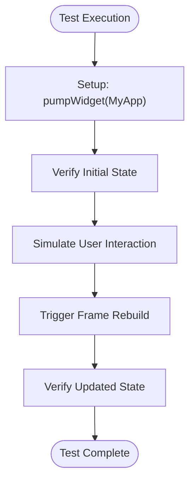
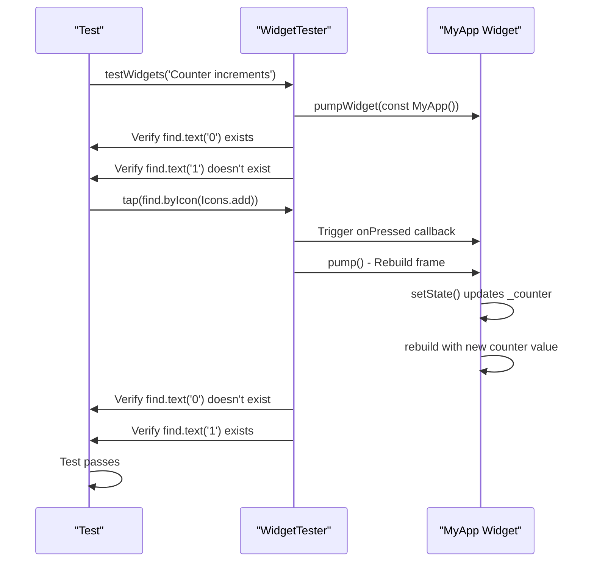

# Testing Practices

<cite>
**Referenced Files in This Document**   
- [widget_test.dart](file://test/widget_test.dart)
- [main.dart](file://lib/main.dart)
</cite>

## Table of Contents
1. [Introduction](#introduction)
2. [Test Structure Overview](#test-structure-overview)
3. [Widget Testing Framework Components](#widget-testing-framework-components)
4. [Test Execution Flow](#test-execution-flow)
5. [Best Practices in Widget Testing](#best-practices-in-widget-testing)
6. [Common Testing Challenges and Solutions](#common-testing-challenges-and-solutions)
7. [Extending Testing for POS Features](#extending-testing-for-pos-features)
8. [Conclusion](#conclusion)

## Introduction
The altura_pos application implements comprehensive widget testing to ensure UI reliability and functionality correctness. This document analyzes the testing practices demonstrated in the widget_test.dart file, focusing on the verification of counter increment functionality. The test serves as a foundational example of Flutter's widget testing capabilities, showcasing how to validate UI state, simulate user interactions, and verify component behavior in isolation. The testing approach follows Flutter's recommended practices for widget testing, providing a reliable foundation for ensuring UI component correctness.

**Section sources**
- [widget_test.dart](file://test/widget_test.dart#L1-L31)
- [main.dart](file://lib/main.dart#L1-L123)

## Test Structure Overview

The widget test in altura_pos follows the standard Flutter testing pattern with a clear structure that includes test definition, setup, interaction, and verification phases. The test is defined using the testWidgets function, which provides a WidgetTester instance for interacting with the widget tree. The test verifies the counter functionality by checking the initial state, simulating user interaction through tapping the increment button, and validating the updated state. This structure ensures comprehensive coverage of the widget's behavior under user interaction.

**Diagram sources**
- [widget_test.dart](file://test/widget_test.dart#L10-L27)

**Section sources**
- [widget_test.dart](file://test/widget_test.dart#L10-L27)

## Widget Testing Framework Components

The test leverages key components of Flutter's testing framework to create a realistic testing environment. The WidgetTester utility provides methods for interacting with widgets, finding elements in the widget tree, and controlling the test environment. The test imports necessary packages including flutter_test for testing utilities and the main application file to access the MyApp widget. These components work together to create a complete testing environment that can accurately simulate user interactions and verify UI state changes.

**Section sources**
- [widget_test.dart](file://test/widget_test.dart#L1-L9)
- [main.dart](file://lib/main.dart#L1-L10)

## Test Execution Flow

The test follows a sequential execution flow that accurately simulates user interaction with the application. The process begins with building the application widget and triggering a frame to ensure the UI is fully rendered. The test then verifies the initial counter state by searching for text elements with specific values. After validation of the initial state, the test simulates a user tap on the increment button by finding the widget with the add icon and triggering a tap event. Following the interaction, the test triggers a frame rebuild to allow state changes to propagate through the widget tree. Finally, the test verifies that the counter has been updated correctly by checking for the presence of the new value and absence of the old value.

**Diagram sources**
- [widget_test.dart](file://test/widget_test.dart#L10-L27)
- [main.dart](file://lib/main.dart#L80-L90)

**Section sources**
- [widget_test.dart](file://test/widget_test.dart#L10-L27)
- [main.dart](file://lib/main.dart#L80-L90)

## Best Practices in Widget Testing

The widget test demonstrates several best practices in Flutter widget testing. The test uses a meaningful name that clearly describes the functionality being tested, making it easy to understand the test's purpose. The test isolates widget behavior by testing only the counter increment functionality without dependencies on external services or state. The test verifies both the initial and final states, ensuring comprehensive validation of the widget's behavior. The use of asynchronous operations with proper await keywords ensures that the test waits for all operations to complete before proceeding to the next step. These practices contribute to reliable, maintainable, and understandable tests.

**Section sources**
- [widget_test.dart](file://test/widget_test.dart#L10-L27)

## Common Testing Challenges and Solutions

The test addresses common challenges in widget testing, particularly around asynchronous operations and widget identification. The use of pump() after user interaction ensures that the framework has time to process state changes and rebuild the widget tree. The test demonstrates reliable widget finding strategies by using both text content and icon identification to locate elements in the widget tree. For text-based finding, the test searches for specific counter values, while for interaction, it finds the FloatingActionButton by its Icons.add icon. These approaches provide robust element identification that is resilient to layout changes as long as the core functionality remains the same.

**Section sources**
- [widget_test.dart](file://test/widget_test.dart#L18-L22)
- [main.dart](file://lib/main.dart#L110-L115)

## Extending Testing for POS Features

The testing approach demonstrated in the counter test can be extended to validate more complex POS features. For transaction validation, similar patterns can be used to verify that input fields accept valid data and reject invalid entries. For inventory display correctness, tests can verify that product lists are rendered correctly and that quantity updates are reflected in the UI. The same principles of initial state verification, user interaction simulation, and final state validation can be applied to more complex scenarios. Additional considerations for POS features might include testing with real data sets, validating formatting of currency values, and ensuring proper handling of edge cases like empty inventory lists or maximum quantity limits.

**Section sources**
- [widget_test.dart](file://test/widget_test.dart#L10-L27)
- [main.dart](file://lib/main.dart#L50-L120)

## Conclusion

The widget testing practices implemented in the altura_pos application provide a solid foundation for ensuring UI reliability and functionality correctness. The counter increment test demonstrates effective use of Flutter's testing framework to validate widget behavior in isolation. By following best practices such as using meaningful test names, isolating component behavior, and thoroughly verifying state changes, the test ensures that the UI components work as expected. The testing approach is scalable and can be extended to cover more complex POS features, providing confidence in the application's reliability as it evolves. These practices contribute to a robust testing strategy that helps maintain high-quality user interfaces throughout the application's lifecycle.