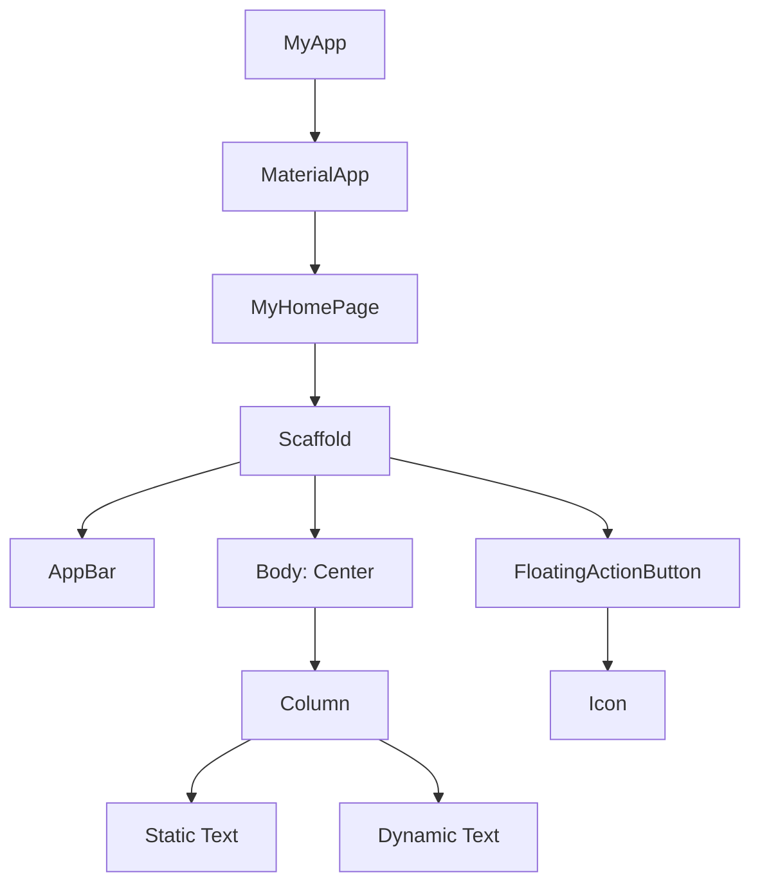
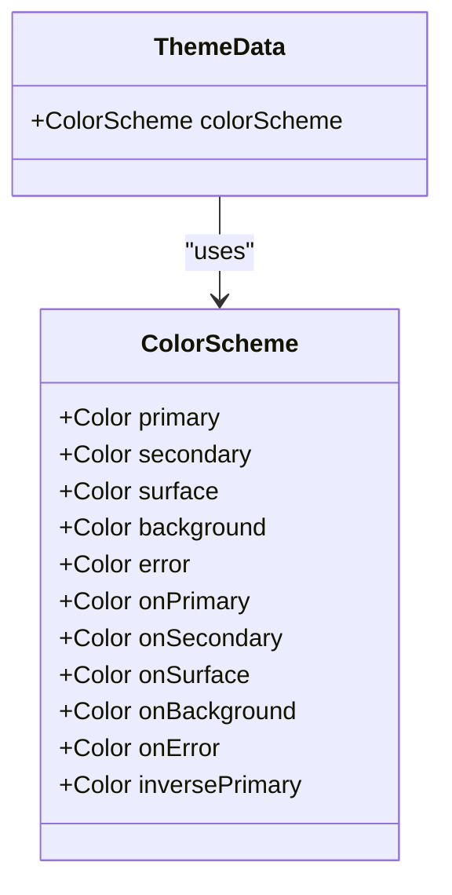

# UI Components

<cite>
**Referenced Files in This Document**   
- [main.dart](file://lib/main.dart)
- [pubspec.yaml](file://pubspec.yaml)
</cite>

## Table of Contents
1. [Introduction](#introduction)
2. [Core UI Components](#core-ui-components)
3. [Component Hierarchy and Composition](#component-hierarchy-and-composition)
4. [Theming and Styling](#theming-and-styling)
5. [Accessibility and Responsive Behavior](#accessibility-and-responsive-behavior)
6. [Evolution for POS-Specific Interfaces](#evolution-for-pos-specific-interfaces)
7. [Conclusion](#conclusion)

## Introduction
The `altura_pos` application utilizes Flutter's Material Design components to construct a responsive and visually consistent user interface. This document details the primary UI components used on the main screen, focusing on their structure, integration, and theming. The components are hierarchically composed within the `main.dart` file, forming a cohesive layout that supports dynamic content updates and adheres to modern design principles.

**Section sources**
- [main.dart](file://lib/main.dart#L1-L122)

## Core UI Components

### Scaffold
The `Scaffold` widget serves as the structural foundation for the main screen, providing a standardized layout that includes slots for an app bar, body content, and a floating action button. It implements the basic Material Design visual layout structure, ensuring consistency across different screens within the application.

**Section sources**
- [main.dart](file://lib/main.dart#L65-L121)

### AppBar
The `AppBar` component displays the application title and provides space for navigation controls. In the `altura_pos` app, it is configured with a background color derived from the theme's `inversePrimary` color scheme, ensuring visual harmony with the overall application theme. The title is dynamically set using the `Text` widget, which receives its value from the parent widget.

**Section sources**
- [main.dart](file://lib/main.dart#L70-L75)

### FloatingActionButton
The `FloatingActionButton` (FAB) represents the primary action on the screen—incrementing a counter. It is positioned at the bottom-right corner of the screen and triggers the `_incrementCounter` method when pressed. The FAB contains an `Icon` widget (plus sign) as its child and includes a tooltip for accessibility purposes.

**Section sources**
- [main.dart](file://lib/main.dart#L114-L120)

### Center and Column
The `Center` widget is used to align its child widget in the middle of the screen. It contains a `Column` widget, which arranges its children vertically. The `Column` uses `mainAxisAlignment.center` to center its children along the main axis (vertical), creating a balanced layout. This combination ensures that the text content is prominently displayed in the center of the screen.

**Section sources**
- [main.dart](file://lib/main.dart#L77-L94)

### Text Widgets
Text widgets are used to display both static and dynamic content. A `const Text` widget shows the static label "You have pushed the button this many times:", while a dynamic `Text` widget displays the current value of `_counter`. The dynamic text is styled using `Theme.of(context).textTheme.headlineMedium`, ensuring it adheres to the application's typographic hierarchy.

**Section sources**
- [main.dart](file://lib/main.dart#L89-L93)

## Component Hierarchy and Composition

**Diagram sources**
- [main.dart](file://lib/main.dart#L1-L122)

The component hierarchy begins with the `MyApp` widget, which returns a `MaterialApp` configured with a theme and home page. The home page is `MyHomePage`, a stateful widget that builds the main screen using `Scaffold`. The `Scaffold` organizes the UI into three main sections: the `AppBar` at the top, the `body` containing a centered `Column` of text, and the `FloatingActionButton` for user interaction. This hierarchical composition allows for clear separation of concerns and maintainable code structure.

**Section sources**
- [main.dart](file://lib/main.dart#L1-L122)

## Theming and Styling

### ThemeData and ColorScheme
The application's visual style is defined using `ThemeData` within the `MaterialApp`. The theme is configured with a `ColorScheme` generated from a seed color (`Colors.deepPurple`). This approach allows for a cohesive color palette across the entire application, where colors for different UI elements are algorithmically derived from the seed color.

**Diagram sources**
- [main.dart](file://lib/main.dart#L14-L30)

### Text Styling and Theme Propagation
Text styling is managed through the theme system, with the dynamic counter text using `Theme.of(context).textTheme.headlineMedium`. This ensures that text appearance is consistent with the application's design language and can be easily modified globally by updating the theme configuration. The theme data propagates down the widget tree, allowing any descendant widget to access and utilize the defined styles.

**Section sources**
- [main.dart](file://lib/main.dart#L109-L110)

## Accessibility and Responsive Behavior

The UI components are designed with accessibility in mind. The `FloatingActionButton` includes a tooltip ("Increment") that provides additional context for screen readers and assistive technologies. The use of semantic widgets like `AppBar` and `FloatingActionButton` ensures that the interface is navigable and understandable for users with disabilities.

The layout is inherently responsive due to Flutter's flexible widget system. The `Center` and `Column` widgets adapt to different screen sizes, ensuring that content remains centered and properly spaced across various device form factors. The `MaterialApp` and `Scaffold` provide built-in support for different orientations and screen densities.

**Section sources**
- [main.dart](file://lib/main.dart#L1-L122)

## Evolution for POS-Specific Interfaces

The current component structure provides a solid foundation that can be extended to support POS-specific interfaces. The `Scaffold` can accommodate additional navigation elements such as a `BottomNavigationBar` for switching between product categories. The `body` content can be replaced with a `GridView` to display product items in a grid layout.

For transaction summaries, the `Column` can be enhanced with `ListTile` widgets to show individual items and totals. Payment buttons can be implemented as `ElevatedButton` or `TextButton` widgets within a dedicated section of the screen. The existing theming system will ensure visual consistency across these new components.

The state management pattern demonstrated with the counter can be scaled to handle more complex POS state, including cart items, customer information, and payment status. The use of `setState` for UI updates can be complemented with more advanced state management solutions as the application grows in complexity.

**Section sources**
- [main.dart](file://lib/main.dart#L1-L122)

## Conclusion
The `altura_pos` application demonstrates effective use of Flutter's Material Design components to create a clean, responsive, and accessible user interface. The hierarchical composition of widgets like `Scaffold`, `AppBar`, `FloatingActionButton`, `Center`, `Column`, and `Text` provides a solid foundation that can be easily extended to meet the requirements of a full-featured point-of-sale system. The integration of theming through `ThemeData` and `ColorScheme` ensures visual consistency and simplifies future design updates.