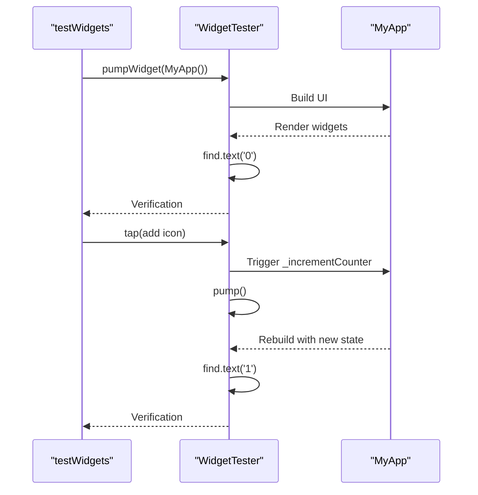

# Development Guidelines

<cite>
**Referenced Files in This Document**   
- [analysis_options.yaml](file://analysis_options.yaml)
- [pubspec.yaml](file://pubspec.yaml)
- [widget_test.dart](file://test/widget_test.dart)
- [main.dart](file://lib/main.dart)
</cite>

## Table of Contents
1. [Introduction](#introduction)
2. [Coding Standards and Static Analysis](#coding-standards-and-static-analysis)
3. [Testing Practices](#testing-practices)
4. [Dependency Management](#dependency-management)
5. [Contribution Guidelines](#contribution-guidelines)
6. [Code Coverage and Performance Optimization](#code-coverage-and-performance-optimization)
7. [Debugging Strategies and Tooling](#debugging-strategies-and-tooling)
8. [Conclusion](#conclusion)

## Introduction
This document outlines the development guidelines for the `altura_pos` Flutter project. It covers coding standards, testing practices, dependency management, contribution workflows, and debugging strategies. The goal is to ensure consistent code quality, maintainability, and efficient development processes across the team.

## Coding Standards and Static Analysis

The `altura_pos` project enforces coding standards through the `flutter_lints` package, which is configured in the `analysis_options.yaml` file. This configuration activates a comprehensive set of recommended lints designed to promote best practices in Flutter development.

The project includes the standard Flutter lints via `package:flutter_lints/flutter.yaml`, which provides rules for code readability, performance, and maintainability. Developers can customize these rules in the `analysis_options.yaml` file by enabling or disabling specific lints under the `rules` section. For example, the `avoid_print` rule can be disabled if print statements are needed for debugging, or the `prefer_single_quotes` rule can be enabled to standardize string literal formatting.

Static analysis is performed using the `flutter analyze` command, which checks for errors, warnings, and lint violations. These issues are also displayed in Dart-enabled IDEs, providing real-time feedback during development. Lint rules can be suppressed at different levels:
- For a single line: `// ignore: rule_name`
- For an entire file: `// ignore_for_file: rule_name`

This approach allows developers to maintain code quality while accommodating specific use cases where certain rules may not apply.

**Section sources**
- [analysis_options.yaml](file://analysis_options.yaml#L1-L28)

## Testing Practices

The project uses the `flutter_test` framework for testing, with widget tests implemented in the `widget_test.dart` file. This framework provides utilities for testing widget rendering, interaction, and state management in a controlled environment.

The example test in `widget_test.dart` demonstrates how to verify widget behavior using the `WidgetTester` utility. The test checks that a counter widget starts at zero, increments correctly when the FloatingActionButton is tapped, and updates the UI accordingly. Key testing patterns include:
- Using `testWidgets` to define widget tests
- Building the app with `tester.pumpWidget`
- Finding widgets using `find.byIcon` or `find.text`
- Simulating user interactions with `tester.tap`
- Triggering widget rebuilds with `tester.pump`
- Verifying widget states with `expect` assertions

These testing practices ensure that UI components behave as expected and help prevent regressions when making changes to the codebase.

**Diagram sources**
- [widget_test.dart](file://test/widget_test.dart#L1-L30)
- [main.dart](file://lib/main.dart#L1-L122)

**Section sources**
- [widget_test.dart](file://test/widget_test.dart#L1-L30)
- [main.dart](file://lib/main.dart#L1-L122)

## Dependency Management

Dependencies in the `altura_pos` project are managed through the `pubspec.yaml` file, which defines both direct dependencies and development dependencies. The project specifies the Flutter SDK version constraint as `^3.9.2`, ensuring compatibility with Dart language features and Flutter framework updates.

The `dependencies` section includes:
- `flutter` SDK: The core Flutter framework
- `cupertino_icons`: Icons for iOS-style interfaces

The `dev_dependencies` section includes:
- `flutter_test`: Testing framework for unit and widget tests
- `flutter_lints`: Lint rules package for code quality enforcement

Version numbers use caret syntax (`^`) to allow compatible updates while maintaining API stability. Developers can check for outdated dependencies using `flutter pub outdated` and upgrade them with `flutter pub upgrade --major-versions`. The `publish_to: 'none'` setting indicates this is a private package that should not be published to pub.dev.

**Section sources**
- [pubspec.yaml](file://pubspec.yaml#L1-L89)

## Contribution Guidelines

Contributors to the `altura_pos` project should follow these guidelines to ensure code consistency and quality:

1. **Code Formatting**: All Dart code must adhere to the formatting rules enforced by `flutter format`. This ensures consistent code style across the codebase.

2. **Commit Messages**: Use clear, descriptive commit messages following the conventional commit format:
   - `feat: add new feature`
   - `fix: resolve issue`
   - `docs: update documentation`
   - `style: format code`
   - `refactor: improve code structure`

3. **Pull Request Workflow**:
   - Create feature branches from the main branch
   - Ensure all tests pass before submitting
   - Include relevant issue references in the PR description
   - Request reviews from team members
   - Address feedback and update the PR as needed
   - Merge only after approval

4. **Code Review Checklist**:
   - Code follows linting rules
   - Tests cover new functionality
   - Documentation is updated
   - No unnecessary code changes
   - Performance implications considered

## Code Coverage and Performance Optimization

While the current project setup does not explicitly configure code coverage tools, developers can generate coverage reports using `flutter test --coverage`. This helps identify untested code paths and ensures critical functionality is properly validated.

Performance optimization techniques for Flutter applications include:
- Minimizing rebuilds by using `const` constructors where possible
- Using `ListView.builder` for efficient rendering of large lists
- Implementing proper state management to avoid unnecessary widget rebuilds
- Optimizing image loading and caching
- Reducing the depth of the widget tree when possible

The project's use of `const` widgets in the `main.dart` file demonstrates one optimization technique, as constant widgets can be reused without recreation. The `setState` pattern is properly implemented to only rebuild affected portions of the UI when state changes.

## Debugging Strategies and Tooling

The Flutter ecosystem provides several tools for effective debugging:

1. **Debug Painting**: Enable "Toggle Debug Paint" in the IDE to visualize widget boundaries, padding, and layout constraints. This helps identify layout issues and understand the widget tree structure.

2. **Hot Reload**: Use hot reload (press 'r') to quickly see changes without restarting the app. This preserves the application state, allowing faster iteration.

3. **Hot Restart**: Use hot restart (press 'R') to reset the application state while still avoiding a full rebuild.

4. **Flutter DevTools**: Utilize the comprehensive debugging suite for inspecting the widget tree, viewing logs, analyzing performance, and debugging memory usage.

5. **Print Debugging**: While the `avoid_print` lint rule discourages print statements in production code, they can be temporarily used for debugging and should be removed before committing.

6. **Breakpoints and Stepping**: Use IDE debugging features to set breakpoints, inspect variables, and step through code execution.

These tools and strategies help developers quickly identify and resolve issues in the application.

## Conclusion
The `altura_pos` project follows established Flutter best practices for code quality, testing, and development workflows. By adhering to the coding standards enforced by `flutter_lints`, implementing comprehensive widget tests, managing dependencies effectively, and following contribution guidelines, the team can maintain a high-quality codebase. The available debugging tools and performance optimization techniques further support efficient development and maintenance of the application.