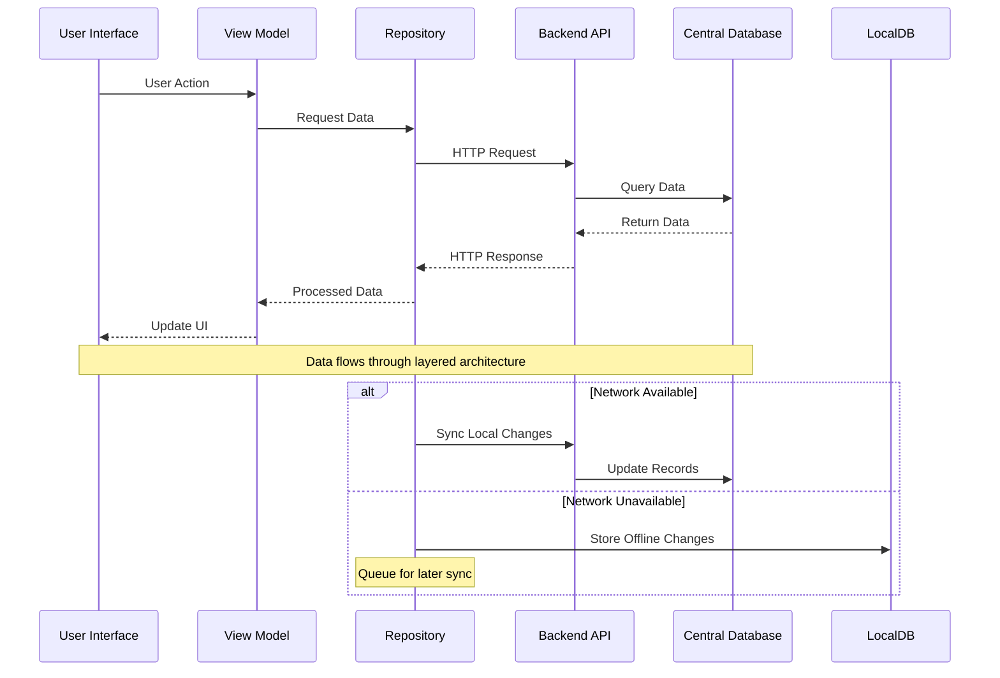
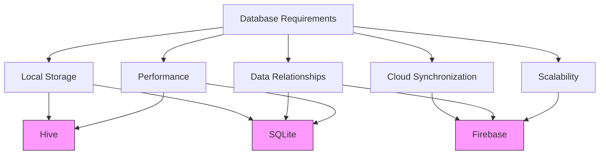
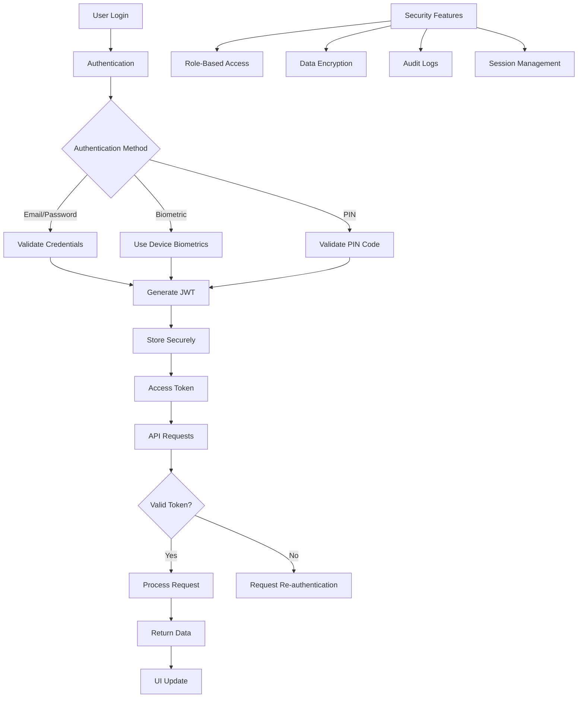
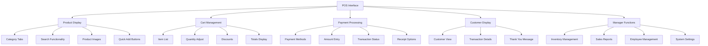
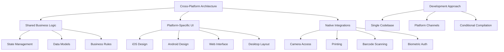

# Future Development Roadmap

<cite>
**Referenced Files in This Document**   
- [main.dart](file://lib/main.dart)
- [pubspec.yaml](file://pubspec.yaml)
- [README.md](file://README.md)
</cite>

## Table of Contents
1. [Introduction](#introduction)
2. [Current State Assessment](#current-state-assessment)
3. [Feature Expansion Plan](#feature-expansion-plan)
4. [State Management Evolution](#state-management-evolution)
5. [Backend Integration Strategy](#backend-integration-strategy)
6. [Database Architecture](#database-architecture)
7. [Security and Authentication](#security-and-authentication)
8. [UI/UX Enhancement Roadmap](#uiux-enhancement-roadmap)
9. [Cross-Platform Considerations](#cross-platform-considerations)
10. [Development Milestones](#development-milestones)

## Introduction

The **altura_pos** application is currently structured as a basic Flutter template application, serving as a foundational starting point for development. This document outlines the strategic roadmap for evolving this template into a fully-featured Point of Sale (POS) system. The transformation will involve significant architectural enhancements, feature expansion, and technology integration to meet the requirements of a robust commercial POS solution. The roadmap focuses on scalable architecture, comprehensive feature implementation, and maintainable code practices while leveraging the current Flutter foundation.

## Current State Assessment

The current implementation of **altura_pos** represents a minimal Flutter application template with basic counter functionality. The application structure follows standard Flutter conventions with a simple stateful widget pattern using `setState()` for state management. The project dependencies are minimal, containing only core Flutter packages without additional state management solutions, database integrations, or authentication mechanisms. This clean slate provides an ideal foundation for implementing a scalable architecture from the outset, avoiding technical debt from legacy patterns.

```mermaid
graph TD
A[altura_pos Application] --> B[Flutter Framework]
A --> C[Material Design]
A --> D[Minimal Dependencies]
B --> E[StatefulWidget]
E --> F[setState() Management]
F --> G[Local State Only]
D --> H[cupertino_icons]
D --> I[flutter_test]
```

**Diagram sources**
- [main.dart](file://lib/main.dart)
- [pubspec.yaml](file://pubspec.yaml)

**Section sources**
- [main.dart](file://lib/main.dart)
- [pubspec.yaml](file://pubspec.yaml)

## Feature Expansion Plan

The evolution of **altura_pos** will focus on implementing core POS functionalities that transform the application from a template to a production-ready system. The feature set will be developed in phases, with each phase building upon the previous foundation.

### Core POS Features

The primary feature domains for the POS system include:

- **Product Catalog Management**: Comprehensive product database with categories, pricing, inventory levels, and product images
- **Cart Functionality**: Dynamic shopping cart with item addition, modification, and removal capabilities
- **Payment Processing**: Integration with multiple payment gateways and support for various payment methods
- **Order History**: Complete transaction history with search, filtering, and reporting capabilities
- **Inventory Tracking**: Real-time inventory monitoring with low-stock alerts and automated reordering
- **Customer Management**: Customer database with purchase history and loyalty program integration
- **Reporting and Analytics**: Sales reports, inventory reports, and business performance metrics

```mermaid
flowchart TD
A[Product Catalog] --> B[Add/Edit Products]
A --> C[Category Management]
A --> D[Price Management]
A --> E[Inventory Levels]
F[Cart Functionality] --> G[Add Items]
F --> H[Modify Quantities]
F --> I[Remove Items]
F --> J[Apply Discounts]
K[Payment Processing] --> L[Credit/Debit Cards]
K --> M[Mobile Payments]
K --> N[Cash Transactions]
K --> O[Split Payments]
P[Order History] --> Q[Transaction Records]
P --> R[Search Functionality]
P --> S[Export Options]
P --> T[Refund Processing]
U[Inventory Tracking] --> V[Stock Levels]
U --> W[Low Stock Alerts]
U --> X[Reorder Points]
U --> Y[Supplier Management]
Z[Customer Management] --> AA[Customer Database]
Z --> AB[Purchase History]
Z --> AC[Loyalty Programs]
Z --> AD[Contact Information]
AE[Reporting] --> AF[Sales Reports]
AE --> AG[Inventory Reports]
AE --> AH[Employee Performance]
AE --> AI[Tax Reports]
```



**Diagram sources**
- [main.dart](file://lib/main.dart)

**Section sources**
- [main.dart](file://lib/main.dart)

## State Management Evolution

The current implementation relies on `setState()` for state management, which is suitable for simple applications but becomes unwieldy as complexity increases. As **altura_pos** evolves into a full-featured POS system, a more sophisticated state management solution will be essential for maintaining code quality, testability, and performance.

### State Management Options

Three primary state management solutions will be evaluated for integration:

- **Provider**: A wrapper around `InheritedWidget` that provides a simple and efficient way to manage state with minimal boilerplate
- **Bloc (Business Logic Component)**: Implements the BLoC pattern using streams for predictable state management with clear separation of concerns
- **Riverpod**: An evolution of Provider with improved testability, flexibility, and compile-time safety

```mermaid
classDiagram
class StateManagement {
<<abstract>>
+build(context)
+dispose()
}
class SetState {
+setState()
+local state management
+simple implementation
}
class Provider {
+ChangeNotifierProvider
+FutureProvider
+StreamProvider
+automatic disposal
}
class Bloc {
+BlocProvider
+Stream-based
+Event-State pattern
+Separation of concerns
}
class Riverpod {
+ProviderScope
+FutureProvider
+StreamProvider
+Improved testability
+Compile-time safety
}
StateManagement <|-- SetState
StateManagement <|-- Provider
StateManagement <|-- Bloc
StateManagement <|-- Riverpod
note right of SetState
Suitable for simple
state management
but scales poorly
end note
note right of Provider
Good balance of
simplicity and
functionality
end note
note right of Bloc
Predictable state
management with
clear patterns
end note
note right of Riverpod
Most modern solution
with best practices
and testability
end note
```

**Diagram sources**
- [main.dart](file://lib/main.dart)

**Section sources**
- [main.dart](file://lib/main.dart)

## Backend Integration Strategy

To enable data persistence, synchronization, and advanced functionality, **altura_pos** will require integration with backend services. This integration will transform the application from a standalone solution to a connected system capable of operating in multi-device environments.

### API Integration Approach

The backend integration will follow a structured approach:

1. **RESTful API Design**: Implementation of a RESTful API with proper resource modeling for products, orders, customers, and inventory
2. **Authentication Layer**: Secure authentication mechanism using JWT (JSON Web Tokens) or OAuth2
3. **Data Synchronization**: Real-time synchronization between devices and central server
4. **Error Handling**: Robust error handling for network failures and server issues
5. **Caching Strategy**: Local caching of frequently accessed data to improve performance



**Diagram sources**
- [main.dart](file://lib/main.dart)

**Section sources**
- [main.dart](file://lib/main.dart)

## Database Architecture

The choice of database solution is critical for the performance, reliability, and scalability of the POS system. Three primary options will be evaluated based on the specific requirements of **altura_pos**.

### Database Solutions Comparison

| Solution | Advantages | Disadvantages | Use Case |
|--------|-----------|-------------|---------|
| **Hive** | - Extremely fast<br>- Simple API<br>- No native dependencies<br>- Good for small to medium datasets | - Limited querying capabilities<br>- No relationships<br>- Less mature ecosystem | Local storage for cached data, settings, and small datasets |
| **SQLite** | - Relational database<br>- Powerful querying<br>- ACID compliance<br>- Well-established | - Requires native compilation<br>- More complex setup<br>- Larger footprint | Local storage for complex data with relationships and transactions |
| **Firebase** | - Real-time synchronization<br>- Cloud-hosted<br>- Authentication integration<br>- Serverless architecture | - Ongoing costs<br>- Internet dependency<br>- Data modeling constraints | Primary data storage with real-time sync across devices |



**Diagram sources**
- [pubspec.yaml](file://pubspec.yaml)

**Section sources**
- [pubspec.yaml](file://pubspec.yaml)

## Security and Authentication

As a POS system handling financial transactions and sensitive customer data, security is paramount. The application must implement robust security measures to protect data integrity and prevent unauthorized access.

### Security Framework

The security implementation will include:

- **User Authentication**: Role-based access control with different permission levels for cashiers, managers, and administrators
- **Data Encryption**: Encryption of sensitive data both in transit and at rest
- **Secure Storage**: Protection of authentication tokens and credentials using secure storage mechanisms
- **Audit Logging**: Comprehensive logging of user actions for security monitoring and compliance
- **Offline Security**: Protection of data when operating in offline mode



**Diagram sources**
- [main.dart](file://lib/main.dart)

**Section sources**
- [main.dart](file://lib/main.dart)

## UI/UX Enhancement Roadmap

The current UI is a basic Flutter template that must be transformed into a professional POS interface optimized for retail environments. The redesign will focus on usability, efficiency, and accessibility.

### POS Interface Design

Key UI components for the POS system:

- **Product Grid View**: Large, touch-friendly product buttons with images and pricing
- **Cart Summary**: Real-time cart display with itemized list and totals
- **Payment Interface**: Secure payment processing screen with multiple payment options
- **Customer Facing Display**: Secondary screen support for customer transaction viewing
- **Manager Functions**: Administrative interface for inventory management and reporting



**Diagram sources**
- [main.dart](file://lib/main.dart)

**Section sources**
- [main.dart](file://lib/main.dart)

## Cross-Platform Considerations

While maintaining cross-platform compatibility across iOS, Android, web, and desktop, the application will also incorporate platform-specific features to enhance the user experience on each platform.

### Platform Strategy

- **Consistent Core**: Shared business logic and data models across all platforms
- **Adaptive UI**: Responsive design that adapts to different screen sizes and input methods
- **Platform-Specific Features**: Integration with platform-specific capabilities like biometric authentication, printing, and hardware peripherals
- **Performance Optimization**: Platform-specific optimizations for smooth operation



**Diagram sources**
- [main.dart](file://lib/main.dart)
- [pubspec.yaml](file://pubspec.yaml)

**Section sources**
- [main.dart](file://lib/main.dart)
- [pubspec.yaml](file://pubspec.yaml)

## Development Milestones

The evolution of **altura_pos** will follow a phased development approach with clear milestones and deliverables.

### Implementation Timeline

1. **Phase 1 - Foundation (Weeks 1-4)**
   - Implement chosen state management solution
   - Design data models for core entities
   - Set up development environment and tooling

2. **Phase 2 - Core Features (Weeks 5-8)**
   - Implement product catalog and inventory
   - Develop cart functionality
   - Create basic UI components

3. **Phase 3 - Backend Integration (Weeks 9-12)**
   - Implement API client
   - Set up authentication
   - Enable data synchronization

4. **Phase 4 - Advanced Features (Weeks 13-16)**
   - Implement payment processing
   - Develop reporting capabilities
   - Add customer management

5. **Phase 5 - Optimization and Testing (Weeks 17-20)**
   - Performance optimization
   - Comprehensive testing
   - Security audit
   - User acceptance testing

This structured approach ensures steady progress while maintaining code quality and allowing for iterative feedback and improvement throughout the development process.