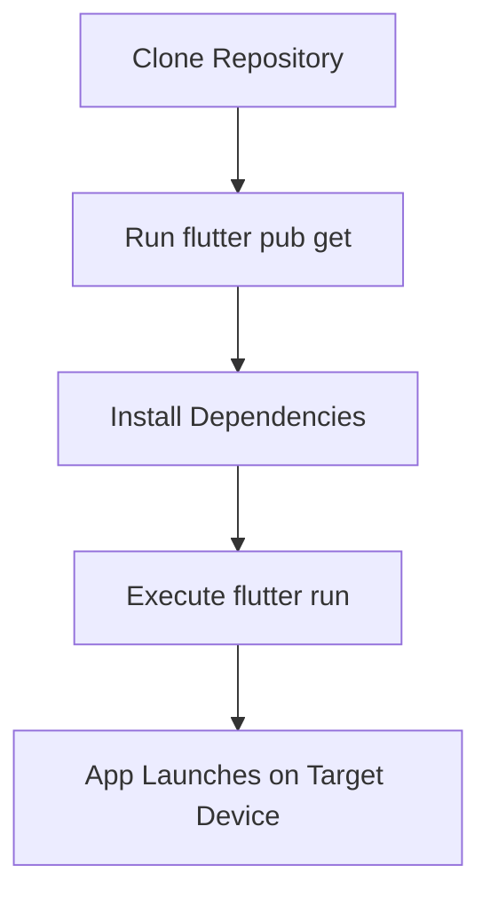
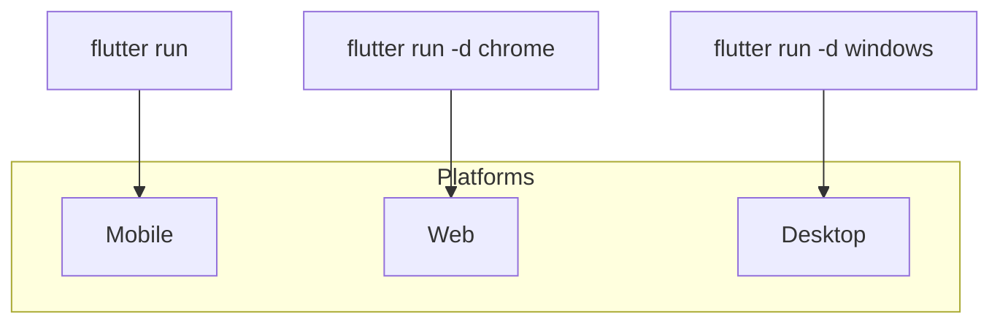

# Getting Started

<cite>
**Referenced Files in This Document**   
- [pubspec.yaml](file://pubspec.yaml)
- [main.dart](file://lib/main.dart)
- [widget_test.dart](file://test/widget_test.dart)
- [README.md](file://README.md)
</cite>

## Table of Contents
1. [Introduction](#introduction)
2. [Prerequisites](#prerequisites)
3. [Project Setup](#project-setup)
4. [Running the Application](#running-the-application)
5. [Development Features](#development-features)
6. [Platform-Specific Execution](#platform-specific-execution)
7. [Common Setup Issues](#common-setup-issues)
8. [Conclusion](#conclusion)

## Introduction

The `altura_pos` application is a Flutter-based project designed as a starting point for building cross-platform applications. This guide provides comprehensive instructions for setting up, running, and developing the application across multiple platforms including mobile, web, and desktop environments. The documentation is structured to support both beginners and experienced developers by combining foundational setup steps with technical depth on Flutter workflows and best practices.

**Section sources**
- [README.md](file://README.md#L1-L17)

## Prerequisites

Before setting up the `altura_pos` application, ensure your development environment meets the following requirements:

1. **Flutter SDK**: Version 3.9.2 or higher must be installed. The project specifies `sdk: ^3.9.2` in its environment configuration, ensuring compatibility with recent Flutter features while allowing patch-level updates.

2. **Supported IDEs**: 
   - Android Studio with Flutter and Dart plugins
   - Visual Studio Code with Flutter extension
   - IntelliJ IDEA with Flutter support
   These IDEs provide essential tools such as code completion, debugging, hot reload, and device emulation.

3. **Platform-Specific Tools**:
   - For Android: Android Studio with SDK Platform-Tools
   - For iOS: Xcode (macOS only)
   - For Web: Chrome or any modern browser
   - For Desktop: Appropriate build tools for Windows, macOS, or Linux

All dependencies are managed through the Flutter toolchain, which handles package resolution and native compilation for target platforms.

**Section sources**
- [pubspec.yaml](file://pubspec.yaml#L15-L18)

## Project Setup

To initialize the `altura_pos` project, follow these steps:

1. **Clone the Repository**:
   ```bash
   git clone https://github.com/example/altura_pos.git
   cd altura_pos
   ```

2. **Install Dependencies**:
   Run the following command to fetch all declared packages:
   ```bash
   flutter pub get
   ```
   This installs the core dependencies specified in `pubspec.yaml`:
   - `flutter`: The core Flutter framework
   - `cupertino_icons`: Icon set for iOS-style interfaces
   - `flutter_test`: Testing utilities (dev dependency)
   - `flutter_lints`: Code quality rules (dev dependency)

3. **Verify Installation**:
   Use `flutter pub outdated` to check for available package updates, or `flutter pub upgrade --major-versions` to update to the latest compatible versions.

The dependency management system ensures that all required libraries are downloaded and linked correctly for development and testing.

**Section sources**
- [pubspec.yaml](file://pubspec.yaml#L20-L50)

## Running the Application

Launch the application using the standard Flutter run command:

```bash
flutter run
```

This command automatically detects connected devices or emulators and deploys the app accordingly. If multiple devices are available, you can specify a target using:

```bash
flutter run -d <device-id>
```

Use `flutter devices` to list all available targets. The application entry point is defined in `lib/main.dart`, which initializes the `MyApp` widget and sets up the MaterialApp with a default theme and home screen.

Upon successful execution, the app displays a counter interface where users can increment a value via a floating action button. This serves as both a functional demo and a validation of the development environment.



**Diagram sources**
- [pubspec.yaml](file://pubspec.yaml#L20-L50)
- [main.dart](file://lib/main.dart#L1-L10)

**Section sources**
- [main.dart](file://lib/main.dart#L1-L10)

## Development Features

Flutter enhances developer productivity through two key features: hot reload and hot restart.

- **Hot Reload**: Press `r` in the terminal or use the IDE's reload button to apply code changes instantly without losing application state. For example, modifying the `seedColor` in `ColorScheme.fromSeed(seedColor: Colors.deepPurple)` will update the UI appearance while preserving the current counter value.

- **Hot Restart**: Use `R` (capital) to completely rebuild the app, resetting all state. This is necessary when making structural changes such as adding new dependencies or modifying widget hierarchies.

These features are demonstrated in the default `MyHomePage` widget, where comments explicitly guide developers to experiment with theme changes and observe real-time updates. The state preservation during hot reload ensures rapid iteration on UI designs without repetitive manual testing.

**Section sources**
- [main.dart](file://lib/main.dart#L20-L35)

## Platform-Specific Execution

The `altura_pos` application supports deployment across multiple platforms using specific Flutter commands:

- **Mobile (Android/iOS)**:
  ```bash
  flutter run
  ```

- **Web**:
  ```bash
  flutter run -d chrome
  ```
  Or deploy to a web server using:
  ```bash
  flutter build web
  ```

- **Desktop (Windows, macOS, Linux)**:
  ```bash
  flutter run -d windows
  flutter run -d macos
  flutter run -d linux
  ```
  Build standalone executables with:
  ```bash
  flutter build windows
  ```

The project structure includes platform-specific directories (`android/`, `ios/`, `windows/`, etc.) that contain native code and configuration files. These are automatically generated and maintained by Flutter, requiring minimal manual intervention for standard use cases.



**Diagram sources**
- [pubspec.yaml](file://pubspec.yaml#L52-L89)
- [main.dart](file://lib/main.dart#L1-L10)

**Section sources**
- [android/app/src/main/AndroidManifest.xml](file://android/app/src/main/AndroidManifest.xml)
- [ios/Runner/Info.plist](file://ios/Runner/Info.plist)
- [windows/CMakeLists.txt](file://windows/CMakeLists.txt)

## Common Setup Issues

Developers may encounter several common issues during setup:

1. **Missing Flutter SDK**: Ensure Flutter is installed and added to the system PATH. Verify installation with `flutter doctor`, which checks dependencies and reports missing components.

2. **Platform-Specific Build Errors**:
   - Android: Missing Android SDK or outdated Gradle version. Resolve by updating Android Studio and accepting licenses via `flutter doctor --android-licenses`.
   - iOS: Requires macOS with Xcode installed. Run `sudo xcode-select --install` if command-line tools are missing.
   - Desktop: Enable desktop support with `flutter config --enable-windows-desktop` (or equivalent for macOS/Linux).

3. **Dependency Resolution Failures**: If `flutter pub get` fails, check internet connectivity or run `flutter pub cache repair` to rebuild the package cache.

4. **IDE Integration Issues**: Ensure the correct Flutter and Dart SDK paths are configured in your IDE settings. Restart the IDE after SDK installation.

The `analysis_options.yaml` file enforces coding standards through `flutter_lints`, helping maintain code quality and avoid common pitfalls.

**Section sources**
- [pubspec.yaml](file://pubspec.yaml#L50-L55)
- [analysis_options.yaml](file://analysis_options.yaml)

## Conclusion

The `altura_pos` application provides a robust foundation for Flutter development across multiple platforms. By following the setup instructions, leveraging Flutter's development features, and addressing common issues proactively, developers can efficiently build and test cross-platform applications. The project's structure and configuration align with Flutter best practices, ensuring maintainability and scalability for future enhancements.