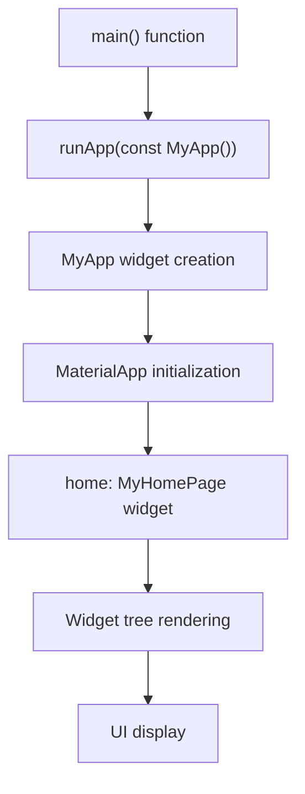
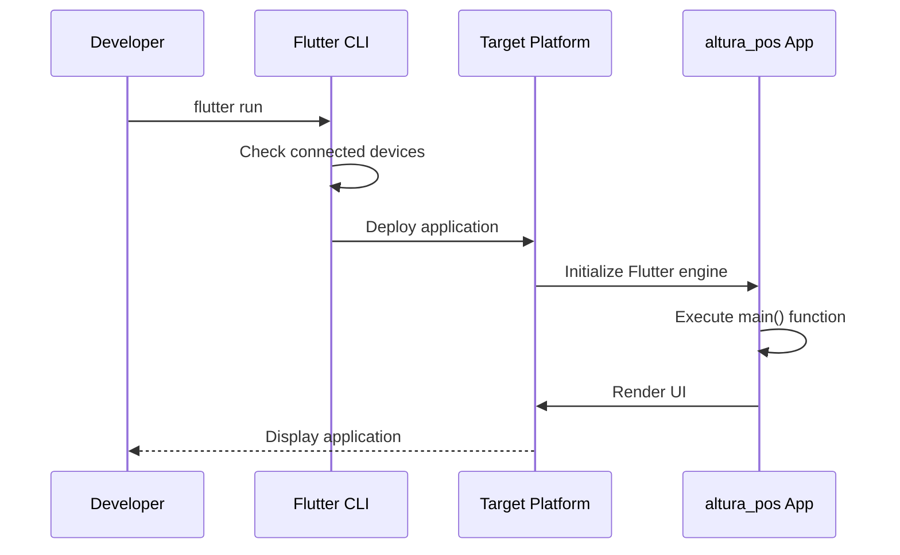

# Getting Started

<cite>
**Referenced Files in This Document**   
- [main.dart](file://lib/main.dart)
- [pubspec.yaml](file://pubspec.yaml)
- [MainActivity.kt](file://android/app/src/main/kotlin/com/example/altura_pos/MainActivity.kt)
- [AppDelegate.swift](file://ios/Runner/AppDelegate.swift)
- [local.properties](file://android/local.properties)
- [main.cpp](file://windows/runner/main.cpp)
- [my_application.cc](file://linux/runner/my_application.cc)
- [AndroidManifest.xml](file://android/app/src/main/AndroidManifest.xml)
</cite>

## Table of Contents
1. [Introduction](#introduction)
2. [Development Environment Setup](#development-environment-setup)
3. [Repository Cloning and Dependency Installation](#repository-cloning-and-dependency-installation)
4. [Application Execution Flow](#application-execution-flow)
5. [Running the Application](#running-the-application)
6. [Hot Reload and Hot Restart](#hot-reload-and-hot-restart)
7. [Common Setup Issues and Solutions](#common-setup-issues-and-solutions)
8. [Conclusion](#conclusion)

## Introduction
The altura_pos application is a Flutter-based point-of-sale system designed for cross-platform deployment. This guide provides comprehensive instructions for setting up the development environment, understanding the application structure, and running the application across various platforms. The project follows standard Flutter conventions and is configured to support Android, iOS, Windows, Linux, and web platforms.

## Development Environment Setup
To begin development with the altura_pos application, you need to set up the Flutter SDK and configure your development environment. Follow these steps:

1. **Install Flutter SDK**: Download and install the Flutter SDK from the official website. The project requires Flutter SDK version 3.9.2 or higher, as specified in the pubspec.yaml file.

2. **Configure IDE**: Set up your preferred IDE (Android Studio, Visual Studio Code, or IntelliJ IDEA) with the Flutter and Dart plugins. This enables features like code completion, debugging, and hot reload.

3. **Platform-Specific Tools**:
   - **Android**: Install Android Studio and configure the Android SDK. The local.properties file in the android directory specifies the SDK path: `sdk.dir=C:\\Users\\CODE.ID\\AppData\\Local\\Android\\sdk`.
   - **iOS**: Install Xcode on macOS for iOS development and testing.
   - **Windows/Linux**: Ensure you have the necessary build tools installed. The CMakeLists.txt files in the windows and linux directories configure the build process for these platforms.

4. **Verify Installation**: Run `flutter doctor` in your terminal to verify that all components are correctly installed and configured.

**Section sources**
- [pubspec.yaml](file://pubspec.yaml#L20-L21)
- [local.properties](file://android/local.properties#L1)

## Repository Cloning and Dependency Installation
After setting up your development environment, clone the repository and install the required dependencies:

1. **Clone the Repository**: Use Git to clone the altura_pos repository from its source location.

2. **Navigate to Project Directory**: Change into the project directory using your terminal or command prompt.

3. **Install Dependencies**: Run `flutter pub get` to install all dependencies specified in the pubspec.yaml file. The project depends on:
   - Flutter SDK
   - cupertino_icons package (^1.0.8) for iOS-style icons
   - flutter_test for testing
   - flutter_lints (^5.0.0) for code quality checks

The pubspec.yaml file also specifies that the application uses Material Design, ensuring consistent UI components across platforms.

**Section sources**
- [pubspec.yaml](file://pubspec.yaml#L24-L45)

## Application Execution Flow
The execution flow of the altura_pos application begins with the main() function in main.dart and proceeds through the Flutter framework initialization:

**Diagram sources**
- [main.dart](file://lib/main.dart#L3-L7)

The main() function serves as the entry point, calling runApp() with the MyApp widget as its parameter. MyApp is a StatelessWidget that returns a MaterialApp widget, which acts as the root of the application's widget tree. The MaterialApp configures the app's theme and sets MyHomePage as the home screen. MyHomePage is a StatefulWidget that manages its state, including the counter value that increments when the user interacts with the floating action button.

**Section sources**
- [main.dart](file://lib/main.dart#L3-L122)

## Running the Application
You can run the altura_pos application on various platforms using the Flutter CLI:

1. **Connect a Device or Start an Emulator**:
   - For Android, start the Android Emulator from Android Studio or connect a physical device via USB.
   - For iOS, use the iOS Simulator from Xcode.
   - For Windows/Linux, the application runs directly on the host system.

2. **Run in Debug Mode**: Execute `flutter run` to launch the application in debug mode. This mode enables debugging features and hot reload.

3. **Run in Release Mode**: Use `flutter run --release` to run the application in release mode, which optimizes performance and disables debugging features.

4. **Target Specific Platforms**: Use the `-d` flag to specify a target device. For example:
   - `flutter run -d chrome` to run on the web
   - `flutter run -d windows` to run on Windows

The platform-specific entry points are configured as follows:
- **Android**: MainActivity.kt extends FlutterActivity
- **iOS**: AppDelegate.swift extends FlutterAppDelegate
- **Windows**: main.cpp initializes the Flutter project and creates the window
- **Linux**: my_application.cc handles application activation and window creation

**Diagram sources**
- [main.dart](file://lib/main.dart#L3-L7)
- [MainActivity.kt](file://android/app/src/main/kotlin/com/example/altura_pos/MainActivity.kt#L3)
- [AppDelegate.swift](file://ios/Runner/AppDelegate.swift#L4)
- [main.cpp](file://windows/runner/main.cpp#L30)
- [my_application.cc](file://linux/runner/my_application.cc#L45)

**Section sources**
- [main.dart](file://lib/main.dart#L3-L7)
- [MainActivity.kt](file://android/app/src/main/kotlin/com/example/altura_pos/MainActivity.kt#L3)
- [AppDelegate.swift](file://ios/Runner/AppDelegate.swift#L4)
- [main.cpp](file://windows/runner/main.cpp#L30)
- [my_application.cc](file://linux/runner/my_application.cc#L45)

## Hot Reload and Hot Restart
Flutter's hot reload and hot restart features significantly speed up the development process:

- **Hot Reload**: When you save changes to your Dart code, Flutter injects the updated code into the running application, preserving the current state. This allows you to see changes instantly without losing the application state. Trigger hot reload by pressing `r` in the terminal or using the IDE's hot reload button.

- **Hot Restart**: This completely rebuilds the widget tree and resets the application state. Use hot restart when you need to start fresh, such as after making changes to the app's initialization logic. Trigger hot restart by pressing `R` in the terminal or using the IDE's hot restart button.

The main.dart file includes comments demonstrating how to use hot reload to change the application's theme color without resetting the counter state, showcasing the power of state preservation during development.

**Section sources**
- [main.dart](file://lib/main.dart#L15-L25)

## Common Setup Issues and Solutions
Developers may encounter several common issues when setting up and running the altura_pos application:

1. **Android SDK Not Found**: If the Android SDK path is not correctly configured, ensure that the local.properties file in the android directory contains the correct sdk.dir path. The current configuration points to `C:\\Users\\CODE.ID\\AppData\\Local\\Android\\sdk`.

2. **Platform-Specific Build Errors**:
   - **Windows**: Ensure that Visual Studio with C++ development tools is installed, as the CMakeLists.txt file requires C++17 support.
   - **Linux**: Install the GTK development libraries, as the application depends on gtk+-3.0 for Linux desktop support.
   - **macOS**: Make sure Xcode command-line tools are installed and the license agreement is accepted.

3. **Dependency Resolution Issues**: If `flutter pub get` fails, check your internet connection and ensure that the Flutter SDK is correctly installed. You can also try running `flutter pub cache repair` to fix corrupted cache entries.

4. **Device Connection Problems**: For Android devices, ensure that USB debugging is enabled in the developer options. For iOS, make sure your device is trusted and properly provisioned for development.

5. **Gradle Sync Issues**: If Android build fails due to Gradle issues, check the settings.gradle.kts file, which configures the Flutter plugin loader and Android application plugin versions.

The AndroidManifest.xml file includes the INTERNET permission in debug and profile builds, which is required for development features like hot reload, but should be reviewed for production builds.

**Section sources**
- [local.properties](file://android/local.properties#L1)
- [settings.gradle.kts](file://android/settings.gradle.kts#L15-L18)
- [AndroidManifest.xml](file://android/app/src/debug/AndroidManifest.xml#L3)
- [AndroidManifest.xml](file://android/app/src/profile/AndroidManifest.xml#L3)

## Conclusion
The altura_pos application provides a solid foundation for a cross-platform point-of-sale system using Flutter. By following this guide, developers can quickly set up their environment, understand the application structure, and begin development with confidence. The project's standard Flutter architecture, combined with platform-specific configurations, enables efficient development across multiple platforms. Remember to leverage Flutter's hot reload feature for rapid iteration and consult the official Flutter documentation for advanced topics and troubleshooting.