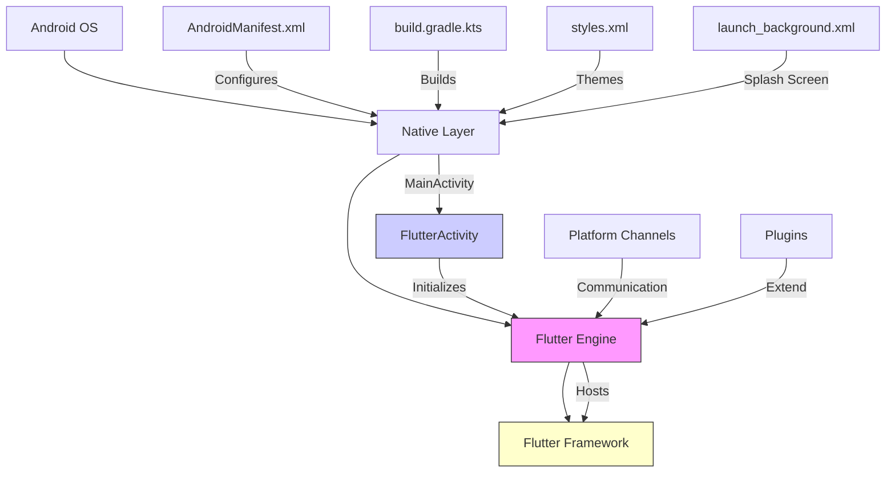
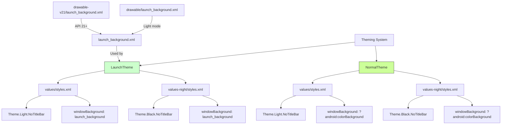
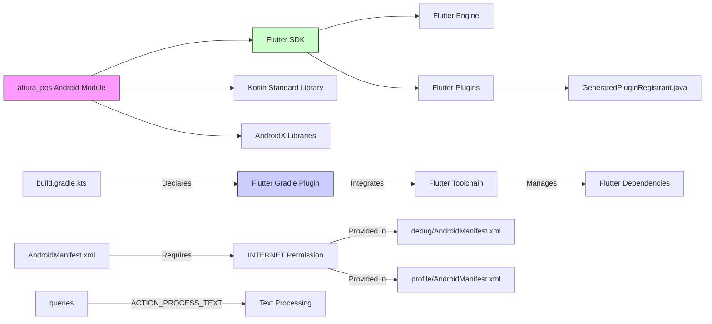

# Android Support

<cite>
**Referenced Files in This Document**   
- [MainActivity.kt](file://android/app/src/main/kotlin/com/example/altura_pos/MainActivity.kt)
- [AndroidManifest.xml](file://android/app/src/main/AndroidManifest.xml)
- [build.gradle.kts](file://android/app/build.gradle.kts)
- [styles.xml](file://android/app/src/main/res/values/styles.xml)
- [styles.xml](file://android/app/src/main/res/values-night/styles.xml)
- [debug/AndroidManifest.xml](file://android/app/src/debug/AndroidManifest.xml)
- [profile/AndroidManifest.xml](file://android/app/src/profile/AndroidManifest.xml)
</cite>

## Table of Contents
1. [Introduction](#introduction)
2. [Project Structure](#project-structure)
3. [Core Components](#core-components)
4. [Architecture Overview](#architecture-overview)
5. [Detailed Component Analysis](#detailed-component-analysis)
6. [Dependency Analysis](#dependency-analysis)
7. [Performance Considerations](#performance-considerations)
8. [Troubleshooting Guide](#troubleshooting-guide)
9. [Conclusion](#conclusion)

## Introduction
This document provides comprehensive architectural documentation for Android platform integration in the `altura_pos` Flutter application. It details the role of key Android components, build configuration, theming, and customization options relevant to POS applications. The guide also includes troubleshooting recommendations for common Android-specific issues.

## Project Structure
The Android module in the `altura_pos` Flutter project follows standard Flutter project conventions with Kotlin as the primary language. The structure is organized to support multiple build variants (debug, profile, release) and includes proper separation of resources, manifests, and Gradle configuration files.

```mermaid
graph TB
subgraph "Android Module"
subgraph "app"
src[Source Sets]
build[Build Config]
res[Resources]
end
gradle[Gradle Scripts]
properties[Configuration Files]
end
src --> |Contains| main["main/ (production)"]
src --> |Contains| debug["debug/ (development)"]
src --> |Contains| profile["profile/ (performance testing)"]
build --> |Uses| gradle
res --> |Includes| values["values/ (light theme)"]
res --> |Includes| values_night["values-night/ (dark theme)"]
res --> |Includes| drawable["drawable/ (launch background)"]
style subgraph fill:#f9f,stroke:#333
```

**Diagram sources**
- [AndroidManifest.xml](file://android/app/src/main/AndroidManifest.xml)
- [build.gradle.kts](file://android/app/build.gradle.kts)
- [styles.xml](file://android/app/src/main/res/values/styles.xml)

**Section sources**
- [AndroidManifest.xml](file://android/app/src/main/AndroidManifest.xml)
- [build.gradle.kts](file://android/app/build.gradle.kts)

## Core Components
The Android integration in `altura_pos` consists of several core components that enable Flutter functionality on the Android platform. These include the main activity entry point, manifest configuration, build system integration, and theming resources. The components work together to initialize the Flutter engine, configure app metadata, and provide a native launch experience.

**Section sources**
- [MainActivity.kt](file://android/app/src/main/kotlin/com/example/altura_pos/MainActivity.kt)
- [AndroidManifest.xml](file://android/app/src/main/AndroidManifest.xml)
- [build.gradle.kts](file://android/app/build.gradle.kts)

## Architecture Overview
The Android architecture for `altura_pos` follows the Flutter V2 embedding model, where the Flutter engine is integrated into a native Android activity. The architecture consists of a layered approach with the native Android layer providing platform services and the Flutter layer handling the UI and business logic.



**Diagram sources**
- [MainActivity.kt](file://android/app/src/main/kotlin/com/example/altura_pos/MainActivity.kt)
- [AndroidManifest.xml](file://android/app/src/main/AndroidManifest.xml)
- [build.gradle.kts](file://android/app/build.gradle.kts)

## Detailed Component Analysis

### MainActivity Analysis
The `MainActivity.kt` file serves as the native entry point for the Android application. It extends `FlutterActivity` from the Flutter Android embedding library, which provides the necessary infrastructure to host the Flutter engine and render the Flutter UI.

```mermaid
classDiagram
class FlutterActivity {
+onCreate(savedInstanceState : Bundle)
+onDestroy()
+onNewIntent(intent : Intent)
+onRequestPermissionsResult(requestCode : Int, permissions : Array<String>, grantResults : IntArray)
+getFlutterEngine() : FlutterEngine
}
class MainActivity {
// Inherits all methods from FlutterActivity
}
MainActivity --|> FlutterActivity : "extends"
note right of MainActivity
MainActivity inherits all functionality
from FlutterActivity and serves as the
entry point for the Android application.
No additional implementation is required
for basic Flutter apps.
end note
```

**Diagram sources**
- [MainActivity.kt](file://android/app/src/main/kotlin/com/example/altura_pos/MainActivity.kt)

**Section sources**
- [MainActivity.kt](file://android/app/src/main/kotlin/com/example/altura_pos/MainActivity.kt)

### AndroidManifest Configuration
The `AndroidManifest.xml` file contains essential configuration for the Android application, including app metadata, activity declarations, permissions, and Flutter-specific settings. The manifest is configured for the V2 embedding model with proper intent filters and theme references.

```mermaid
flowchart TD
A[AndroidManifest.xml] --> B[Application Element]
B --> C[android:label="altura_pos"]
B --> D[android:icon="@mipmap/ic_launcher"]
B --> E[MainActivity Declaration]
E --> F[android:name=".MainActivity"]
F --> G[android:exported="true"]
G --> H[android:launchMode="singleTop"]
H --> I[android:theme="@style/LaunchTheme"]
I --> J[android:configChanges="orientation|keyboardHidden|..."]
J --> K[android:hardwareAccelerated="true"]
E --> L[Intent Filter]
L --> M[action.MAIN]
L --> N[category.LAUNCHER]
E --> O[NormalTheme Meta-Data]
O --> P[io.flutter.embedding.android.NormalTheme]
P --> Q[@style/NormalTheme]
E --> R[Flutter Embedding Meta-Data]
R --> S[flutterEmbedding=2]
style A fill:#f9f,stroke:#333
style R fill:#cfc,stroke:#333
```

**Diagram sources**
- [AndroidManifest.xml](file://android/app/src/main/AndroidManifest.xml)

**Section sources**
- [AndroidManifest.xml](file://android/app/src/main/AndroidManifest.xml)

### Gradle Build Configuration
The Gradle build system integrates with the Flutter toolchain to compile and package the Android application. The configuration uses Kotlin DSL (build.gradle.kts) and follows modern Android development practices with proper SDK version management and compilation settings.

```mermaid
classDiagram
class BuildConfig {
+namespace : String
+compileSdk : Int
+ndkVersion : String
+sourceCompatibility : JavaVersion
+targetCompatibility : JavaVersion
+jvmTarget : String
+applicationId : String
+minSdk : Int
+targetSdk : Int
+versionCode : Int
+versionName : String
}
class Plugins {
+com.android.application
+kotlin-android
+dev.flutter.flutter-gradle-plugin
}
class BuildTypes {
+release
+debug
}
class FlutterConfig {
+source : String
}
BuildConfig -->|Configured by| build.gradle.kts
Plugins -->|Applied in| build.gradle.kts
BuildTypes -->|Defined in| build.gradle.kts
FlutterConfig -->|Set in| build.gradle.kts
note right of Plugins
Plugin order is critical :
Flutter plugin must be applied
after Android and Kotlin plugins
end note
note right of FlutterConfig
Source points to parent directory
where Flutter project resides
end note
```

**Diagram sources**
- [build.gradle.kts](file://android/app/build.gradle.kts)

**Section sources**
- [build.gradle.kts](file://android/app/build.gradle.kts)

### Theming and Launch Experience
The theming system in `altura_pos` provides a seamless launch experience with support for both light and dark modes. The themes are defined in XML resources and control the appearance of the app during startup before the Flutter UI is rendered.



**Diagram sources**
- [styles.xml](file://android/app/src/main/res/values/styles.xml)
- [styles.xml](file://android/app/src/main/res/values-night/styles.xml)
- [launch_background.xml](file://android/app/src/main/res/drawable/launch_background.xml)

**Section sources**
- [styles.xml](file://android/app/src/main/res/values/styles.xml)
- [styles.xml](file://android/app/src/main/res/values-night/styles.xml)

## Dependency Analysis
The Android module in `altura_pos` has a well-defined dependency structure that integrates with the Flutter ecosystem while maintaining compatibility with native Android development practices. The dependencies are managed through Gradle and the Flutter toolchain.



**Diagram sources**
- [build.gradle.kts](file://android/app/build.gradle.kts)
- [AndroidManifest.xml](file://android/app/src/main/AndroidManifest.xml)
- [debug/AndroidManifest.xml](file://android/app/src/debug/AndroidManifest.xml)
- [profile/AndroidManifest.xml](file://android/app/src/profile/AndroidManifest.xml)

**Section sources**
- [build.gradle.kts](file://android/app/build.gradle.kts)
- [AndroidManifest.xml](file://android/app/src/main/AndroidManifest.xml)

## Performance Considerations
The Android configuration in `altura_pos` follows performance best practices for Flutter applications. The build settings use Java 11 compatibility, which provides modern language features while maintaining good performance characteristics. The app is configured to support the appropriate SDK versions and includes hardware acceleration for smooth rendering.

For POS applications, special attention should be paid to startup time optimization by minimizing the launch theme duration and ensuring efficient initialization of the Flutter engine. The current configuration properly uses the V2 embedding model, which provides faster startup times compared to the legacy embedding.

The multidex configuration is not explicitly defined, which means the app will automatically handle multidex if needed based on the Flutter toolchain defaults. For production POS applications with many plugins, monitoring the method count and configuring proguard rules appropriately is recommended to optimize APK size and performance.

**Section sources**
- [build.gradle.kts](file://android/app/build.gradle.kts)
- [AndroidManifest.xml](file://android/app/src/main/AndroidManifest.xml)

## Troubleshooting Guide
This section provides guidance for resolving common Android build and runtime issues in the `altura_pos` application.

### Build Issues
- **Multidex errors**: If encountering multidex limitations, enable multidex explicitly in `build.gradle.kts` by adding `multiDexEnabled true` to the `defaultConfig` block and ensure the `multidex` dependency is included.
- **ProGuard/R8 issues**: For release builds with code shrinking, create a `proguard-rules.pro` file in the `android/app` directory and reference it in `build.gradle.kts`. Include rules for Flutter and any native plugins used.
- **Gradle sync failures**: Ensure the Flutter Gradle Plugin version is compatible with the Android Gradle Plugin version. Check for conflicting dependencies in the project.

### Platform Channel Setup
- Verify that the `flutterEmbedding` meta-data value is set to "2" in `AndroidManifest.xml`
- Ensure platform channel method names are consistent between Dart and Android code
- Use proper error handling in platform channel methods to catch and report exceptions

### Permission Handling
For POS-specific permissions like Bluetooth and location access:
- Add required permissions to `AndroidManifest.xml` (e.g., `ACCESS_FINE_LOCATION`, `BLUETOOTH`, `BLUETOOTH_ADMIN`)
- Request permissions at runtime using the `permission_handler` plugin or native Android APIs
- Handle permission denial gracefully and provide appropriate user guidance

### Hardware Back Button
To customize back button behavior:
- Override `onBackPressed()` in `MainActivity.kt` to intercept the back button
- Use `android:windowSoftInputMode="adjustResize"` (already configured) to properly handle keyboard dismissal
- Consider using `WillPopScope` in Flutter for more granular control over navigation

**Section sources**
- [AndroidManifest.xml](file://android/app/src/main/AndroidManifest.xml)
- [build.gradle.kts](file://android/app/build.gradle.kts)
- [MainActivity.kt](file://android/app/src/main/kotlin/com/example/altura_pos/MainActivity.kt)

## Conclusion
The Android integration in `altura_pos` follows Flutter best practices with a clean architecture that separates concerns between native Android components and Flutter UI. The configuration supports modern Android development features including dark mode, proper theming, and the V2 embedding model. The build system is properly configured to work with the Flutter toolchain, and the app is structured to support POS-specific requirements like hardware access and custom navigation behavior. By following the guidance in this document, developers can effectively maintain and extend the Android functionality of the application.