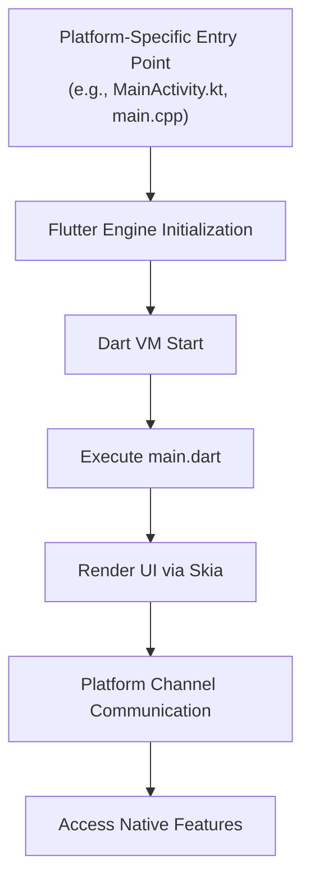
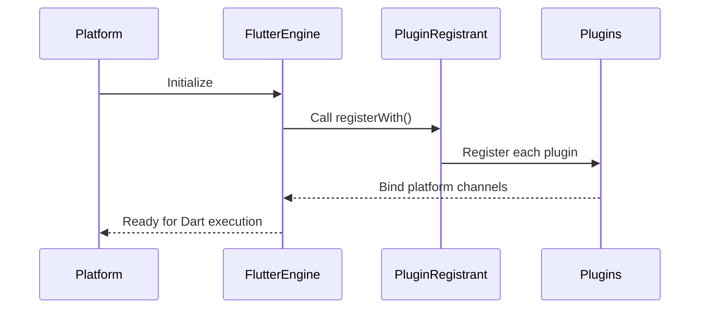
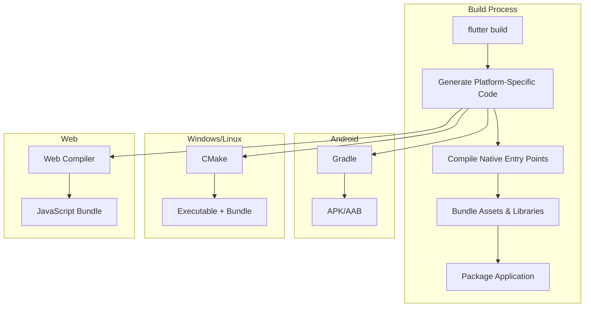

# Multi-Platform Support

<cite>
**Referenced Files in This Document**   
- [main.dart](file://lib/main.dart)
- [MainActivity.kt](file://android/app/src/main/kotlin/com/example/altura_pos/MainActivity.kt)
- [main.cpp](file://windows/runner/main.cpp)
- [my_application.cc](file://linux/runner/my_application.cc)
- [index.html](file://web/index.html)
- [GeneratedPluginRegistrant.java](file://android/app/src/main/java/io/flutter/plugins/GeneratedPluginRegistrant.java)
- [GeneratedPluginRegistrant.m](file://ios/Runner/GeneratedPluginRegistrant.m)
- [generated_plugin_registrant.cc](file://linux/flutter/generated_plugin_registrant.cc)
- [generated_plugin_registrant.cc](file://windows/flutter/generated_plugin_registrant.cc)
- [build.gradle.kts](file://android/build.gradle.kts)
- [CMakeLists.txt](file://windows/CMakeLists.txt)
- [CMakeLists.txt](file://linux/CMakeLists.txt)
- [pubspec.yaml](file://pubspec.yaml)
</cite>

## Table of Contents
1. [Introduction](#introduction)
2. [Flutter Multi-Platform Architecture](#flutter-multi-platform-architecture)
3. [Platform-Specific Entry Points](#platform-specific-entry-points)
4. [Plugin Registration Mechanism](#plugin-registration-mechanism)
5. [Build Systems and Configuration](#build-systems-and-configuration)
6. [Building and Running for Target Platforms](#building-and-running-for-target-platforms)
7. [Platform-Specific Considerations for POS Applications](#platform-specific-considerations-for-pos-applications)
8. [Conclusion](#conclusion)

## Introduction

Flutter enables the development of high-performance, natively compiled applications for mobile, web, and desktop from a single codebase. The `altura_pos` project exemplifies this capability by supporting Android, iOS, Linux, macOS, Windows, and Web platforms. This document details the architectural components that facilitate multi-platform deployment, focusing on how Flutter integrates with native platform entry points, manages plugin communication, and leverages platform-specific build systems to deliver a unified POS application experience across diverse environments.

**Section sources**
- [README.md](file://README.md#L1-L17)

## Flutter Multi-Platform Architecture

Flutter's architecture is designed around a portable runtime that can be embedded into various host platforms. At its core, the Dart code in `main.dart` serves as the universal entry point for all platforms. When the application launches, the Flutter engine initializes and executes the Dart code, rendering the UI through Skia, Flutter’s graphics engine. This engine abstraction allows the same UI and business logic to run consistently across platforms while interfacing with native capabilities through platform channels.

The `main()` function in `main.dart` calls `runApp()` with the root widget, which bootstraps the Flutter framework and begins rendering. This Dart-centric approach ensures that 90%+ of the application code remains shared, while platform-specific files handle only the minimal native integration required to launch the engine.

**Diagram sources**
- [main.dart](file://lib/main.dart#L6-L10)
- [MainActivity.kt](file://android/app/src/main/kotlin/com/example/altura_pos/MainActivity.kt#L4)
- [main.cpp](file://windows/runner/main.cpp#L20-L25)

**Section sources**
- [main.dart](file://lib/main.dart#L1-L122)

## Platform-Specific Entry Points

Each platform requires a native entry point to initialize the Flutter engine and load the Dart application. These files are minimal by design, delegating most functionality to the Flutter framework while providing the necessary hooks for platform integration.

### Android: MainActivity.kt

On Android, `MainActivity.kt` extends `FlutterActivity`, which handles the creation of the Flutter view, engine initialization, and lifecycle management. This class serves as the entry point declared in `AndroidManifest.xml` and automatically loads the Flutter module.

**Section sources**
- [MainActivity.kt](file://android/app/src/main/kotlin/com/example/altura_pos/MainActivity.kt#L1-L6)

### Windows: main.cpp

For Windows, `main.cpp` is the entry point that initializes COM, creates a `FlutterWindow` instance, and runs the message loop. It configures the Dart project with the correct assets path and starts the Flutter engine. The window size and title are set here before the engine begins rendering.

**Section sources**
- [main.cpp](file://windows/runner/main.cpp#L1-L44)

### Linux: my_application.cc

On Linux, `my_application.cc` implements a GTK application that embeds the Flutter engine. It defines callbacks for application activation, command-line handling, and startup/shutdown. The window is created with platform-appropriate styling (header bar in GNOME, traditional title bar otherwise), and the Flutter view is added as a child widget.

**Section sources**
- [my_application.cc](file://linux/runner/my_application.cc#L1-L145)

### Web: index.html

The web platform uses `index.html` as the entry point. This HTML file includes the `flutter_bootstrap.js` script, which loads the Flutter engine and compiles the Dart code (typically AOT-compiled to JavaScript). Meta tags define app metadata, icons, and the base href for routing.

**Section sources**
- [index.html](file://web/index.html#L1-L39)

## Plugin Registration Mechanism

Communication between Dart code and native platform features is enabled through platform channels. Flutter automatically generates plugin registrant files for each platform, which register all plugins with the Flutter engine at startup.

### Auto-Generated Plugin Registrants

- **Android**: `GeneratedPluginRegistrant.java` contains a static `registerWith()` method that registers plugins with the `FlutterEngine`. Currently empty, it will populate when plugins are added.
- **iOS**: `GeneratedPluginRegistrant.m` implements `+registerWithRegistry:` to register plugins with the Flutter plugin registry.
- **Linux/Windows**: `generated_plugin_registrant.cc` provides `fl_register_plugins()` and `RegisterPlugins()` functions respectively, which are called after the Flutter view is created to bind plugins.

These files are regenerated during builds whenever plugin dependencies change, ensuring consistent registration across platforms.

**Diagram sources**
- [GeneratedPluginRegistrant.java](file://android/app/src/main/java/io/flutter/plugins/GeneratedPluginRegistrant.java#L13-L18)
- [GeneratedPluginRegistrant.m](file://ios/Runner/GeneratedPluginRegistrant.m#L7-L14)
- [generated_plugin_registrant.cc](file://linux/flutter/generated_plugin_registrant.cc#L9-L11)
- [generated_plugin_registrant.cc](file://windows/flutter/generated_plugin_registrant.cc#L9-L11)

**Section sources**
- [GeneratedPluginRegistrant.java](file://android/app/src/main/java/io/flutter/plugins/GeneratedPluginRegistrant.java#L1-L20)
- [generated_plugin_registrant.cc](file://linux/flutter/generated_plugin_registrant.cc#L1-L12)
- [generated_plugin_registrant.cc](file://windows/flutter/generated_plugin_registrant.cc#L1-L12)

## Build Systems and Configuration

Each platform uses its native build system to compile the Flutter application, with Flutter integrating through generated project files.

### Android: Gradle

The Android build is managed by Gradle, with `build.gradle.kts` configuring repositories (Google, Maven Central) and defining build directories. Flutter integrates by generating the necessary Android project structure and dependencies. The `clean` task removes build artifacts from the standard location, redirecting output to Flutter's build directory.

**Section sources**
- [build.gradle.kts](file://android/build.gradle.kts#L1-L25)

### Desktop: CMake

Both Linux and Windows use CMake for building. The `CMakeLists.txt` files configure project settings, define compilation standards (C++14/17), and integrate the Flutter library. Key responsibilities include:
- Setting binary name and application ID
- Configuring build types (Debug, Profile, Release)
- Defining installation bundles with assets, libraries, and ICU data
- Including generated plugin configurations via `generated_plugins.cmake`

The build process ensures that all Flutter assets and AOT-compiled code are bundled correctly for execution.

**Diagram sources**
- [CMakeLists.txt](file://windows/CMakeLists.txt#L1-L109)
- [CMakeLists.txt](file://linux/CMakeLists.txt#L1-L129)

**Section sources**
- [CMakeLists.txt](file://windows/CMakeLists.txt#L1-L109)
- [CMakeLists.txt](file://linux/CMakeLists.txt#L1-L129)

## Building and Running for Target Platforms

The Flutter CLI provides unified commands for building and running applications across all supported platforms:

| Platform | Build Command | Run Command |
|---------|---------------|-------------|
| Android | `flutter build apk` or `flutter build appbundle` | `flutter run -d android` |
| iOS | `flutter build ios` | `flutter run -d ios` |
| Linux | `flutter build linux` | `flutter run -d linux` |
| Windows | `flutter build windows` | `flutter run -d windows` |
| Web | `flutter build web` | `flutter run -d chrome` |

Before building, ensure that the target platform's development environment is properly configured (e.g., Android SDK, Xcode, or desktop toolchains). The `pubspec.yaml` file defines project metadata, dependencies, and Flutter-specific settings like asset inclusion and font usage.

**Section sources**
- [pubspec.yaml](file://pubspec.yaml#L1-L90)

## Platform-Specific Considerations for POS Applications

Point-of-sale applications have unique requirements that may necessitate platform-specific adaptations:

### Device Permissions and Hardware Integration

- **Android**: Request permissions (camera, location, Bluetooth) in `AndroidManifest.xml` and handle runtime permission requests in Dart code.
- **Desktop**: Access peripherals like receipt printers, barcode scanners, or cash drawers through native plugins using platform channels.
- **Web**: Limited hardware access; consider using Web Bluetooth or WebUSB APIs through JavaScript interop.

### UI Adaptations

- **Mobile**: Optimize for touch with larger buttons and simplified navigation.
- **Desktop**: Support keyboard shortcuts, mouse interactions, and multiple windows.
- **Web**: Ensure responsive design and compatibility with various browsers.

### Performance Optimization

- Use AOT compilation for production builds to ensure fast startup and smooth performance.
- Minimize plugin overhead by only including necessary platform-specific functionality.
- Optimize asset loading and memory usage, especially on lower-end devices.

**Section sources**
- [main.dart](file://lib/main.dart#L1-L122)
- [pubspec.yaml](file://pubspec.yaml#L1-L90)

## Conclusion

The `altura_pos` application demonstrates Flutter's robust multi-platform capabilities, enabling a single codebase to target six different platforms with minimal platform-specific code. By leveraging standardized entry points, auto-generated plugin registrants, and platform-appropriate build systems, Flutter provides a cohesive development experience while maintaining native performance and integration. For POS applications, this architecture offers significant advantages in development efficiency, code maintainability, and cross-platform consistency, with the flexibility to address platform-specific requirements through targeted native integrations when necessary.