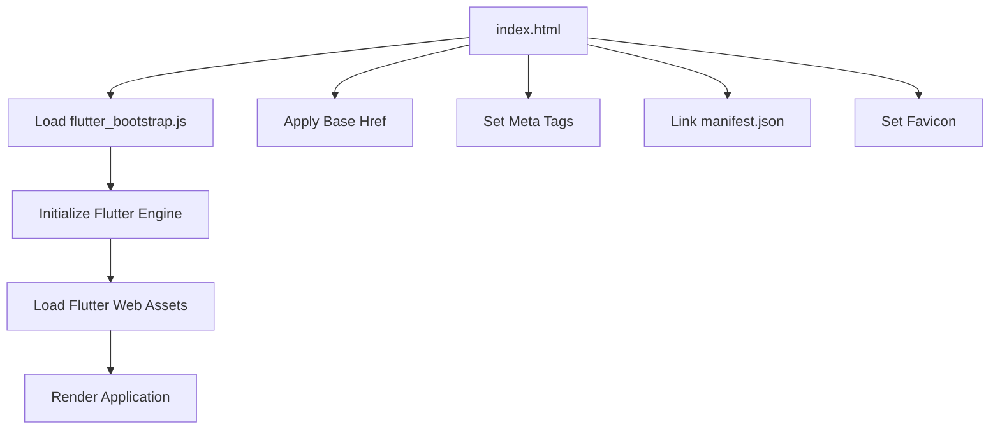
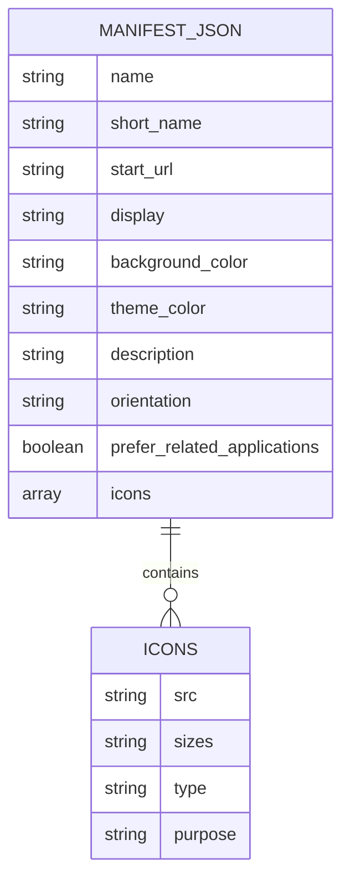
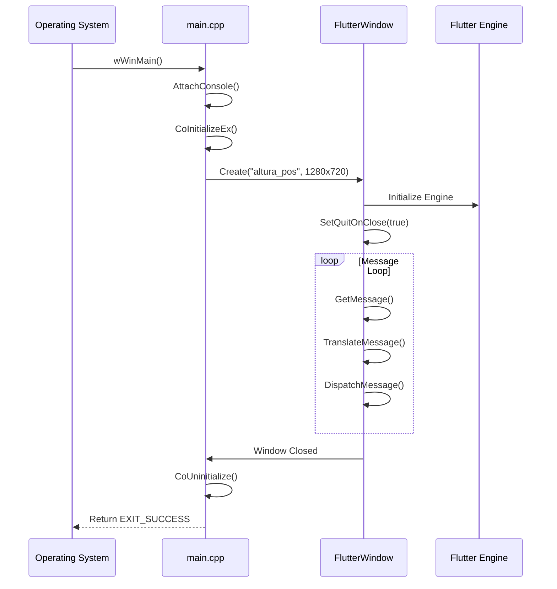
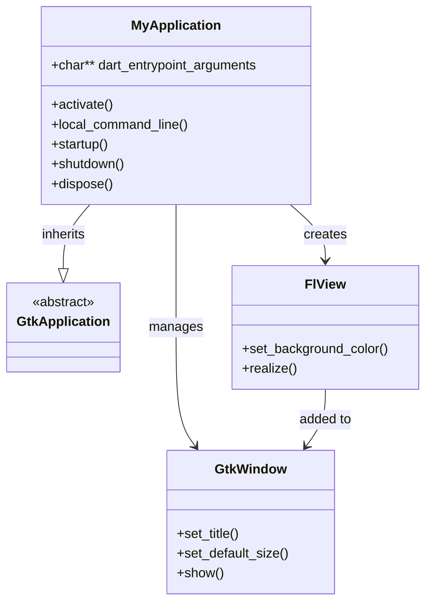
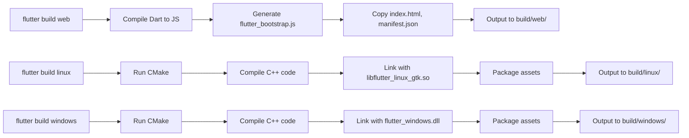

# Web & Desktop Builds

<cite>
**Referenced Files in This Document**   
- [index.html](file://web/index.html)
- [manifest.json](file://web/manifest.json)
- [main.cpp](file://windows/runner/main.cpp)
- [my_application.cc](file://linux/runner/my_application.cc)
- [CMakeLists.txt](file://windows/CMakeLists.txt)
- [CMakeLists.txt](file://linux/CMakeLists.txt)
- [CMakeLists.txt](file://windows/flutter/CMakeLists.txt)
- [CMakeLists.txt](file://linux/flutter/CMakeLists.txt)
</cite>

## Table of Contents
1. [Web Platform Support](#web-platform-support)
2. [Desktop Platform Support](#desktop-platform-support)
3. [Build and Deployment](#build-and-deployment)
4. [Common Issues and Solutions](#common-issues-and-solutions)

## Web Platform Support

The web platform support in `altura_pos` is centered around the `web/index.html` file, which serves as the bootstrap page for the Flutter web application. This file is responsible for loading the necessary JavaScript assets, configuring metadata for Progressive Web App (PWA) capabilities, and setting up the base structure for the application.

The `index.html` file includes a placeholder `$FLUTTER_BASE_HREF` for the base href, which is dynamically replaced during the build process using the `--base-href` argument. This allows the application to be served from subdirectories if needed. The page includes essential meta tags for character encoding, compatibility mode, and mobile web app capabilities, enabling features like full-screen mode on iOS devices.



**Diagram sources**
- [index.html](file://web/index.html#L1-L38)

**Section sources**
- [index.html](file://web/index.html#L1-L38)

### PWA Configuration via manifest.json

The `web/manifest.json` file enables Progressive Web App features for `altura_pos`, allowing it to function offline, be installed on the user's home screen, and launch in standalone mode. The manifest defines the application name, display mode (`standalone`), theme colors, and a set of icons in various sizes including maskable icons for modern app launcher compatibility.

The configuration includes portrait orientation preference and specifies background and theme colors that match the application's branding. The icons array provides multiple resolutions (192x192 and 512x512) in both standard and maskable variants, ensuring proper display across different devices and platforms.



**Diagram sources**
- [manifest.json](file://web/manifest.json#L1-L35)

**Section sources**
- [manifest.json](file://web/manifest.json#L1-L35)

## Desktop Platform Support

Desktop platform support for `altura_pos` is implemented through native entry points for Windows and Linux platforms. Each platform has its own C++ implementation that initializes the Flutter engine, creates the application window, and manages the application lifecycle.

### Windows Desktop Implementation

The Windows desktop application is bootstrapped through `windows/runner/main.cpp`, which serves as the entry point for the executable. The `wWinMain` function initializes COM (Component Object Model), creates a `FlutterWindow` instance, and sets up the window properties including title, initial size (1280x720), and position.

The application handles console attachment for debugging purposes and implements the standard Windows message loop to process UI events. When the window is closed, the application properly uninitializes COM and returns the exit code. The window creation and event handling are abstracted through `FlutterWindow` and `Win32Window` classes.



**Diagram sources**
- [main.cpp](file://windows/runner/main.cpp#L1-L43)

**Section sources**
- [main.cpp](file://windows/runner/main.cpp#L1-L43)

### Linux Desktop Implementation

The Linux desktop application uses GTK+ 3.0 for window management and is implemented in `linux/runner/my_application.cc`. The application follows the GObject class system, defining a `MyApplication` type that extends `GtkApplication`. The `my_application_activate` function is called when the application is launched, creating a new window with appropriate title and size (1280x720).

The implementation includes platform-specific logic to determine whether to use a header bar based on the window manager (using GNOME Shell detection on X11). This ensures proper integration with different desktop environments. The Flutter view is created and added to the window, with signal handling for the first frame rendering to show the window only after Flutter content is ready.



**Diagram sources**
- [my_application.cc](file://linux/runner/my_application.cc#L1-L144)

**Section sources**
- [my_application.cc](file://linux/runner/my_application.cc#L1-L144)

### Build Configuration with CMake

Both Windows and Linux desktop builds use CMake for configuration and compilation. The root `CMakeLists.txt` files in each platform directory define the build settings, target name, and include the Flutter-managed build rules.

The Windows `CMakeLists.txt` requires CMake 3.14+ and defines standard compilation settings including C++17 support, warning levels, and exception handling configuration. It sets up installation rules to bundle the executable with Flutter assets, ICU data, and plugins in a runtime directory structure.

The Linux `CMakeLists.txt` uses CMake 3.13+ and configures the build with C++14, wall warnings, and optimization settings. It uses `pkg-config` to locate GTK+ 3.0 and other system dependencies. The build system sets up RPATH for library loading and creates a relocatable bundle in the build directory.

```mermaid
graph TB
subgraph "Windows Build"
A[CMakeLists.txt] --> B[C++17]
A --> C[MSVC Compiler]
A --> D[Windows SDK]
A --> E[flutter/CMakeLists.txt]
E --> F[flutter_windows.dll]
E --> G[icudtl.dat]
end
subgraph "Linux Build"
H[CMakeLists.txt] --> I[C++14]
H --> J[GNU Compiler]
H --> K[GTK+ 3.0]
H --> L[flutter/CMakeLists.txt]
L --> M[libflutter_linux_gtk.so]
L --> N[icudtl.dat]
end
A --> H : Common Structure
```

**Diagram sources**
- [CMakeLists.txt](file://windows/CMakeLists.txt#L1-L108)
- [CMakeLists.txt](file://linux/CMakeLists.txt#L1-L128)
- [CMakeLists.txt](file://windows/flutter/CMakeLists.txt#L1-L109)
- [CMakeLists.txt](file://linux/flutter/CMakeLists.txt#L1-L88)

**Section sources**
- [CMakeLists.txt](file://windows/CMakeLists.txt#L1-L108)
- [CMakeLists.txt](file://linux/CMakeLists.txt#L1-L128)

## Build and Deployment

The `altura_pos` application can be built for different platforms using the Flutter CLI commands. Each platform has specific build requirements and output formats.

### Web Build Process

To build the web version of the application, use the following command:

```bash
flutter build web --base-href /altura_pos/
```

This command compiles the Dart code to JavaScript, generates the `flutter_bootstrap.js` file, and copies all assets to the `build/web` directory. The `--base-href` parameter sets the base path for the application, which is substituted into the `index.html` file.

### Desktop Build Processes

For desktop platforms, the build commands are:

```bash
# Build for Linux
flutter build linux

# Build for Windows
flutter build windows
```

These commands invoke CMake to compile the native code, link against the Flutter library, and package the application with all necessary assets. The output is a standalone executable that can be distributed to end users.



**Diagram sources**
- [CMakeLists.txt](file://windows/CMakeLists.txt#L1-L108)
- [CMakeLists.txt](file://linux/CMakeLists.txt#L1-L128)
- [index.html](file://web/index.html#L1-L38)

**Section sources**
- [index.html](file://web/index.html#L1-L38)
- [CMakeLists.txt](file://windows/CMakeLists.txt#L1-L108)
- [CMakeLists.txt](file://linux/CMakeLists.txt#L1-L128)

## Common Issues and Solutions

When building and deploying `altura_pos` across different platforms, several common issues may arise:

### Missing Dependencies

On Linux systems, missing GTK+ 3.0 development packages can prevent successful compilation. Install the required dependencies:

```bash
sudo apt-get install libgtk-3-dev
```

### DPI Scaling Issues

Desktop applications may experience DPI scaling problems on high-resolution displays. The Windows implementation can be enhanced with proper DPI awareness by adding manifest entries or using Windows API calls to set process DPI awareness.

### Executable Packaging

Ensure that the build process correctly packages all required assets and libraries. The CMake installation rules in both platform directories are configured to copy Flutter assets, ICU data, and plugin libraries to the appropriate locations relative to the executable.

### Platform-Specific Considerations for POS Applications

For Point of Sale (POS) applications like `altura_pos`, consider the following platform-specific features:

- **Window Size Constraints**: The application sets a fixed initial size of 1280x720, which may need adjustment based on POS hardware requirements.
- **System Tray Integration**: Desktop applications can implement system tray icons for background operation and quick access.
- **Native Menu Bars**: Platform-specific menu bars can be implemented for better integration with desktop environments.
- **Hardware Peripheral Access**: USB and serial port access may require additional permissions and native plugins for interacting with POS hardware like barcode scanners and receipt printers.

**Section sources**
- [main.cpp](file://windows/runner/main.cpp#L1-L43)
- [my_application.cc](file://linux/runner/my_application.cc#L1-L144)
- [CMakeLists.txt](file://windows/CMakeLists.txt#L1-L108)
- [CMakeLists.txt](file://linux/CMakeLists.txt#L1-L128)