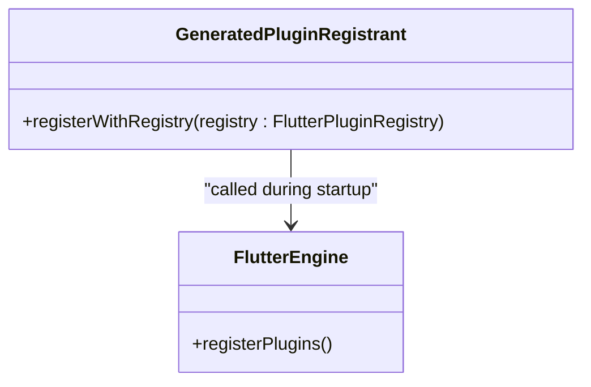

# iOS Support

<cite>
**Referenced Files in This Document**   
- [Info.plist](file://ios/Runner/Info.plist)
- [GeneratedPluginRegistrant.h](file://ios/Runner/GeneratedPluginRegistrant.h)
- [GeneratedPluginRegistrant.m](file://ios/Runner/GeneratedPluginRegistrant.m)
- [Runner-Bridging-Header.h](file://ios/Runner/Runner-Bridging-Header.h)
- [AppIcon.appiconset/Contents.json](file://ios/Runner/Assets.xcassets/AppIcon.appiconset/Contents.json)
- [LaunchImage.imageset/Contents.json](file://ios/Runner/Assets.xcassets/LaunchImage.imageset/Contents.json)
- [LaunchImage.imageset/README.md](file://ios/Runner/Assets.xcassets/LaunchImage.imageset/README.md)
</cite>

## Table of Contents
1. [Introduction](#introduction)
2. [Info.plist Configuration](#infoplist-configuration)
3. [GeneratedPluginRegistrant Files](#generatedpluginregistrant-files)
4. [Assets Management with Assets.xcassets](#assets-management-with-assetsxcassets)
5. [LaunchScreen.storyboard Integration](#launchscreensstoryboard-integration)
6. [Runner-Bridging-Header.h and Swift Interoperability](#runner-bridging-headerh-and-swift-interoperability)
7. [POS-Specific Capabilities and Permissions](#pos-specific-capabilities-and-permissions)
8. [Common iOS Build Issues](#common-ios-build-issues)
9. [Xcode Build Configuration Best Practices](#xcode-build-configuration-best-practices)

## Introduction
This document provides comprehensive guidance on iOS platform support for the `altura_pos` Flutter application. It details the configuration and functionality of key iOS-specific components, including app metadata, plugin registration, asset management, launch screen integration, and interoperability mechanisms. Additionally, it covers essential POS-specific capabilities, privacy requirements, and common build issues encountered during iOS development and deployment.

## Info.plist Configuration
The `Info.plist` file in the `ios/Runner` directory defines essential metadata and behavioral configurations for the iOS application. Key settings include:

- **Bundle Identifier**: Specified via `CFBundleIdentifier` using the placeholder `$(PRODUCT_BUNDLE_IDENTIFIER)`, which is resolved during the build process in Xcode.
- **Display Name**: Set by `CFBundleDisplayName` with the value "Altura Pos", determining the app's name as shown on the iOS home screen.
- **Supported Interface Orientations**: Configured through `UISupportedInterfaceOrientations` for iPhone and `UISupportedInterfaceOrientations~ipad` for iPad, allowing portrait and landscape modes.
- **Minimum iOS Version**: While not explicitly defined in the current `Info.plist`, the minimum iOS version should be set in Xcode project settings or via `IPHONEOS_DEPLOYMENT_TARGET` in the build configuration to ensure compatibility.
- **Launch Storyboard**: The `UILaunchStoryboardName` key specifies "LaunchScreen" as the storyboard used during app startup.

These configurations are critical for defining the app's identity, user interface behavior, and device compatibility.

**Section sources**
- [Info.plist](file://ios/Runner/Info.plist#L1-L50)

## GeneratedPluginRegistrant Files
The `GeneratedPluginRegistrant.h` and `GeneratedPluginRegistrant.m` files are auto-generated by the Flutter tool during the build process. These files serve as the bridge between Dart code and native iOS plugins, enabling Flutter to register and communicate with platform-specific plugins.

- `GeneratedPluginRegistrant.h` declares the `GeneratedPluginRegistrant` class interface, which contains the `registerWithRegistry:` method.
- `GeneratedPluginRegistrant.m` provides the implementation of this method, where each plugin is registered with the Flutter engine.

This mechanism ensures that all plugins declared in `pubspec.yaml` are properly initialized and available for use when the app runs on iOS.

**Diagram sources**
- [GeneratedPluginRegistrant.h](file://ios/Runner/GeneratedPluginRegistrant.h#L1-L20)
- [GeneratedPluginRegistrant.m](file://ios/Runner/GeneratedPluginRegistrant.m#L1-L15)

**Section sources**
- [GeneratedPluginRegistrant.h](file://ios/Runner/GeneratedPluginRegistrant.h#L1-L20)
- [GeneratedPluginRegistrant.m](file://ios/Runner/GeneratedPluginRegistrant.m#L1-L15)

## Assets Management with Assets.xcassets
The `Assets.xcassets` directory manages all visual assets for the iOS application, including app icons and launch images.

### App Icons
The `AppIcon.appiconset/Contents.json` file defines multiple icon sizes for different iOS devices and screen densities. It includes:
- iPhone and iPad icons at various scales (1x, 2x, 3x)
- Marketing icon (1024x1024) for App Store submission
- Specific sizes for iPad Pro (83.5x83.5@2x)

Each entry specifies the `size`, `idiom` (device type), `filename`, and `scale` to ensure proper display across all supported devices.

### Launch Images
The `LaunchImage.imageset/Contents.json` contains image definitions for different screen resolutions (1x, 2x, 3x), used during app launch before Flutter renders its first frame. The associated `README.md` provides instructions for customizing these images.

**Section sources**
- [AppIcon.appiconset/Contents.json](file://ios/Runner/Assets.xcassets/AppIcon.appiconset/Contents.json#L1-L123)
- [LaunchImage.imageset/Contents.json](file://ios/Runner/Assets.xcassets/LaunchImage.imageset/Contents.json#L1-L24)
- [LaunchImage.imageset/README.md](file://ios/Runner/Assets.xcassets/LaunchImage.imageset/README.md#L1-L5)

## LaunchScreen.storyboard Integration
Although not directly visible in the file structure, the `LaunchScreen.storyboard` is referenced in `Info.plist` via the `UILaunchStoryboardName` key. This storyboard defines the native iOS launch screen displayed while the Flutter engine initializes. It integrates with the Flutter bootstrapping process by providing a seamless transition from the native launch screen to the first Flutter-rendered frame, ensuring a smooth user experience during app startup.

## Runner-Bridging-Header.h and Swift Interoperability
The `Runner-Bridging-Header.h` file enables Objective-C and Swift interoperability within the iOS module. Currently, it imports `GeneratedPluginRegistrant.h`, allowing Swift code to access the plugin registration system. This bridging header is essential when incorporating Swift-based plugins or custom native modules that need to interact with Flutter’s plugin architecture. While no Swift code is currently present, this file lays the foundation for future Swift-Kotlin interoperability if native extensions are developed.

**Section sources**
- [Runner-Bridging-Header.h](file://ios/Runner/Runner-Bridging-Header.h#L1-L2)

## POS-Specific Capabilities and Permissions
To support POS functionality, specific capabilities must be enabled in the Xcode project:

### Background Modes
Enable "Background fetch" and "Audio, AirPlay, and Picture in Picture" under Background Modes to allow the app to process transactions or communicate with peripherals even when in the background.

### External Accessory Communication
Add the `UISupportedExternalAccessoryProtocols` key in `Info.plist` to declare compatibility with MFi (Made for iPhone) hardware such as barcode scanners or payment terminals. Each protocol string must match the peripheral's protocol string.

### Privacy Descriptions
Add the following keys with appropriate descriptions:
- `NSCameraUsageDescription`: Required if scanning barcodes or QR codes using the camera.
- `NSMicrophoneUsageDescription`: Needed if audio input is used for voice commands or sound-based authentication.

These entries are mandatory for App Store submission and must provide clear justification for data access.

## Common iOS Build Issues
### Code Signing Errors
Ensure that:
- A valid Apple Developer account is configured in Xcode
- The Bundle Identifier matches a registered App ID
- Automatic signing is enabled or provisioning profiles are correctly installed

### Architecture Mismatches
When building for physical devices (arm64) versus simulators (x86_64), ensure:
- All native dependencies support both architectures
- Third-party frameworks include slices for both arm64 and x86_64
- `EXCLUDED_ARCHS` is set appropriately for simulator builds in Debug mode

## Xcode Build Configuration Best Practices
- Use `.xcconfig` files to manage build settings across environments
- Set `Swift Version` explicitly if using Swift plugins
- Enable `Parallelize Build` and `Distribute Builds` for faster compilation
- Use `Debug`, `Profile`, and `Release` configurations appropriately for testing and deployment
- Keep `Flutter` folder in `ios/Flutter` unmodified as it is auto-generated