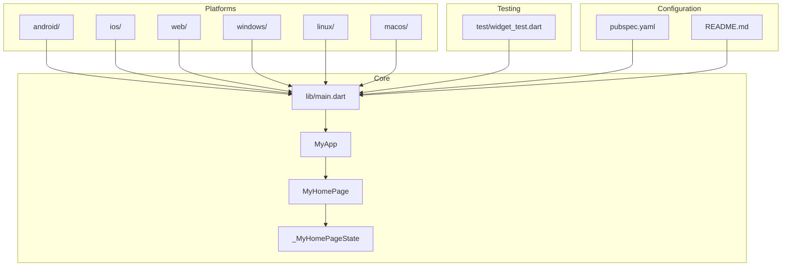
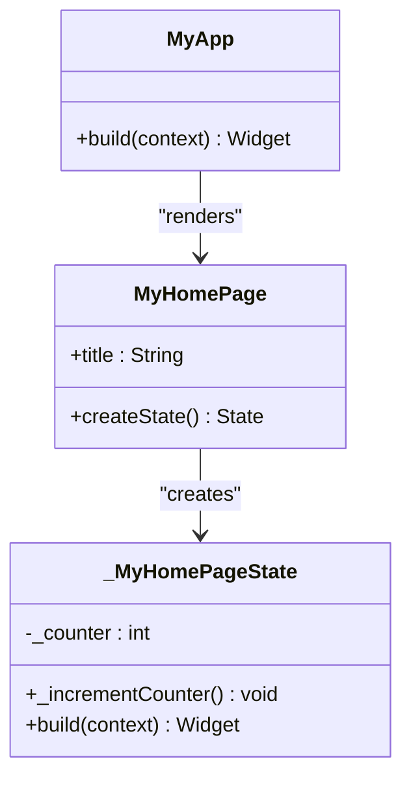
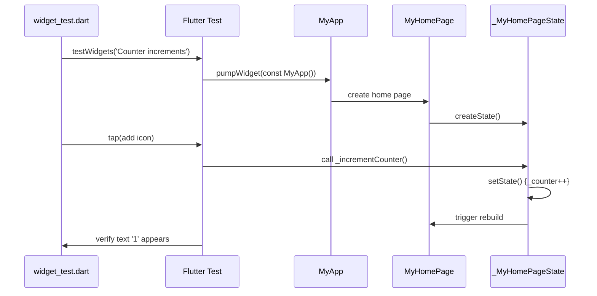

# Project Overview

<cite>
**Referenced Files in This Document**  
- [main.dart](file://lib/main.dart)
- [pubspec.yaml](file://pubspec.yaml)
- [README.md](file://README.md)
- [widget_test.dart](file://test/widget_test.dart)
</cite>

## Table of Contents
1. [Introduction](#introduction)
2. [Project Structure](#project-structure)
3. [Core Components](#core-components)
4. [Architecture Overview](#architecture-overview)
5. [Development and Testing](#development-and-testing)
6. [Conclusion](#conclusion)

## Introduction

The `altura_pos` project is a Flutter-based Point-of-Sale (POS) application currently in its initial development phase. As of now, it is built upon the default Flutter template and demonstrates a basic counter functionality. The application is designed to evolve into a full-featured retail transaction system, supporting comprehensive sales, inventory, and customer management capabilities.

Currently, the app serves as a foundational scaffold, showcasing Flutter's declarative UI programming model through a simple interactive counter. The primary goal is to incrementally develop this minimal implementation into a robust, cross-platform POS solution suitable for real-world retail environments.

**Section sources**
- [README.md](file://README.md#L1-L16)
- [pubspec.yaml](file://pubspec.yaml#L1-L10)

## Project Structure

The `altura_pos` project follows the standard Flutter directory structure, enabling cross-platform deployment across Android, iOS, Web, Linux, macOS, and Windows from a single codebase. The core application logic resides in the `lib/` directory, while platform-specific configurations are maintained in their respective folders (`android/`, `ios/`, `windows/`, etc.).

Key directories include:
- `lib/`: Contains the main Dart source code, currently centered around `main.dart`
- `test/`: Houses widget and integration tests
- `web/`, `android/`, `ios/`, `linux/`, `macos/`, `windows/`: Platform-specific configuration and native code
- Root-level configuration files: `pubspec.yaml`, `analysis_options.yaml`, and `README.md`

This structure provides a scalable foundation for future feature development while maintaining Flutter's convention-over-configuration philosophy.

**Diagram sources**
- [main.dart](file://lib/main.dart#L1-L123)
- [pubspec.yaml](file://pubspec.yaml#L1-L90)

**Section sources**
- [main.dart](file://lib/main.dart#L1-L123)
- [pubspec.yaml](file://pubspec.yaml#L1-L90)

## Core Components

The application's core consists of three primary components defined in `main.dart`: `MyApp`, `MyHomePage`, and `_MyHomePageState`. These classes demonstrate Flutter's widget-based architecture and state management patterns.

`MyApp` serves as the root widget, configuring the application with Material Design theming. `MyHomePage` is a stateful widget that manages the UI, while `_MyHomePageState` contains the mutable state (the counter value) and logic for updating it. This separation follows Flutter's convention of distinguishing between stateless configuration widgets and stateful components.

The current implementation showcases fundamental Flutter concepts including widget composition, state management via `setState()`, and event handling through the floating action button.

**Section sources**
- [main.dart](file://lib/main.dart#L6-L121)

## Architecture Overview

`altura_pos` leverages Flutter's declarative UI framework with a widget-driven architecture based on Material Design principles. The application follows a hierarchical component structure where widgets are composed to build complex UIs from simpler elements.

The architecture enables reactive programming through Flutter's rendering pipeline, where UI updates are triggered by state changes. When the user interacts with the counter button, the `_incrementCounter` method calls `setState()`, prompting the framework to rebuild the affected portion of the UI tree.

This foundation supports future scalability, allowing for the addition of features such as product catalogs, transaction processing, payment integration, and inventory management while maintaining a consistent development pattern.

**Diagram sources**
- [main.dart](file://lib/main.dart#L6-L121)

**Section sources**
- [main.dart](file://lib/main.dart#L6-L121)

## Development and Testing

The project includes a basic widget test in `widget_test.dart` that validates the counter functionality. This test uses Flutter's testing framework to simulate user interaction with the floating action button and verify that the counter increments correctly.

The `pubspec.yaml` file defines project metadata, dependencies, and Flutter-specific configurations such as asset management and font usage. Currently, the application depends only on core Flutter packages and `cupertino_icons`, maintaining a minimal dependency footprint suitable for early-stage development.

The configuration enables Material Design through `uses-material-design: true` and specifies the application version and SDK constraints, ensuring compatibility across development environments.

**Diagram sources**
- [widget_test.dart](file://test/widget_test.dart#L1-L30)
- [main.dart](file://lib/main.dart#L1-L123)

**Section sources**
- [widget_test.dart](file://test/widget_test.dart#L1-L30)
- [pubspec.yaml](file://pubspec.yaml#L1-L90)

## Conclusion

The `altura_pos` project establishes a solid foundation for a cross-platform POS application using Flutter. While currently minimal in functionality—demonstrating only a basic counter—it embodies the architectural principles and development patterns necessary for scaling into a comprehensive retail solution.

The current implementation provides a working example of Flutter's reactive programming model, state management, and widget composition. As development progresses, this scaffold will be extended with features such as product management, sales transactions, payment processing, and reporting capabilities, transforming the simple counter demo into a fully functional point-of-sale system.

The project's structure supports this evolution, with clear separation of concerns and adherence to Flutter best practices, ensuring maintainability and scalability throughout the development lifecycle.