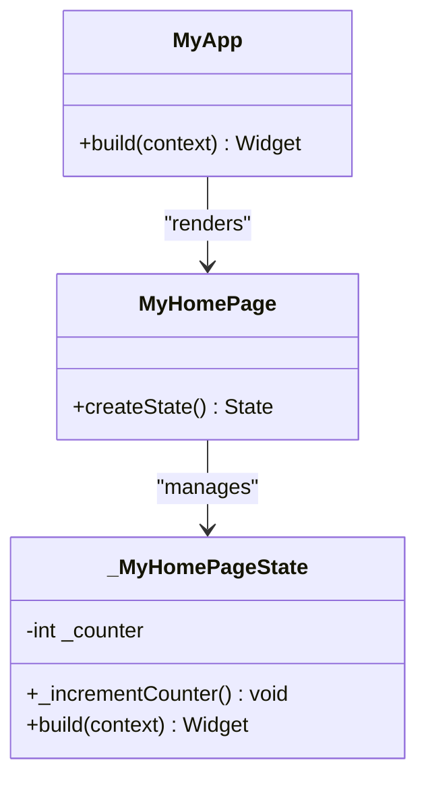
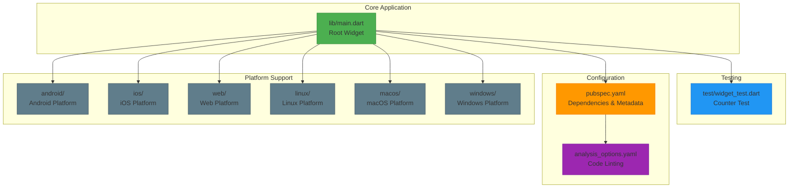

# Project Overview

<cite>
**Referenced Files in This Document**   
- [main.dart](file://lib/main.dart)
- [pubspec.yaml](file://pubspec.yaml)
- [widget_test.dart](file://test/widget_test.dart)
- [README.md](file://README.md)
</cite>

## Table of Contents
1. [Introduction](#introduction)
2. [Project Purpose and Goals](#project-purpose-and-goals)
3. [Target Audience and Use Cases](#target-audience-and-use-cases)
4. [Architectural Foundation](#architectural-foundation)
5. [Cross-Platform Capabilities](#cross-platform-capabilities)
6. [Configuration and Dependencies](#configuration-and-dependencies)
7. [Codebase Structure and Scalability](#codebase-structure-and-scalability)
8. [Current Functionality and Roadmap](#current-functionality-and-roadmap)

## Introduction

The `altura_pos` Flutter application serves as a foundational Point of Sale (POS) system designed to provide developers with a starting template for building retail-focused mobile and desktop applications. Currently implemented as a starter project, it demonstrates core Flutter concepts through a simple counter functionality while establishing the architectural groundwork for future expansion into a full-featured POS solution. This document provides a comprehensive overview of the project's structure, goals, and technical foundation.

**Section sources**
- [README.md](file://README.md#L1-L17)
- [pubspec.yaml](file://pubspec.yaml#L1-L90)

## Project Purpose and Goals

The primary purpose of `altura_pos` is to function as a scalable starter template for Flutter-based Point of Sale systems. While currently demonstrating basic counter functionality, the project is strategically designed to evolve into a comprehensive retail solution. The core goal is to establish a clean, maintainable codebase that can be incrementally enhanced with essential POS features such as payment processing, inventory management, customer relationship management, and barcode scanning capabilities.

By beginning with a minimal viable structure, the project enables developers to understand the foundational architecture before implementing complex business logic. This approach ensures that future feature additions integrate seamlessly with the existing codebase, maintaining code quality and architectural integrity throughout the development lifecycle.

**Section sources**
- [README.md](file://README.md#L1-L17)
- [main.dart](file://lib/main.dart#L1-L123)

## Target Audience and Use Cases

The `altura_pos` application is specifically targeted at Flutter developers who are building or planning to build retail applications. This includes independent developers, software agencies, and enterprise teams looking for a structured starting point for POS systems. The target audience benefits from a pre-configured Flutter environment with best practices in widget composition, state management patterns, and cross-platform considerations already established.

Use cases for this project include developing POS systems for small retail stores, restaurants, service providers, and pop-up shops. The starter template is particularly valuable for developers who need to quickly prototype a retail application or want to avoid the initial setup overhead of configuring a new Flutter project from scratch. Educational institutions and training programs can also leverage this project to teach POS system development concepts in a real-world context.

**Section sources**
- [README.md](file://README.md#L1-L17)
- [pubspec.yaml](file://pubspec.yaml#L1-L90)

## Architectural Foundation

The `altura_pos` application is built upon Flutter's widget-based composition architecture and Material Design principles, creating a solid foundation for future expansion. The application follows a hierarchical widget structure where the `MyApp` class serves as the root widget, configuring the overall application theme and routing. This is followed by the `MyHomePage` stateful widget, which manages dynamic data and user interactions.

The architecture demonstrates proper separation of concerns, with stateless widgets handling presentation and stateful widgets managing mutable state. The use of `StatefulWidget` and `State` classes illustrates Flutter's reactive programming model, where UI updates are triggered by calling `setState()` when data changes. This pattern is essential for building responsive POS interfaces where inventory levels, order totals, and payment statuses need to update in real-time.

The current implementation showcases Flutter's hot reload capabilities, allowing developers to make UI changes without losing application state—a critical feature for rapidly iterating on POS interface designs.

**Diagram sources **
- [main.dart](file://lib/main.dart#L15-L40)
- [main.dart](file://lib/main.dart#L43-L123)

**Section sources**
- [main.dart](file://lib/main.dart#L1-L123)

## Cross-Platform Capabilities

One of the key advantages of the `altura_pos` application is its inherent cross-platform support enabled by the Flutter framework. The project is configured to run seamlessly on Android, iOS, Web, Linux, macOS, and Windows platforms from a single codebase. This capability is particularly valuable for POS systems that may need to operate on various hardware configurations, from mobile devices used by sales staff to desktop terminals at checkout counters.

The cross-platform nature of Flutter allows businesses to maintain a consistent user experience across different devices while reducing development and maintenance costs. For example, a retail manager could use the same application interface on an iPad for floor sales, a Windows desktop for back-office operations, and a web browser for remote monitoring—all powered by the same underlying code.

This multi-platform support is automatically configured through Flutter's build system, which generates platform-specific binaries while preserving the shared business logic and UI components defined in the Dart code.

**Section sources**
- [pubspec.yaml](file://pubspec.yaml#L1-L90)
- [main.dart](file://lib/main.dart#L1-L123)

## Configuration and Dependencies

The project's configuration is managed through the `pubspec.yaml` file, which defines essential metadata and dependency requirements. The configuration includes the project name (`altura_pos`), description, versioning scheme (1.0.0+1), and SDK constraints (Dart SDK ^3.9.2). The `publish_to: 'none'` directive indicates this is a private project not intended for publication on pub.dev.

Key dependencies include:
- **flutter**: The core Flutter SDK
- **cupertino_icons**: For iOS-style icons
- **flutter_test**: For widget testing
- **flutter_lints**: For code quality enforcement

The Flutter-specific configuration enables Material Design with `uses-material-design: true`, ensuring access to the comprehensive set of Material icons and components. This configuration choice aligns with modern POS interface design principles, providing a professional, familiar user experience.

The inclusion of `flutter_lints` demonstrates a commitment to code quality and consistency, which is crucial for maintaining a large-scale POS application as it grows in complexity.

**Section sources**
- [pubspec.yaml](file://pubspec.yaml#L1-L90)
- [analysis_options.yaml](file://analysis_options.yaml)

## Codebase Structure and Scalability

The `altura_pos` codebase follows Flutter's standard project structure, organized into platform-specific directories (android, ios, linux, macos, windows, web) and core application directories (lib, test). The primary application logic resides in `lib/main.dart`, while tests are located in the `test/` directory.

This structure is highly scalable, allowing for the organized addition of new features. Future development can follow a modular approach by creating dedicated directories within `lib/` for specific POS functionalities:
- `lib/payment/` for payment processing
- `lib/inventory/` for product management
- `lib/orders/` for transaction handling
- `lib/reports/` for business analytics

The current single-file architecture in `lib/main.dart` serves as an effective starting point, and as the application grows, it can be refactored into multiple Dart files while maintaining the same architectural patterns. This evolutionary approach ensures that developers can start simple and gradually introduce complexity as needed.

**Diagram sources **
- [main.dart](file://lib/main.dart)
- [pubspec.yaml](file://pubspec.yaml)
- [widget_test.dart](file://test/widget_test.dart)
- [analysis_options.yaml](file://analysis_options.yaml)

**Section sources**
- [main.dart](file://lib/main.dart)
- [pubspec.yaml](file://pubspec.yaml)
- [test/widget_test.dart](file://test/widget_test.dart)
- [analysis_options.yaml](file://analysis_options.yaml)

## Current Functionality and Roadmap

Currently, the `altura_pos` application demonstrates basic counter functionality through a simple stateful widget that increments a value when a floating action button is pressed. This serves as a foundational example of Flutter's state management and widget composition concepts. The accompanying `widget_test.dart` file includes a basic test that verifies the counter increments correctly, establishing a testing foundation for future development.

The project roadmap involves evolving this starter template into a full-featured POS system through phased feature additions:
1. **Phase 1**: Implement product catalog management with CRUD operations
2. **Phase 2**: Add shopping cart functionality and order processing
3. **Phase 3**: Integrate payment processing gateways
4. **Phase 4**: Implement inventory tracking and low-stock alerts
5. **Phase 5**: Add barcode scanning capabilities using device cameras
6. **Phase 6**: Develop reporting and analytics features

Each phase will build upon the existing architectural foundation, maintaining the clean code structure and widget-based design patterns established in the initial implementation. This incremental approach ensures that the application remains maintainable and testable throughout its evolution from a simple counter demo to a comprehensive retail solution.

**Section sources**
- [main.dart](file://lib/main.dart#L1-L123)
- [widget_test.dart](file://test/widget_test.dart#L1-L31)
- [README.md](file://README.md#L1-L17)