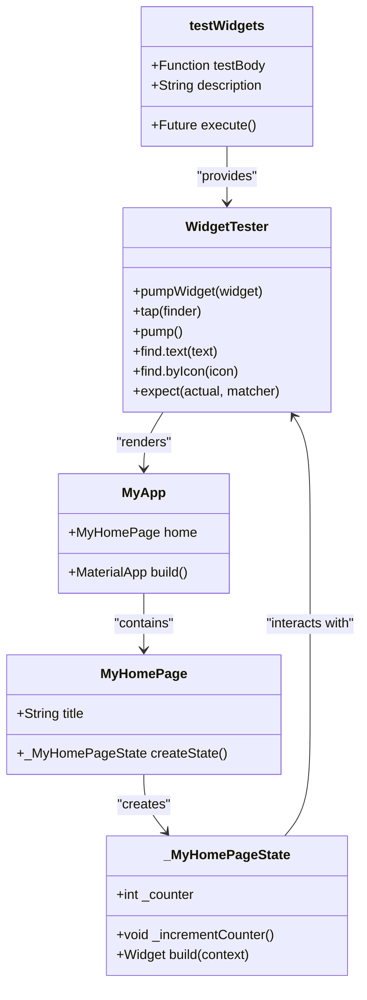
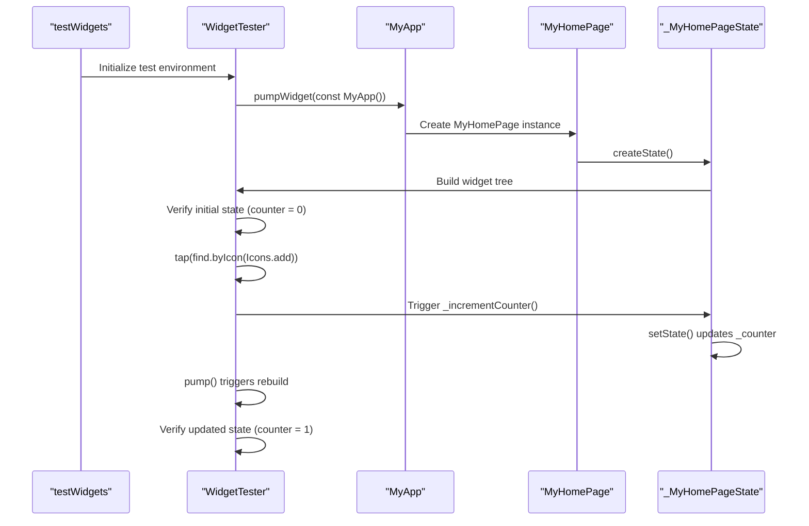

# Testing

<cite>
**Referenced Files in This Document**   
- [widget_test.dart](file://test/widget_test.dart)
- [main.dart](file://lib/main.dart)
- [flutter_test.dart](file://c:/flutter/packages/flutter_test/lib/flutter_test.dart)
</cite>

## Table of Contents
1. [Introduction](#introduction)
2. [Core Testing Components](#core-testing-components)
3. [Widget Test Implementation](#widget-test-implementation)
4. [Test Execution Flow](#test-execution-flow)
5. [Flutter Test Framework Integration](#flutter-test-framework-integration)
6. [Best Practices for Widget Testing](#best-practices-for-widget-testing)
7. [Conclusion](#conclusion)

## Introduction
The testing infrastructure in altura_pos demonstrates a fundamental approach to UI testing in Flutter applications. This document provides a comprehensive analysis of the widget test implementation that verifies counter increment functionality, detailing the use of testing utilities, interaction methods, and assertion patterns. The test serves as a foundational example for building a robust testing suite for POS (Point of Sale) features, illustrating how Flutter's testing framework enables developers to validate UI behavior and state management in a controlled environment.

**Section sources**
- [widget_test.dart](file://test/widget_test.dart#L1-L31)
- [main.dart](file://lib/main.dart#L1-L123)

## Core Testing Components

The widget test in altura_pos leverages several key components from the flutter_test package to create a comprehensive testing environment. These components work together to simulate user interactions, render widgets, and verify application state.

**Diagram sources **
- [widget_test.dart](file://test/widget_test.dart#L10-L30)
- [main.dart](file://lib/main.dart#L6-L121)

**Section sources**
- [widget_test.dart](file://test/widget_test.dart#L1-L31)
- [main.dart](file://lib/main.dart#L1-L123)

## Widget Test Implementation

The implementation of the widget test follows a clear structure that demonstrates best practices for Flutter widget testing. The test verifies the counter increment functionality through a series of well-defined steps that simulate user interaction and validate application state.

### Test Structure and Components

The test is structured around the `testWidgets` function, which creates a test environment specifically designed for widget testing. Within this environment, the `WidgetTester` utility provides methods for interacting with the widget tree, simulating user actions, and verifying widget properties.

**Diagram sources **
- [widget_test.dart](file://test/widget_test.dart#L10-L30)
- [main.dart](file://lib/main.dart#L37-L53)

**Section sources**
- [widget_test.dart](file://test/widget_test.dart#L10-L30)
- [main.dart](file://lib/main.dart#L37-L53)

## Test Execution Flow

The test execution follows a precise sequence of operations that accurately simulates user interaction with the application. Each step in the flow serves a specific purpose in verifying the correct behavior of the counter functionality.

### Initial Setup and Rendering

The test begins by rendering the application using the `pumpWidget` method, which builds the widget tree and triggers the first frame. This step is crucial as it establishes the initial state of the application before any interactions occur.

### State Verification

After rendering, the test verifies the initial state of the counter by using the `find.text` method to locate widgets containing specific text. The assertions confirm that the counter starts at 0 and that the value 1 is not present, establishing a baseline for the subsequent interaction.

### User Interaction Simulation

The test simulates a user tapping the FloatingActionButton by using the `tap` method with a finder that locates the widget by its icon. This interaction triggers the `_incrementCounter` method in the `_MyHomePageState` class, which updates the counter value through `setState`.

### State Update and Verification

Following the interaction, the test calls `pump` to allow the framework to process the state change and rebuild the widget tree. The final assertions verify that the counter has been incremented to 1 and that the previous value of 0 is no longer displayed, confirming the successful update of the application state.

**Section sources**
- [widget_test.dart](file://test/widget_test.dart#L10-L30)
- [main.dart](file://lib/main.dart#L37-L53)

## Flutter Test Framework Integration

The flutter_test package provides a comprehensive testing framework that integrates seamlessly with the Flutter SDK, enabling developers to write reliable and maintainable UI tests. The framework offers a range of utilities and matchers that simplify the process of testing complex widget interactions.

### Key Testing Utilities

The framework provides several essential utilities that are critical for effective widget testing:

- **testWidgets**: A function that creates a test environment specifically designed for widget testing, handling the setup and teardown of the test environment
- **WidgetTester**: A utility that provides methods for interacting with widgets, finding elements in the widget tree, and verifying widget properties
- **pumpWidget**: A method that builds the widget tree and triggers a frame, allowing tests to render widgets in a controlled environment
- **tap**: A method that simulates a tap gesture on a widget, triggering callbacks and interactions as if a user had tapped the widget
- **pump**: A method that advances the clock and allows animations and state changes to complete, essential for testing asynchronous updates

### Assertion and Matching

The framework includes a rich set of matchers that enable precise verification of widget properties and application state. These matchers work in conjunction with the `expect` function to create clear and expressive assertions that are easy to understand and maintain.

**Section sources**
- [flutter_test.dart](file://c:/flutter/packages/flutter_test/lib/flutter_test.dart#L1-L96)
- [widget_test.dart](file://test/widget_test.dart#L1-L31)

## Best Practices for Widget Testing

The implementation in altura_pos demonstrates several best practices for writing effective and maintainable widget tests. These practices can be extended to create a comprehensive testing suite for more complex POS features.

### Asynchronous Testing Considerations

When testing widgets with state changes or animations, it's essential to account for asynchronous updates by using the `pump` method to allow the framework to process state changes and rebuild the widget tree. This ensures that assertions are made against the updated state rather than the intermediate state.

### Widget Finding Strategies

The test demonstrates effective strategies for locating widgets in the widget tree:

- **Finding by text**: Using `find.text` to locate widgets containing specific text, which is useful for verifying displayed content
- **Finding by icon**: Using `find.byIcon` to locate widgets based on their icon, which is effective for interactive elements like buttons
- **Finding by type**: Using `find.byType` to locate widgets of a specific class, which is useful for verifying the presence of specific widget types

### Stateful Widget Interaction

Testing stateful widgets requires careful consideration of the widget lifecycle and state management. The test demonstrates how to verify initial state, trigger state changes through user interactions, and verify the updated state, providing a complete picture of the widget's behavior.

### Extensibility for POS Features

The testing approach demonstrated in this example can be extended to test more complex POS features by:

- Creating tests for individual components and their interactions
- Using setUp and tearDown methods to manage test state and resources
- Implementing integration tests that verify the interaction between multiple components
- Using mock objects to isolate components and test edge cases

**Section sources**
- [widget_test.dart](file://test/widget_test.dart#L1-L31)
- [main.dart](file://lib/main.dart#L1-L123)

## Conclusion

The widget test implementation in altura_pos provides a solid foundation for testing Flutter applications, demonstrating effective use of the flutter_test framework to verify UI behavior and state management. By following the patterns and best practices illustrated in this example, developers can create a comprehensive testing suite that ensures the reliability and maintainability of POS features. The test structure, interaction methods, and assertion patterns serve as a template for building more complex tests that cover the full range of functionality required in a production POS application.