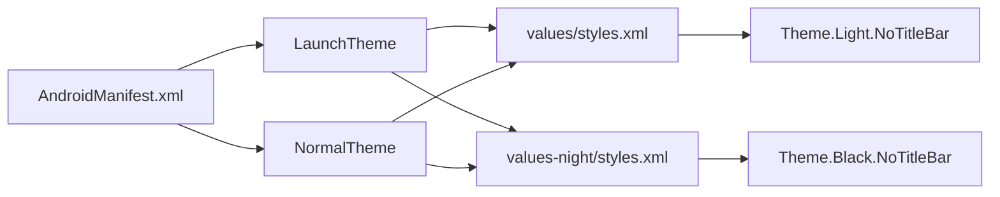

# Theming & UI

<cite>
**Referenced Files in This Document**   
- [main.dart](file://lib/main.dart)
- [styles.xml](file://android/app/src/main/res/values/styles.xml)
- [styles.xml](file://android/app/src/main/res/values-night/styles.xml)
</cite>

## Table of Contents
1. [Material Design Theming Configuration](#material-design-theming-configuration)
2. [Theme Data Propagation and Access](#theme-data-propagation-and-access)
3. [UI Component Styling with Theme Properties](#ui-component-styling-with-theme-properties)
4. [Platform-Specific Theming for Android](#platform-specific-theming-for-android)
5. [Theme Customization Guidelines](#theme-customization-guidelines)
6. [Extending Theming for Branded POS Experience](#extending-theming-for-branded-pos-experience)
7. [Development Tips for Theme Experimentation](#development-tips-for-theme-experimentation)

## Material Design Theming Configuration

The altura_pos application implements Material Design 3 theming through Flutter's ThemeData and ColorScheme classes. In the MyApp widget's build method, the theme is configured using ThemeData with a ColorScheme generated from a seed color. The current implementation uses Colors.deepPurple as the seed color, which automatically generates a complete color palette including primary, secondary, tertiary, and associated tones. This dynamic color system ensures visual consistency across all UI components while maintaining accessibility standards. The seed-based approach allows for easy theming adjustments by simply changing the base color, with the framework automatically calculating harmonious color variations for different UI elements.

**Section sources**
- [main.dart](file://lib/main.dart#L14-L30)

## Theme Data Propagation and Access

Theme data propagates down the widget tree through Flutter's inherited widget mechanism. Once MaterialApp is configured with a theme, all descendant widgets can access the theme data without explicit passing. The Theme.of(context) method provides access to the current theme from any widget in the tree, enabling consistent styling across the application. This inheritance model ensures that theme changes at the root level automatically cascade to all components that reference theme properties. The context parameter in Theme.of(context) refers to the BuildContext of the current widget, allowing the framework to traverse upward through the widget hierarchy to locate the nearest enclosing theme data.

**Section sources**
- [main.dart](file://lib/main.dart#L82)
- [main.dart](file://lib/main.dart#L109)

## UI Component Styling with Theme Properties

The MyHomePage widget demonstrates practical usage of theme properties for consistent UI styling. The AppBar background color is set using Theme.of(context).colorScheme.inversePrimary, which provides a high-contrast background for primary interface elements. This ensures the app bar maintains visual prominence while harmonizing with the overall color scheme. Text styling is implemented through Theme.of(context).textTheme.headlineMedium, which applies predefined typography settings for headline text. This approach guarantees typographic consistency across the application and automatically adapts to system accessibility settings such as font size preferences. By leveraging these theme properties, the application maintains a cohesive visual language that adheres to Material Design guidelines.

```mermaid
flowchart TD
A[MyApp] --> B[MaterialApp]
B --> C[ThemeData]
C --> D[ColorScheme.fromSeed]
D --> E[seedColor: Colors.deepPurple]
B --> F[MyHomePage]
F --> G[AppBar]
G --> H[backgroundColor: Theme.of(context).colorScheme.inversePrimary]
F --> I[Text]
I --> J[style: Theme.of(context).textTheme.headlineMedium]
```

**Diagram sources**
- [main.dart](file://lib/main.dart#L14-L30)
- [main.dart](file://lib/main.dart#L82)
- [main.dart](file://lib/main.dart#L109)

**Section sources**
- [main.dart](file://lib/main.dart#L77-L121)

## Platform-Specific Theming for Android

Android platform theming is configured through native XML resources to ensure launch theme consistency. The application uses separate styles.xml files for light and dark modes located in the values and values-night directories respectively. The LaunchTheme style defines the window background during application startup, using Theme.Light.NoTitleBar for light mode and Theme.Black.NoTitleBar for dark mode. This ensures a seamless transition from the native splash screen to the Flutter UI. The NormalTheme style determines the window background color while the Flutter UI initializes and runs, maintaining visual consistency during the app launch sequence. These native themes are referenced in AndroidManifest.xml to ensure proper application during the Android activity lifecycle.



**Diagram sources**
- [styles.xml](file://android/app/src/main/res/values/styles.xml#L1-L17)
- [styles.xml](file://android/app/src/main/res/values-night/styles.xml#L1-L17)
- [AndroidManifest.xml](file://android/app/src/main/AndroidManifest.xml#L1-L26)

**Section sources**
- [styles.xml](file://android/app/src/main/res/values/styles.xml#L1-L17)
- [styles.xml](file://android/app/src/main/res/values-night/styles.xml#L1-L17)

## Theme Customization Guidelines

To customize the theme for the altura_pos application, developers can modify several key aspects. Changing the seedColor in ColorScheme.fromSeed() to any Color value will generate a new complete color palette automatically. For more precise control, specific color roles can be overridden while maintaining the seed-based generation for other colors. Typography can be customized by extending the default textTheme with custom TextStyle objects for specific use cases. Shape definitions for components like buttons and cards can be modified by setting the relevant shape properties in ThemeData. When making these changes, it's important to maintain sufficient contrast ratios for accessibility and ensure the theme remains consistent across both light and dark mode configurations.

**Section sources**
- [main.dart](file://lib/main.dart#L14-L30)

## Extending Theming for Branded POS Experience

For a branded POS experience, the theme system can be extended to incorporate brand-specific colors, typography, and shapes. Create a custom ColorScheme that extends the seed-based scheme with brand colors for specific UI elements. Define custom text themes that include brand typography, potentially loading custom fonts declared in pubspec.yaml. Implement consistent shape definitions for buttons, cards, and input fields that reflect brand identity. Consider creating a ThemeManager class to handle theme switching between light, dark, and potential custom brand themes. For POS-specific UI patterns, extend the theme to include specialized color roles for status indicators, transaction types, and inventory levels, ensuring these are accessible and consistent across all screens.

**Section sources**
- [main.dart](file://lib/main.dart#L14-L30)
- [pubspec.yaml](file://pubspec.yaml#L50-L88)

## Development Tips for Theme Experimentation

Leverage Flutter's hot reload functionality to experiment with theme changes without losing application state. Modify the seedColor in main.dart and save the file to see immediate visual updates across the entire application. This rapid feedback loop allows for quick iteration on color schemes and styling decisions. Use the commented suggestions in the code as starting points for experimentation, such as trying different seed colors like Colors.green. When testing platform-specific themes, use Android Studio's theme preview or run the application on physical devices with different system theme settings. For complex theme changes, consider implementing a theme toggle in the UI during development to quickly switch between variations and assess their impact on the user experience.

**Section sources**
- [main.dart](file://lib/main.dart#L19-L25)
- [main.dart](file://lib/main.dart#L80-L81)